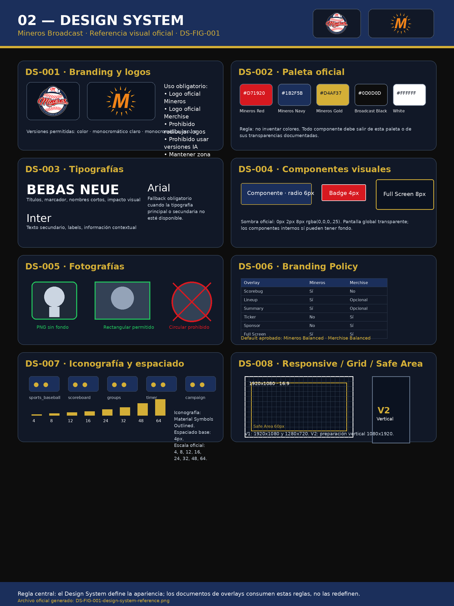

# 02-design-system

Versión: 1.1.0  
Estado: CERRADO PARA REVISIÓN  

## Referencia visual oficial

**Figura:** `DS-FIG-001`  
**Archivo:** `02-design-system-assets/DS-FIG-001-design-system-reference.png`

La figura `DS-FIG-001` consolida visualmente las reglas de branding, logos, paleta, tipografías, componentes, fotografías, branding policy, iconografía, espaciado, grid, safe area y responsive.

---

## Branding
- Logo oficial Mineros.
- Logo oficial Merchise.
- Prohibido redibujar logos.

## Branding Policy Default
Mineros: Balanced
Merchise: Balanced

## Paleta
- Mineros Red: #D71920
- Mineros Navy: #1B2F5B
- Mineros Gold: #D4AF37
- Broadcast Black: #0D0D0D
- White: #FFFFFF

## Tipografías
- Principal: Bebas Neue
- Secundaria: Inter
- Fallback: Arial

## Transparencia
- Pantalla global transparente.
- Componentes internos con fondo.

## Bordes
- Componentes: 6px
- Badges: 4px
- Full Screen: 8px

## Sombras
0px 2px 8px rgba(0,0,0,.25)

## Fotografías
- Oficial: PNG recortado sin fondo.
- Permitido: rectangular.
- Prohibido: circular.

## Logos
- Color
- Monocromático claro
- Monocromático oscuro

## Iconografía
- Material Symbols Outlined

## Espaciado
Base 4px
Escala: 4,8,12,16,24,32,48,64

## Responsive
- Canvas 1920x1080
- Grid 24x12
- Safe Area 60px
- Vertical V2
