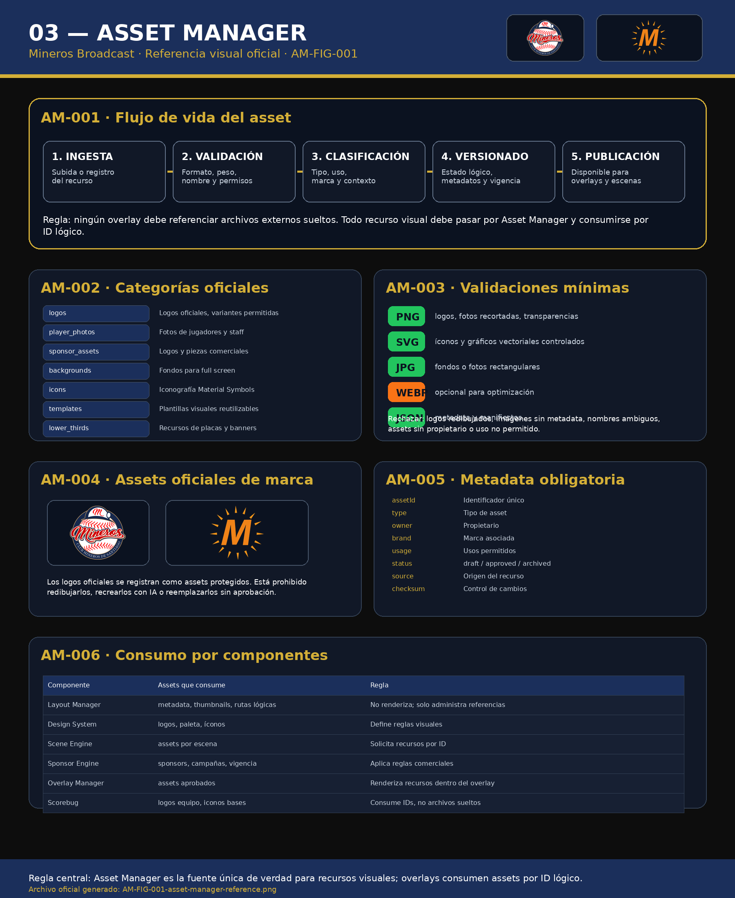
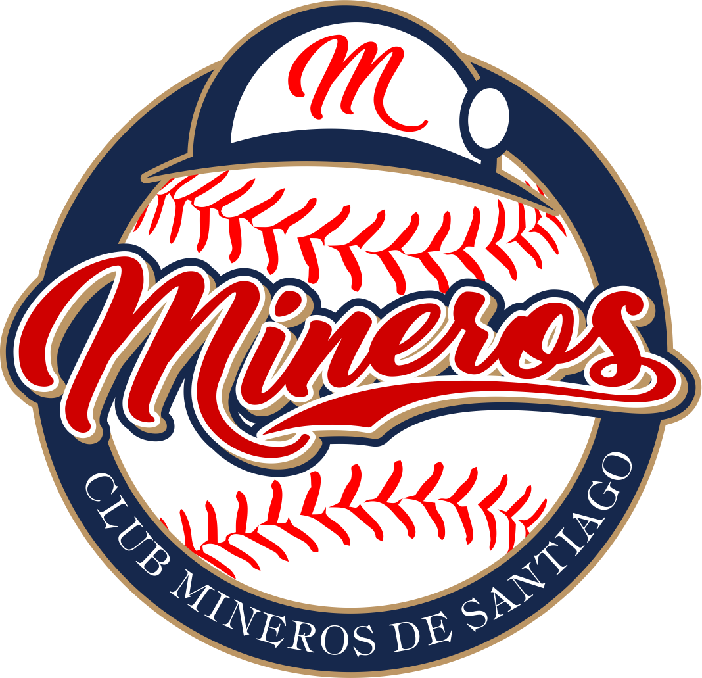

# 03 — Asset Manager

**Sistema:** Mineros Broadcast  
**Documento:** `03-asset-manager.md`  
**Versión:** `1.0.0`  
**Estado:** CERRADO PARA REVISIÓN  
**Propietario:** Club Mineros de Santiago  
**Desarrollado por:** Merchise  

---

## 0. Alcance del documento

Este documento define el **Asset Manager** de Mineros Broadcast.

El Asset Manager es la fuente única de verdad para recursos visuales usados por el sistema.

Administra:

- logos oficiales;
- fotografías;
- sponsors;
- fondos;
- íconos;
- plantillas;
- piezas comerciales;
- metadata;
- estados de aprobación;
- rutas lógicas;
- validaciones;
- permisos de uso.

El Asset Manager **no renderiza overlays**.  
El Asset Manager **no decide cuándo aparece un sponsor**.  
El Asset Manager **no modifica datos deportivos**.  
El Asset Manager entrega assets aprobados a otros componentes mediante referencias lógicas.

---

## 0.1 Documentos relacionados

| Documento | Relación |
|---|---|
| `00-master-index.md` | Índice general del sistema |
| `01-layout-manager.md` | Consume metadata y thumbnails de assets |
| `02-design-system.md` | Define reglas visuales, logos, colores, tipografías |
| `05-sponsor-engine.md` | Consume assets comerciales y reglas de sponsor |
| `08-overlay-manager.md` | Renderiza assets dentro de overlays |
| `10-scorebug.md` | Consume logos de equipos e iconos de estado |
| `15-sponsor-overlay.md` | Consume assets comerciales |

---

## AM-001 — Referencia Visual Oficial

**Figura:** `AM-FIG-001`  
**Archivo:** `03-asset-manager-assets/AM-FIG-001-asset-manager-reference.png`



La figura `AM-FIG-001` es la referencia visual normativa del Asset Manager.

La figura muestra:

- flujo de vida del asset;
- categorías oficiales;
- validaciones mínimas;
- assets oficiales de marca;
- metadata obligatoria;
- consumo por componentes;
- reglas de uso.

---

# AM-002 — Principio central

El Asset Manager debe impedir que el sistema use archivos visuales sin control.

Todo recurso visual debe ser registrado, validado, clasificado y publicado antes de ser consumido por overlays, escenas o motores.

Regla central:

```text
Ningún overlay debe referenciar archivos externos sueltos.
Todo recurso visual debe consumirse mediante assetId.
```

---

# AM-003 — Flujo de vida del asset

El flujo oficial es:

```text
Ingesta
  ↓
Validación
  ↓
Clasificación
  ↓
Versionado lógico
  ↓
Publicación
  ↓
Consumo por componentes
```

## 1. Ingesta

La ingesta registra un nuevo recurso visual en el sistema.

Origen posible:

- carga manual;
- importación;
- asset oficial del club;
- asset de sponsor;
- asset generado por diseño;
- asset aprobado desde una carpeta controlada.

## 2. Validación

La validación confirma que el recurso cumple requisitos técnicos y de uso.

Debe validar:

- formato;
- peso;
- dimensiones;
- transparencia;
- nombre;
- duplicidad;
- propietario;
- uso permitido;
- estado legal o comercial;
- metadata mínima.

## 3. Clasificación

La clasificación asigna tipo, contexto y reglas.

Ejemplos:

- `logo`;
- `player_photo`;
- `sponsor_asset`;
- `background`;
- `icon`;
- `template`;
- `lower_third`.

## 4. Versionado lógico

El versionado mantiene trazabilidad del recurso.

No significa que el nombre del archivo de especificación tenga versión.

El asset puede mantener:

- versión interna;
- checksum;
- fecha de aprobación;
- fecha de reemplazo;
- asset anterior;
- estado.

## 5. Publicación

Un asset publicado queda disponible para consumo por componentes.

Solo assets en estado `approved` pueden ser usados en Program.

---

# AM-004 — Categorías oficiales de assets

| Categoría | Descripción | Ejemplos |
|---|---|---|
| `logos` | Logos oficiales y variantes permitidas | Mineros, Merchise, equipos |
| `player_photos` | Fotos de jugadores y staff | PNG sin fondo, rectangular |
| `sponsor_assets` | Recursos comerciales | logos sponsor, banners |
| `backgrounds` | Fondos visuales | full screen, lineup |
| `icons` | Iconografía del sistema | Material Symbols |
| `templates` | Plantillas reutilizables | layout base, placas |
| `lower_thirds` | Recursos de placas | nombres, datos, cargos |
| `broadcast_graphics` | Gráficos de transmisión | headers, separadores |

---

# AM-005 — Assets oficiales de marca

## 1. Logo oficial Mineros

**Asset ID:** `AM-LOGO-001`  
**Archivo:** `03-asset-manager-assets/AM-LOGO-001-mineros-oficial.png`  
**Estado:** Protegido  
**Uso:** Marca principal del club



## 2. Logo oficial Merchise

**Asset ID:** `AM-LOGO-002`  
**Archivo:** `03-asset-manager-assets/AM-LOGO-002-merchise-oficial.png`  
**Estado:** Protegido  
**Uso:** Marca desarrolladora / soporte comercial


## 3. Regla de protección de logos

Está prohibido:

- redibujar logos;
- recrear logos con IA;
- cambiar proporciones;
- aplicar filtros no autorizados;
- alterar colores oficiales;
- recortar sin criterio;
- usar versiones no aprobadas.

Los documentos de overlays deben consumir estos logos por `assetId`.

---

# AM-006 — Formatos permitidos

| Formato | Uso permitido | Observación |
|---|---|---|
| PNG | Logos, fotos recortadas, transparencias | Recomendado para overlays |
| SVG | Íconos y recursos vectoriales controlados | Debe estar validado |
| JPG | Fondos y fotos rectangulares | Sin transparencia |
| WEBP | Optimización web | Opcional |
| JSON | Metadata y manifiestos | Obligatorio para exportación/importación |

---

# AM-007 — Validaciones mínimas

Todo asset debe validar:

- existencia de `assetId`;
- nombre legible;
- tipo;
- propietario;
- estado;
- archivo asociado;
- formato permitido;
- uso permitido;
- metadata mínima;
- checksum;
- fecha de creación;
- fecha de modificación;
- compatibilidad con Design System.

Los assets inválidos no pueden usarse en Program.

---

# AM-008 — Metadata obligatoria

Cada asset debe tener:

```json
{
  "assetId": "AM-LOGO-001",
  "name": "Logo oficial Mineros",
  "type": "logo",
  "owner": "Club Mineros de Santiago",
  "brand": "Mineros",
  "status": "approved",
  "usage": ["scorebug", "lineup", "summary", "fullscreen"],
  "file": "03-asset-manager-assets/AM-LOGO-001-mineros-oficial.png",
  "format": "png",
  "protected": true,
  "checksum": "generated-on-upload",
  "createdAt": "2026-06-23T00:00:00Z",
  "updatedAt": "2026-06-23T00:00:00Z"
}
```

---

# AM-009 — Estados del asset

| Estado | Descripción | Puede usarse en Program |
|---|---|---|
| `draft` | Asset cargado, no validado | No |
| `review` | Asset en revisión | No |
| `approved` | Asset aprobado | Sí |
| `rejected` | Asset rechazado | No |
| `archived` | Asset histórico | No, salvo recuperación |
| `expired` | Asset vencido | No |

---

# AM-010 — Reglas de consumo

Los componentes deben consumir assets por `assetId`.

Ejemplo correcto:

```json
{
  "overlay": "scorebug",
  "homeTeamLogoAssetId": "AM-TEAM-001",
  "awayTeamLogoAssetId": "AM-TEAM-002"
}
```

Ejemplo incorrecto:

```json
{
  "overlay": "scorebug",
  "homeTeamLogo": "/desktop/logos/logo-final-v3-copy.png"
}
```

---

# AM-011 — Relación con Layout Manager

El Layout Manager consume assets para:

- mostrar thumbnails;
- validar disponibilidad;
- validar permisos;
- relacionar assets a perfiles;
- relacionar assets a zonas;
- relacionar assets a escenas;
- validar Program antes de Take.

El Layout Manager no debe editar assets.

---

# AM-012 — Relación con Design System

El Design System define:

- paleta;
- tipografías;
- reglas de logos;
- uso de fotografías;
- bordes;
- sombras;
- transparencia;
- iconografía;
- espaciado.

El Asset Manager debe validar que los assets respeten el Design System.

---

# AM-013 — Relación con Sponsor Engine

El Sponsor Engine consume assets comerciales.

El Asset Manager entrega:

- logo sponsor;
- banner sponsor;
- metadata;
- vigencia;
- estado;
- restricciones de uso.

El Sponsor Engine decide cuándo y dónde se usa el sponsor según reglas comerciales.

El Asset Manager no decide rotación comercial.

---

# AM-014 — Relación con Overlay Manager

El Overlay Manager renderiza assets dentro de overlays.

Debe recibir:

- `assetId`;
- ruta resuelta;
- metadata;
- estado;
- variante permitida;
- fallback si aplica.

El Overlay Manager no debe renderizar assets en estado no aprobado.

---

# AM-015 — Permisos

| Rol | Permisos sobre assets |
|---|---|
| Administrador | Crear, editar, aprobar, archivar, eliminar |
| Productor | Seleccionar y asignar assets aprobados |
| Operador | Usar assets aprobados |
| Sponsor Manager | Cargar y administrar assets comerciales |
| Lectura | Ver assets aprobados |

---

# AM-016 — Buenas prácticas

- Usar nombres descriptivos.
- Registrar propietario.
- Usar `assetId` estable.
- Mantener logos protegidos.
- Mantener fotos en formato permitido.
- Separar assets de marca y assets comerciales.
- Archivar antes de reemplazar.
- Validar assets antes de Program.
- Usar thumbnails en interfaces de selección.

---

# AM-017 — Malas prácticas

- Referenciar archivos locales sueltos.
- Usar logos redibujados.
- Usar imágenes sin metadata.
- Usar assets sin propietario.
- Usar sponsors vencidos.
- Modificar archivos sin actualizar checksum.
- Duplicar assets con nombres ambiguos.
- Permitir assets `draft` en Program.
- Mezclar reglas comerciales dentro del Asset Manager.

---

# AM-018 — Criterios de aceptación

El documento `03-asset-manager.md` queda cerrado cuando:

- existe referencia visual `AM-FIG-001`;
- existen categorías oficiales;
- existen formatos permitidos;
- existen validaciones mínimas;
- existe metadata obligatoria;
- existen estados de asset;
- existen assets oficiales de marca;
- se protege el logo Mineros;
- se protege el logo Merchise;
- se define consumo por `assetId`;
- se define relación con Layout Manager;
- se define relación con Design System;
- se define relación con Sponsor Engine;
- se define relación con Overlay Manager;
- se definen permisos;
- se definen buenas prácticas;
- se definen malas prácticas.

---

# Historial del documento

| Versión | Estado | Descripción |
|---|---|---|
| 1.0.0 | Cerrado para revisión | Primera versión completa del Asset Manager con referencia gráfica oficial |
