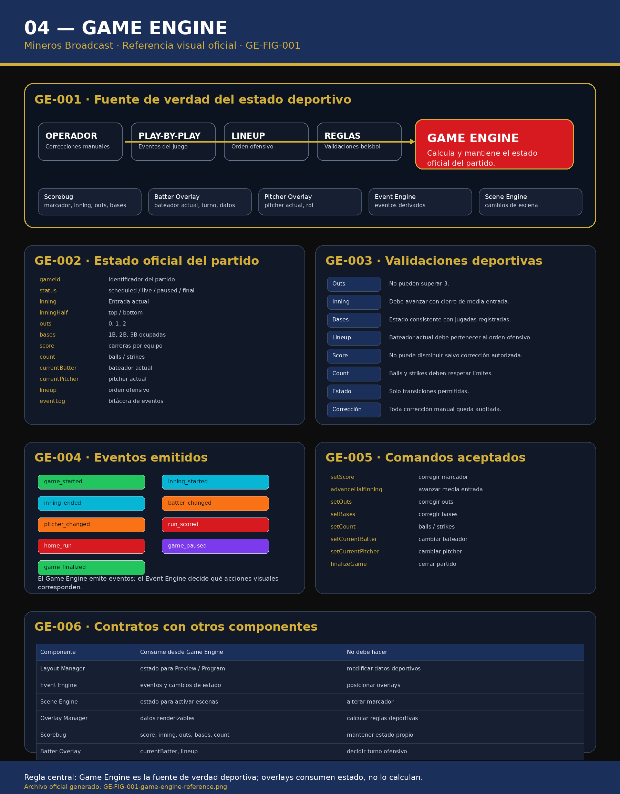

# 04 — Game Engine

**Sistema:** Mineros Broadcast  
**Documento:** `04-game-engine.md`  
**Versión:** `1.0.0`  
**Estado:** CERRADO PARA REVISIÓN  
**Propietario:** Club Mineros de Santiago  
**Desarrollado por:** Merchise  

---

## 0. Alcance del documento

Este documento define el **Game Engine** de Mineros Broadcast.

El Game Engine es la fuente de verdad del estado deportivo del partido.

Administra:

- equipos;
- marcador;
- inning;
- mitad de inning;
- outs;
- bases ocupadas;
- conteo de balls y strikes;
- bateador actual;
- pitcher actual;
- lineup;
- estado del juego;
- eventos deportivos;
- correcciones manuales auditadas.

El Game Engine **no renderiza overlays**.  
El Game Engine **no decide posiciones visuales**.  
El Game Engine **no administra sponsors**.  
El Game Engine **no reemplaza al Layout Manager**.  
El Game Engine entrega estado y eventos a otros componentes.

---

## 0.1 Documentos relacionados

| Documento | Relación |
|---|---|
| `01-layout-manager.md` | Consume estado deportivo para Preview / Program |
| `02-design-system.md` | Define apariencia de visualización |
| `03-asset-manager.md` | Entrega logos y recursos asociados a equipos |
| `05-sponsor-engine.md` | Puede reaccionar a momentos del juego |
| `06-event-engine.md` | Consume eventos emitidos por Game Engine |
| `07-scene-engine.md` | Puede activar escenas según estado del juego |
| `08-overlay-manager.md` | Renderiza overlays con datos del Game Engine |
| `10-scorebug.md` | Consume marcador, inning, outs, bases y conteo |
| `11-batter-overlay.md` | Consume bateador actual y lineup |

---

# GE-001 — Referencia Visual Oficial

**Figura:** `GE-FIG-001`  
**Archivo:** `04-game-engine-assets/GE-FIG-001-game-engine-reference.png`



La figura `GE-FIG-001` es la referencia visual normativa del Game Engine.

La figura muestra:

- entradas al motor deportivo;
- estado oficial del partido;
- validaciones deportivas;
- eventos emitidos;
- comandos aceptados;
- contratos con otros componentes;
- relación con overlays.

---

# GE-002 — Principio central

El Game Engine mantiene el estado deportivo oficial.

Regla central:

```text
El Game Engine calcula y mantiene datos deportivos.
Los overlays solo consumen esos datos.
```

Ningún overlay debe mantener su propio marcador, inning, outs o bases.

---

# GE-003 — Modelo de estado del partido

El estado mínimo del partido debe incluir:

```json
{
  "gameId": "game-2026-001",
  "status": "live",
  "homeTeam": {
    "id": "team-mineros",
    "name": "Mineros",
    "shortName": "MIN",
    "logoAssetId": "AM-LOGO-001"
  },
  "awayTeam": {
    "id": "team-rival",
    "name": "Rival",
    "shortName": "RIV",
    "logoAssetId": "AM-TEAM-002"
  },
  "inning": 3,
  "inningHalf": "top",
  "outs": 1,
  "bases": {
    "first": true,
    "second": false,
    "third": true
  },
  "count": {
    "balls": 2,
    "strikes": 1
  },
  "score": {
    "home": 4,
    "away": 2
  },
  "currentBatterId": "player-018",
  "currentPitcherId": "player-031",
  "lineup": {
    "home": [],
    "away": []
  },
  "eventLog": []
}
```

---

# GE-004 — Estados del juego

| Estado | Descripción |
|---|---|
| `scheduled` | Partido programado |
| `pre_game` | Preparación antes del inicio |
| `live` | Partido en curso |
| `paused` | Partido pausado |
| `between_innings` | Cambio de entrada |
| `final` | Partido finalizado |
| `cancelled` | Partido cancelado |
| `suspended` | Partido suspendido |

---

# GE-005 — Inning y mitad de inning

El Game Engine debe representar:

- número de entrada;
- parte alta;
- parte baja;
- estado entre entradas.

Valores permitidos:

```text
top
bottom
```

Reglas:

- `top` representa ataque del equipo visitante.
- `bottom` representa ataque del equipo local.
- Al cerrar `top`, se pasa a `bottom` del mismo inning.
- Al cerrar `bottom`, se avanza al siguiente inning en `top`.
- El cambio de media entrada debe limpiar outs, bases y conteo.

---

# GE-006 — Outs

Los outs deben cumplir:

```text
0 <= outs <= 2
```

Al registrar el tercer out, el sistema debe disparar cierre de media entrada.

El estado persistido no debe quedar en `outs = 3` como estado estable.

---

# GE-007 — Bases ocupadas

El Game Engine debe modelar las bases como estado booleano:

```json
{
  "first": true,
  "second": false,
  "third": true
}
```

Reglas:

- Cada base puede estar ocupada o libre.
- No debe existir más de un corredor lógico en la misma base.
- El cambio de media entrada limpia las bases.
- Las correcciones manuales deben quedar auditadas.

---

# GE-008 — Conteo

El conteo debe representar:

- balls;
- strikes.

Estructura:

```json
{
  "balls": 2,
  "strikes": 1
}
```

Reglas mínimas:

- balls no puede ser negativo;
- strikes no puede ser negativo;
- el conteo debe reiniciarse al cambiar bateador;
- el conteo debe reiniciarse en cambio de media entrada.

---

# GE-009 — Marcador

El marcador debe representar carreras del equipo local y visitante.

```json
{
  "home": 4,
  "away": 2
}
```

Reglas:

- el marcador no puede ser negativo;
- el marcador no debe disminuir salvo corrección manual autorizada;
- toda corrección manual debe registrarse en auditoría;
- los overlays consumen marcador desde Game Engine.

---

# GE-010 — Equipos

Cada equipo debe tener:

```json
{
  "id": "team-mineros",
  "name": "Mineros",
  "shortName": "MIN",
  "logoAssetId": "AM-LOGO-001",
  "role": "home"
}
```

Reglas:

- `shortName` debe ser apto para Scorebug.
- `logoAssetId` debe existir en Asset Manager.
- El equipo local y visitante deben estar definidos antes de iniciar Program.

---

# GE-011 — Lineup

El lineup representa el orden ofensivo de cada equipo.

Cada entrada de lineup debe incluir:

```json
{
  "order": 1,
  "playerId": "player-018",
  "name": "Jugador Ejemplo",
  "number": "12",
  "position": "SS",
  "status": "active"
}
```

Reglas:

- el bateador actual debe pertenecer al lineup activo;
- el orden ofensivo debe avanzar de forma consistente;
- cambios manuales deben registrarse;
- sustituciones deben quedar auditadas.

---

# GE-012 — Bateador actual

El bateador actual se define por:

```json
{
  "currentBatterId": "player-018",
  "teamId": "team-mineros",
  "lineupOrder": 4
}
```

Reglas:

- al cambiar bateador se reinicia el conteo;
- el cambio puede disparar evento `batter_changed`;
- Batter Overlay debe consumir este dato;
- Scorebug puede consumir nombre corto si corresponde.

---

# GE-013 — Pitcher actual

El pitcher actual se define por:

```json
{
  "currentPitcherId": "player-031",
  "teamId": "team-rival"
}
```

Reglas:

- cambio de pitcher dispara evento `pitcher_changed`;
- Pitcher Overlay consume este dato;
- el pitcher pertenece al equipo defensivo.

---

# GE-014 — Comandos aceptados

El Game Engine debe exponer comandos controlados.

| Comando | Descripción |
|---|---|
| `startGame` | Inicia partido |
| `pauseGame` | Pausa partido |
| `resumeGame` | Reanuda partido |
| `finalizeGame` | Finaliza partido |
| `setScore` | Corrige marcador |
| `incrementScore` | Suma carrera |
| `setOuts` | Corrige outs |
| `addOut` | Agrega out |
| `setBases` | Corrige bases |
| `clearBases` | Limpia bases |
| `setCount` | Corrige conteo |
| `resetCount` | Reinicia conteo |
| `setCurrentBatter` | Cambia bateador |
| `setCurrentPitcher` | Cambia pitcher |
| `advanceHalfInning` | Avanza media entrada |
| `setLineup` | Define lineup |

---

# GE-015 — Eventos emitidos

El Game Engine puede emitir eventos para otros componentes.

| Evento | Descripción |
|---|---|
| `game_started` | Inicio del partido |
| `game_paused` | Partido pausado |
| `game_resumed` | Partido reanudado |
| `game_finalized` | Partido finalizado |
| `inning_started` | Inicio de entrada |
| `inning_ended` | Fin de media entrada |
| `batter_changed` | Cambio de bateador |
| `pitcher_changed` | Cambio de pitcher |
| `run_scored` | Carrera anotada |
| `home_run` | Home Run |
| `bases_changed` | Cambio de bases |
| `outs_changed` | Cambio de outs |
| `count_changed` | Cambio de conteo |
| `score_corrected` | Corrección manual de marcador |
| `lineup_changed` | Cambio de lineup |

---

# GE-016 — Contrato de evento

Todo evento emitido debe tener estructura mínima:

```json
{
  "eventId": "evt-000001",
  "eventType": "batter_changed",
  "gameId": "game-2026-001",
  "timestamp": "2026-06-23T00:00:00Z",
  "source": "GameEngine",
  "payload": {
    "previousBatterId": "player-017",
    "currentBatterId": "player-018"
  }
}
```

---

# GE-017 — Auditoría

Toda acción manual debe quedar auditada.

Debe registrar:

- identificador;
- fecha;
- operador;
- comando ejecutado;
- estado anterior;
- estado nuevo;
- motivo si corresponde;
- origen de la acción.

Ejemplo:

```json
{
  "auditId": "audit-000010",
  "timestamp": "2026-06-23T00:00:00Z",
  "operatorId": "operator-001",
  "command": "setScore",
  "reason": "Corrección de anotación",
  "previousState": {
    "home": 3,
    "away": 2
  },
  "newState": {
    "home": 4,
    "away": 2
  }
}
```

---

# GE-018 — Validaciones deportivas mínimas

El Game Engine debe validar:

- outs entre 0 y 2 como estado estable;
- inning mayor o igual a 1;
- marcador no negativo;
- balls no negativas;
- strikes no negativos;
- bases consistentes;
- bateador actual perteneciente al lineup;
- pitcher actual perteneciente al equipo defensivo;
- estado del juego compatible con el comando;
- lineup definido antes de iniciar transmisión oficial.

---

# GE-019 — Relación con Layout Manager

El Layout Manager consume estado deportivo para:

- Preview;
- Program;
- validación de overlays;
- escenas basadas en estado;
- visualización de información operativa.

El Layout Manager no debe modificar estado deportivo directamente.

Toda modificación deportiva debe entrar como comando al Game Engine.

---

# GE-020 — Relación con Event Engine

El Event Engine consume eventos emitidos por Game Engine.

El Event Engine decide acciones visuales según eventos.

El Game Engine no debe decidir visualización.

Ejemplo:

```text
Game Engine emite batter_changed
Event Engine decide mostrar Batter Overlay
Layout Manager asigna zona
Overlay Manager renderiza
```

---

# GE-021 — Relación con Scene Engine

El Scene Engine puede reaccionar a eventos o estados.

Ejemplo:

- `inning_ended` puede solicitar escena `Fin Entrada`.
- `game_started` puede solicitar escena `Inicio Partido`.
- `game_finalized` puede solicitar escena `Cierre`.

El Game Engine no activa escenas directamente.

---

# GE-022 — Relación con Overlay Manager

El Overlay Manager consume datos normalizados del Game Engine.

Overlays que dependen de Game Engine:

- Scorebug;
- Batter Overlay;
- Pitcher Overlay;
- Lineup;
- Next Batters;
- Inning Summary.

Los overlays no deben calcular datos deportivos propios.

---

# GE-023 — Buenas prácticas

- Mantener Game Engine como fuente única de verdad deportiva.
- Registrar toda corrección manual.
- Emitir eventos después de cambios relevantes.
- Mantener estado normalizado.
- Separar comandos de eventos.
- Validar antes de persistir.
- Evitar lógica visual dentro del Game Engine.
- Evitar lógica comercial dentro del Game Engine.

---

# GE-024 — Malas prácticas

- Que un overlay mantenga su propio marcador.
- Que Layout Manager modifique outs o inning directamente.
- Que Game Engine decida mostrar un overlay.
- Que Game Engine calcule rotación de sponsors.
- Que se permita marcador negativo.
- Que se mantenga `outs = 3` como estado estable.
- Que se cambie bateador sin reiniciar conteo.
- Que se corrija marcador sin auditoría.

---

# GE-025 — Criterios de aceptación

El documento `04-game-engine.md` queda cerrado cuando:

- existe referencia visual `GE-FIG-001`;
- existe modelo de estado del partido;
- existen estados del juego;
- existe modelo de inning;
- existe modelo de outs;
- existe modelo de bases;
- existe modelo de conteo;
- existe modelo de marcador;
- existe modelo de equipos;
- existe modelo de lineup;
- existen comandos aceptados;
- existen eventos emitidos;
- existe contrato de evento;
- existe auditoría;
- existen validaciones deportivas mínimas;
- queda clara la relación con Layout Manager;
- queda clara la relación con Event Engine;
- queda clara la relación con Scene Engine;
- queda clara la relación con Overlay Manager;
- queda claro que overlays consumen datos y no los calculan.

---

# Historial del documento

| Versión | Estado | Descripción |
|---|---|---|
| 1.0.0 | Cerrado para revisión | Primera versión completa del Game Engine con referencia gráfica oficial |
