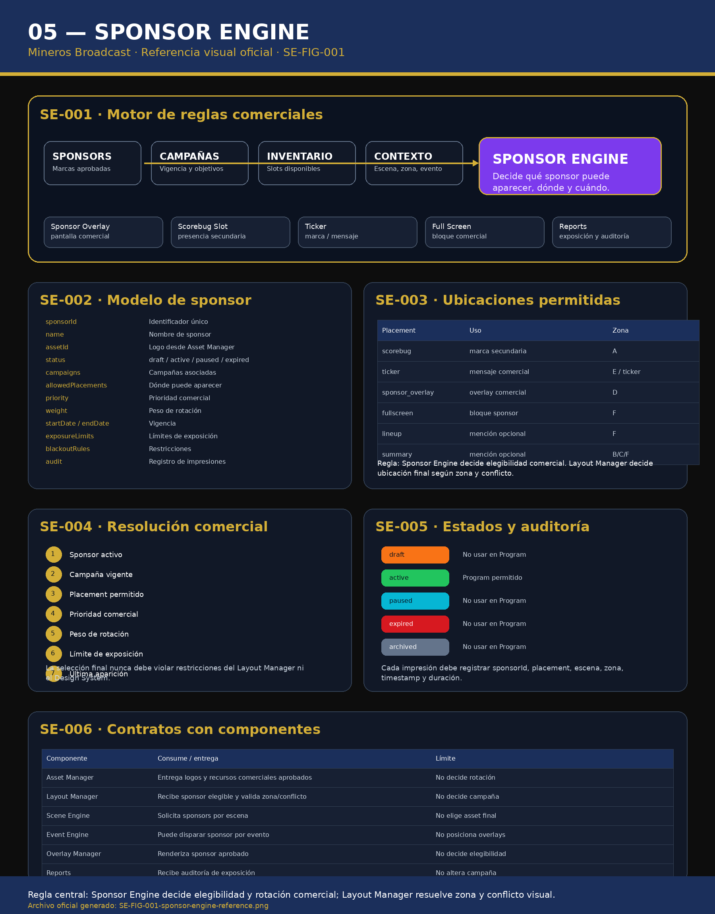

# 05 — Sponsor Engine

**Sistema:** Mineros Broadcast  
**Documento:** `05-sponsor-engine.md`  
**Versión:** `1.0.0`  
**Estado:** CERRADO PARA REVISIÓN  
**Propietario:** Club Mineros de Santiago  
**Desarrollado por:** Merchise  

---

## 0. Alcance del documento

Este documento define el **Sponsor Engine** de Mineros Broadcast.

El Sponsor Engine administra reglas comerciales para determinar qué sponsor puede aparecer, cuándo puede aparecer, dónde puede aparecer y bajo qué restricciones.

Administra:

- sponsors;
- campañas;
- placements;
- prioridades comerciales;
- pesos de rotación;
- vigencias;
- límites de exposición;
- restricciones;
- auditoría de impresiones;
- disponibilidad comercial por escena, zona o evento.

El Sponsor Engine **no renderiza overlays**.  
El Sponsor Engine **no posiciona overlays**.  
El Sponsor Engine **no modifica datos deportivos**.  
El Sponsor Engine **no reemplaza al Asset Manager**.  
El Sponsor Engine entrega decisiones comerciales al Layout Manager, Scene Engine, Event Engine u Overlay Manager según corresponda.

---

## 0.1 Documentos relacionados

| Documento | Relación |
|---|---|
| `01-layout-manager.md` | Valida zona, conflicto y visibilidad final |
| `02-design-system.md` | Define cómo se visualizan logos y componentes |
| `03-asset-manager.md` | Entrega logos y piezas comerciales aprobadas |
| `04-game-engine.md` | Puede entregar contexto deportivo para activaciones |
| `06-event-engine.md` | Puede disparar activaciones comerciales |
| `07-scene-engine.md` | Puede solicitar sponsors por escena |
| `08-overlay-manager.md` | Renderiza overlays comerciales |
| `15-sponsor-overlay.md` | Overlay específico de sponsor |
| `16-ticker.md` | Puede mostrar mensajes comerciales |

---

# SE-001 — Referencia Visual Oficial

**Figura:** `SE-FIG-001`  
**Archivo:** `05-sponsor-engine-assets/SE-FIG-001-sponsor-engine-reference.png`



La figura `SE-FIG-001` es la referencia visual normativa del Sponsor Engine.

La figura muestra:

- entradas comerciales;
- motor de reglas;
- modelo de sponsor;
- ubicaciones permitidas;
- resolución comercial;
- estados;
- auditoría;
- contratos con componentes.

---

# SE-002 — Principio central

El Sponsor Engine decide elegibilidad comercial y rotación.

Regla central:

```text
Sponsor Engine decide qué sponsor es elegible.
Layout Manager decide si puede mostrarse visualmente en una zona.
Overlay Manager renderiza el resultado.
```

---

# SE-003 — Modelo de sponsor

Cada sponsor debe tener:

```json
{
  "sponsorId": "sponsor-001",
  "name": "Sponsor Ejemplo",
  "brand": "Sponsor Ejemplo",
  "assetId": "AM-SPONSOR-001",
  "status": "active",
  "priority": 80,
  "weight": 10,
  "allowedPlacements": ["sponsor_overlay", "ticker", "fullscreen"],
  "campaignIds": ["campaign-001"],
  "startDate": "2026-06-01T00:00:00Z",
  "endDate": "2026-12-31T23:59:59Z",
  "exposureLimits": {
    "maxPerGame": 20,
    "minSecondsBetween": 120
  },
  "blackoutRules": [],
  "metadata": {
    "owner": "Sponsor Manager",
    "createdAt": "2026-06-23T00:00:00Z"
  }
}
```

---

# SE-004 — Modelo de campaña

Una campaña agrupa reglas comerciales asociadas a uno o más sponsors.

```json
{
  "campaignId": "campaign-001",
  "name": "Temporada Regular 2026",
  "sponsorIds": ["sponsor-001", "sponsor-002"],
  "status": "active",
  "placements": ["ticker", "sponsor_overlay"],
  "startDate": "2026-06-01T00:00:00Z",
  "endDate": "2026-12-31T23:59:59Z",
  "rules": {
    "rotationMode": "weighted",
    "allowDuringLivePlay": false,
    "allowBetweenInnings": true
  }
}
```

---

# SE-005 — Estados de sponsor

| Estado | Descripción | Puede usarse en Program |
|---|---|---|
| `draft` | Sponsor registrado pero no aprobado | No |
| `review` | En revisión comercial | No |
| `active` | Sponsor activo y vigente | Sí |
| `paused` | Pausado temporalmente | No |
| `expired` | Vencido por fecha | No |
| `archived` | Histórico | No |

---

# SE-006 — Placements oficiales

| Placement | Uso | Zona recomendada |
|---|---|---|
| `scorebug` | Marca secundaria junto al scorebug | Zona A |
| `ticker` | Mensaje comercial breve | Zona E / ticker |
| `sponsor_overlay` | Overlay comercial dedicado | Zona D |
| `fullscreen` | Bloque comercial completo | Zona F |
| `lineup` | Mención dentro de lineup | Zona F |
| `summary` | Mención en resumen | Zona B / C / F |

---

# SE-007 — Resolución comercial

Cuando existen varios sponsors elegibles, el sistema debe resolver usando:

1. Sponsor activo.
2. Campaña vigente.
3. Placement permitido.
4. Prioridad comercial.
5. Peso de rotación.
6. Límite de exposición.
7. Última aparición.
8. Restricciones por escena, zona o evento.

La selección comercial no puede violar reglas visuales del Layout Manager.

---

# SE-008 — Pesos de rotación

El peso de rotación permite favorecer un sponsor sobre otro.

Ejemplo:

```json
[
  {
    "sponsorId": "sponsor-001",
    "weight": 70
  },
  {
    "sponsorId": "sponsor-002",
    "weight": 30
  }
]
```

Esto no garantiza aparición exacta por porcentaje, pero orienta la rotación.

---

# SE-009 — Límites de exposición

El Sponsor Engine debe poder limitar exposición por:

- partido;
- inning;
- escena;
- bloque de tiempo;
- placement;
- sponsor;
- campaña.

Ejemplo:

```json
{
  "maxPerGame": 20,
  "maxPerInning": 3,
  "minSecondsBetween": 120,
  "maxDurationSeconds": 15
}
```

---

# SE-010 — Restricciones

Las restricciones pueden impedir una aparición aunque el sponsor esté activo.

Ejemplos:

- no mostrar durante jugada en vivo;
- solo mostrar entre entradas;
- no mostrar sobre Zona A;
- no mostrar junto a otro sponsor;
- no mostrar en categoría específica;
- no mostrar después de vencimiento;
- no mostrar sin asset aprobado.

---

# SE-011 — Auditoría de exposición

Cada aparición de sponsor debe registrar:

```json
{
  "impressionId": "imp-000001",
  "sponsorId": "sponsor-001",
  "campaignId": "campaign-001",
  "placement": "ticker",
  "zoneId": "zone-e",
  "sceneId": "scene-between-innings",
  "gameId": "game-2026-001",
  "startedAt": "2026-06-23T00:00:00Z",
  "endedAt": "2026-06-23T00:00:10Z",
  "durationSeconds": 10,
  "trigger": "manual"
}
```

---

# SE-012 — Activación manual

Un operador autorizado puede solicitar un sponsor manualmente.

El sistema debe validar:

- sponsor activo;
- campaña vigente;
- asset aprobado;
- placement permitido;
- zona disponible;
- conflictos visuales;
- límites de exposición;
- permisos del operador.

La activación manual debe ir a Preview si afecta Program.

---

# SE-013 — Activación automática

El Sponsor Engine puede responder a solicitudes automáticas desde:

- Event Engine;
- Scene Engine;
- Layout Manager;
- programación temporal;
- reglas entre innings.

Ejemplo:

```json
{
  "trigger": "inning_ended",
  "requestedPlacement": "sponsor_overlay",
  "preferredZone": "D",
  "mode": "preview"
}
```

---

# SE-014 — Relación con Asset Manager

El Asset Manager entrega assets comerciales aprobados.

El Sponsor Engine consume:

- logo;
- banner;
- pieza full screen;
- metadata;
- vigencia;
- estado del asset.

Regla:

```text
Sponsor Engine no debe usar assets no aprobados.
```

---

# SE-015 — Relación con Layout Manager

El Layout Manager valida:

- zona;
- Safe Area;
- conflictos;
- Preview / Program;
- locks;
- disponibilidad visual.

El Sponsor Engine no debe imponer posición visual directa.

---

# SE-016 — Relación con Event Engine

El Event Engine puede disparar una solicitud comercial.

Ejemplo:

```text
inning_ended
  ↓
Event Engine solicita sponsor entre entradas
  ↓
Sponsor Engine elige sponsor elegible
  ↓
Layout Manager valida zona y conflicto
  ↓
Overlay Manager renderiza
```

---

# SE-017 — Relación con Scene Engine

El Scene Engine puede declarar una escena como apta para sponsors.

Ejemplos:

- Fin Entrada.
- Lineup.
- Cierre.
- Presentación Equipos.
- MVP.

El Sponsor Engine decide qué sponsor elegible se asigna a esa escena.

---

# SE-018 — Relación con Overlay Manager

El Overlay Manager recibe:

- sponsor elegido;
- assetId;
- placement;
- duración;
- zona validada;
- metadata.

El Overlay Manager renderiza, pero no decide elegibilidad comercial.

---

# SE-019 — Permisos

| Rol | Permisos |
|---|---|
| Administrador | Control total |
| Productor | Activar sponsors y aprobar usos |
| Sponsor Manager | Crear, editar y pausar sponsors |
| Operador | Activar sponsors permitidos |
| Lectura | Ver sponsors y exposición |

---

# SE-020 — Buenas prácticas

- Definir vigencia para toda campaña.
- Usar assets aprobados desde Asset Manager.
- Separar prioridad comercial de prioridad visual.
- Registrar toda impresión.
- Evitar saturación comercial.
- Validar Preview antes de Program.
- Usar placements específicos.
- Respetar zonas críticas del juego.

---

# SE-021 — Malas prácticas

- Mostrar sponsors vencidos.
- Usar assets no aprobados.
- Posicionar sponsors desde Sponsor Engine.
- Invadir Zona A sin regla explícita.
- Mostrar sponsor durante jugada en vivo si no está permitido.
- No auditar impresiones.
- Mezclar lógica comercial dentro de overlays.
- Repetir el mismo sponsor sin respetar frecuencia mínima.

---

# SE-022 — Criterios de aceptación

El documento `05-sponsor-engine.md` queda cerrado cuando:

- existe referencia visual `SE-FIG-001`;
- existe modelo de sponsor;
- existe modelo de campaña;
- existen estados;
- existen placements oficiales;
- existe resolución comercial;
- existen pesos de rotación;
- existen límites de exposición;
- existen restricciones;
- existe auditoría de exposición;
- existe activación manual;
- existe activación automática;
- queda clara la relación con Asset Manager;
- queda clara la relación con Layout Manager;
- queda clara la relación con Event Engine;
- queda clara la relación con Scene Engine;
- queda clara la relación con Overlay Manager;
- queda claro que Sponsor Engine no renderiza ni posiciona overlays.

---

# Historial del documento

| Versión | Estado | Descripción |
|---|---|---|
| 1.0.0 | Cerrado para revisión | Primera versión completa del Sponsor Engine con referencia gráfica oficial |
