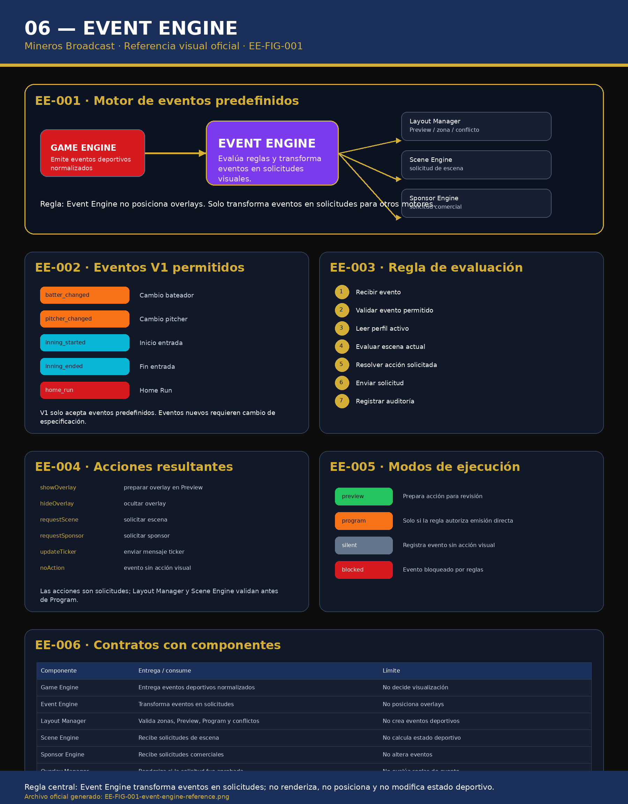

# 06 — Event Engine

**Sistema:** Mineros Broadcast  
**Documento:** `06-event-engine.md`  
**Versión:** `1.0.0`  
**Estado:** CERRADO PARA REVISIÓN  
**Propietario:** Club Mineros de Santiago  
**Desarrollado por:** Merchise  

---

## 0. Alcance del documento

Este documento define el **Event Engine** de Mineros Broadcast.

El Event Engine transforma eventos deportivos normalizados en solicitudes visuales, operativas o comerciales.

Administra:

- recepción de eventos;
- validación de eventos permitidos;
- evaluación de reglas;
- activación de solicitudes;
- priorización de acciones;
- auditoría de eventos procesados;
- integración con Layout Manager;
- integración con Scene Engine;
- integración con Sponsor Engine.

El Event Engine **no renderiza overlays**.  
El Event Engine **no posiciona overlays**.  
El Event Engine **no modifica datos deportivos**.  
El Event Engine **no reemplaza al Game Engine**.  
El Event Engine **no ejecuta Program directamente salvo regla explícita**.

---

## 0.1 Documentos relacionados

| Documento | Relación |
|---|---|
| `01-layout-manager.md` | Recibe solicitudes y valida Preview / Program |
| `04-game-engine.md` | Emite eventos deportivos normalizados |
| `05-sponsor-engine.md` | Puede recibir solicitudes comerciales |
| `07-scene-engine.md` | Puede recibir solicitudes de escena |
| `08-overlay-manager.md` | Renderiza overlays si la acción fue aprobada |
| `10-scorebug.md` | Puede reaccionar a eventos de estado |
| `11-batter-overlay.md` | Puede activarse por cambio de bateador |

---

# EE-001 — Referencia Visual Oficial

**Figura:** `EE-FIG-001`  
**Archivo:** `06-event-engine-assets/EE-FIG-001-event-engine-reference.png`



La figura `EE-FIG-001` es la referencia visual normativa del Event Engine.

La figura muestra:

- origen de eventos;
- motor de reglas;
- eventos V1 permitidos;
- regla de evaluación;
- acciones resultantes;
- modos de ejecución;
- contratos con componentes.

---

# EE-002 — Principio central

El Event Engine no decide visualización final.

Regla central:

```text
Game Engine emite eventos.
Event Engine transforma eventos en solicitudes.
Layout Manager, Scene Engine o Sponsor Engine validan y ejecutan.
Overlay Manager renderiza.
```

---

# EE-003 — Eventos V1 permitidos

En V1, el Event Engine debe aceptar únicamente los siguientes eventos:

| Evento | Descripción | Origen esperado |
|---|---|---|
| `batter_changed` | Cambio de bateador | Game Engine |
| `pitcher_changed` | Cambio de pitcher | Game Engine |
| `inning_started` | Inicio de entrada | Game Engine |
| `inning_ended` | Fin de entrada | Game Engine |
| `home_run` | Home Run | Game Engine |

Eventos fuera de esta lista deben rechazarse o registrarse como no soportados.

---

# EE-004 — Contrato de evento recibido

Todo evento recibido debe cumplir esta estructura mínima:

```json
{
  "eventId": "evt-000001",
  "eventType": "batter_changed",
  "gameId": "game-2026-001",
  "timestamp": "2026-06-23T00:00:00Z",
  "source": "GameEngine",
  "payload": {
    "previousBatterId": "player-017",
    "currentBatterId": "player-018"
  }
}
```

---

# EE-005 — Flujo de evaluación

El flujo oficial del Event Engine es:

```text
Recibir evento
  ↓
Validar evento permitido
  ↓
Leer perfil activo
  ↓
Evaluar escena actual
  ↓
Evaluar reglas del evento
  ↓
Construir solicitud
  ↓
Enviar solicitud a componente correspondiente
  ↓
Registrar auditoría
```

---

# EE-006 — Acciones resultantes

El Event Engine puede producir las siguientes acciones:

| Acción | Descripción | Destino |
|---|---|---|
| `showOverlay` | Solicita mostrar overlay | Layout Manager |
| `hideOverlay` | Solicita ocultar overlay | Layout Manager |
| `requestScene` | Solicita activar escena | Scene Engine |
| `requestSponsor` | Solicita sponsor elegible | Sponsor Engine |
| `updateTicker` | Solicita mensaje ticker | Layout Manager / Overlay Manager |
| `noAction` | Evento registrado sin acción visual | Auditoría |

---

# EE-007 — Modos de ejecución

| Modo | Descripción |
|---|---|
| `preview` | Prepara acción para revisión en Preview |
| `program` | Ejecuta si la regla permite emisión directa |
| `silent` | Registra evento sin acción visual |
| `blocked` | Bloquea evento por reglas o conflicto |

Regla:

```text
El modo por defecto debe ser preview.
```

---

# EE-008 — Reglas por evento

## 1. Cambio bateador

Evento:

```text
batter_changed
```

Acciones posibles:

- mostrar Batter Overlay;
- actualizar Next Batters;
- actualizar ticker contextual;
- solicitar escena Cambio Bateador.

Modo recomendado:

```text
preview
```

## 2. Cambio pitcher

Evento:

```text
pitcher_changed
```

Acciones posibles:

- mostrar Pitcher Overlay;
- actualizar matchup;
- solicitar escena Cambio Pitcher si existe.

Modo recomendado:

```text
preview
```

## 3. Inicio entrada

Evento:

```text
inning_started
```

Acciones posibles:

- limpiar overlays temporales;
- actualizar Scorebug;
- solicitar escena Inicio Entrada;
- reiniciar reglas de sponsor por entrada.

Modo recomendado:

```text
preview
```

## 4. Fin entrada

Evento:

```text
inning_ended
```

Acciones posibles:

- solicitar Inning Summary;
- solicitar Sponsor Overlay;
- solicitar escena Fin Entrada;
- actualizar ticker.

Modo recomendado:

```text
preview
```

## 5. Home Run

Evento:

```text
home_run
```

Acciones posibles:

- solicitar escena Home Run si existe;
- solicitar overlay de celebración;
- solicitar sponsor contextual si aplica;
- actualizar Scorebug después del cambio de marcador.

Modo recomendado:

```text
preview
```

---

# EE-009 — Solicitud al Layout Manager

Ejemplo de solicitud:

```json
{
  "requestId": "req-000001",
  "source": "EventEngine",
  "eventId": "evt-000001",
  "action": "showOverlay",
  "overlay": "batter",
  "preferredZone": "B",
  "mode": "preview",
  "priority": 80,
  "payload": {
    "currentBatterId": "player-018"
  }
}
```

El Layout Manager debe validar:

- zona;
- Safe Area;
- conflictos;
- locks;
- perfil activo;
- estado Preview / Program.

---

# EE-010 — Solicitud al Scene Engine

Ejemplo:

```json
{
  "requestId": "req-000002",
  "source": "EventEngine",
  "eventId": "evt-000010",
  "action": "requestScene",
  "sceneId": "scene-inning-summary",
  "mode": "preview",
  "priority": 90
}
```

El Scene Engine decide si la escena existe y puede activarse.

---

# EE-011 — Solicitud al Sponsor Engine

Ejemplo:

```json
{
  "requestId": "req-000003",
  "source": "EventEngine",
  "eventId": "evt-000020",
  "action": "requestSponsor",
  "placement": "sponsor_overlay",
  "preferredZone": "D",
  "mode": "preview",
  "context": {
    "trigger": "inning_ended"
  }
}
```

El Sponsor Engine decide elegibilidad comercial.

---

# EE-012 — Auditoría

Cada evento procesado debe registrar:

```json
{
  "auditId": "ee-audit-000001",
  "eventId": "evt-000001",
  "eventType": "batter_changed",
  "receivedAt": "2026-06-23T00:00:00Z",
  "processedAt": "2026-06-23T00:00:01Z",
  "result": "request_sent",
  "target": "LayoutManager",
  "action": "showOverlay",
  "mode": "preview"
}
```

---

# EE-013 — Validaciones mínimas

El Event Engine debe validar:

- evento permitido;
- `eventId` presente;
- `eventType` presente;
- `gameId` presente;
- `timestamp` presente;
- `source` permitido;
- payload mínimo;
- perfil activo si la acción depende de perfil;
- escena activa si la acción depende de escena;
- destino válido.

---

# EE-014 — Rechazo de eventos

Un evento debe rechazarse cuando:

- el tipo no está permitido en V1;
- falta información obligatoria;
- el origen no es confiable;
- el evento ya fue procesado;
- el estado del partido no permite la acción;
- el perfil activo bloquea ese evento;
- el sistema está en modo bloqueado.

El rechazo debe auditarse.

---

# EE-015 — Relación con Game Engine

El Game Engine emite eventos deportivos normalizados.

El Event Engine consume esos eventos.

El Event Engine no debe modificar el estado deportivo.

---

# EE-016 — Relación con Layout Manager

El Layout Manager recibe solicitudes visuales.

El Event Engine no debe posicionar overlays.

Toda acción visual debe pasar por Layout Manager cuando implique zona, Preview, Program o conflicto.

---

# EE-017 — Relación con Scene Engine

El Event Engine puede solicitar escenas.

El Scene Engine valida existencia, disponibilidad, prioridad y compatibilidad de escena.

El Event Engine no activa escenas directamente en Program.

---

# EE-018 — Relación con Sponsor Engine

El Event Engine puede solicitar activación comercial contextual.

El Sponsor Engine decide sponsor elegible.

El Event Engine no decide rotación comercial.

---

# EE-019 — Relación con Overlay Manager

El Overlay Manager renderiza únicamente acciones ya aprobadas por Layout Manager o Scene Engine.

El Event Engine no debe renderizar overlays directamente.

---

# EE-020 — Buenas prácticas

- Mantener lista cerrada de eventos V1.
- Auditar todo evento recibido.
- Auditar todo rechazo.
- Usar `preview` como modo por defecto.
- No posicionar overlays desde Event Engine.
- No modificar datos deportivos.
- Separar evento, regla y acción.
- Evitar lógica comercial dentro del Event Engine.

---

# EE-021 — Malas prácticas

- Aceptar eventos no definidos.
- Activar Program sin validación.
- Posicionar overlays directamente.
- Calcular score, inning u outs.
- Elegir sponsor final.
- Renderizar HTML.
- No auditar eventos rechazados.
- Duplicar reglas del Scene Engine.

---

# EE-022 — Criterios de aceptación

El documento `06-event-engine.md` queda cerrado cuando:

- existe referencia visual `EE-FIG-001`;
- existen eventos V1 permitidos;
- existe contrato de evento recibido;
- existe flujo de evaluación;
- existen acciones resultantes;
- existen modos de ejecución;
- existen reglas por evento;
- existe solicitud al Layout Manager;
- existe solicitud al Scene Engine;
- existe solicitud al Sponsor Engine;
- existe auditoría;
- existen validaciones mínimas;
- existe rechazo auditado;
- queda clara la relación con Game Engine;
- queda clara la relación con Layout Manager;
- queda clara la relación con Scene Engine;
- queda clara la relación con Sponsor Engine;
- queda claro que Event Engine no renderiza, no posiciona y no modifica estado deportivo.

---

# Historial del documento

| Versión | Estado | Descripción |
|---|---|---|
| 1.0.0 | Cerrado para revisión | Primera versión completa del Event Engine con referencia gráfica oficial |
