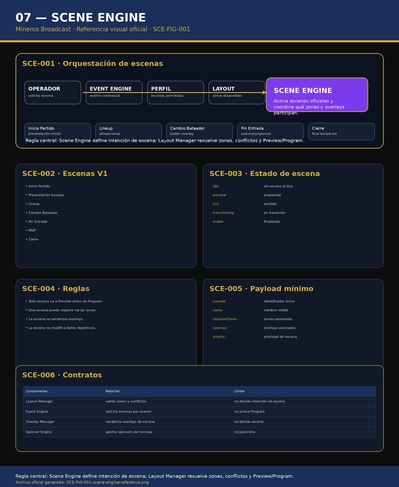

# 07 — Scene Engine

**Sistema:** Mineros Broadcast  
**Documento:** `07-scene-engine.md`  
**Versión:** `1.0.0`  
**Estado:** CERRADO PARA REVISIÓN  
**Propietario:** Club Mineros de Santiago  
**Desarrollado por:** Merchise  

---

## 0. Alcance

El **Scene Engine** administra escenas oficiales de transmisión. Define la intención visual de una situación de transmisión, pero no renderiza overlays ni decide posiciones finales.

Administra:

- catálogo de escenas;
- escena activa;
- escena en Preview;
- prioridad de escena;
- overlays requeridos;
- zonas requeridas;
- transiciones;
- relación con Event Engine;
- relación con Layout Manager;
- relación con Sponsor Engine.

---

# SCE-001 — Referencia Visual Oficial

**Figura:** `SCE-FIG-001`  
**Archivo:** `07-scene-engine-assets/SCE-FIG-001-scene-engine-reference.png`



---

# SCE-002 — Principio central

```text
Scene Engine define la intención.
Layout Manager resuelve zonas, conflictos y Preview / Program.
Overlay Manager renderiza.
```

---

# SCE-003 — Escenas V1

| Escena | Propósito |
|---|---|
| `inicio_partido` | Abrir transmisión |
| `presentacion_equipos` | Presentar equipos |
| `lineup` | Mostrar alineaciones |
| `cambio_bateador` | Presentar bateador |
| `fin_entrada` | Resumen de entrada |
| `mvp` | Destacar jugador |
| `cierre` | Cerrar transmisión |

---

# SCE-004 — Modelo de escena

```json
{
  "sceneId": "scene-lineup",
  "name": "Lineup",
  "status": "preview",
  "priority": 95,
  "requiredZones": ["F"],
  "overlays": ["lineup"],
  "sponsorAllowed": true,
  "defaultMode": "preview"
}
```

---

# SCE-005 — Estados

| Estado | Descripción |
|---|---|
| `idle` | Sin escena activa |
| `preview` | Preparada en Preview |
| `live` | Emitida en Program |
| `transitioning` | En transición |
| `ended` | Finalizada |
| `blocked` | Bloqueada por validación |

---

# SCE-006 — Flujo

```text
Solicitud de escena
  ↓
Validar escena
  ↓
Validar perfil activo
  ↓
Solicitar zonas al Layout Manager
  ↓
Preparar overlays
  ↓
Preview
  ↓
Take
  ↓
Program
```

---

# SCE-007 — Relación con Layout Manager

El Layout Manager valida:

- zonas requeridas;
- conflictos;
- Safe Area;
- locks;
- Preview / Program;
- prioridad de escena.

El Scene Engine no posiciona overlays directamente.

---

# SCE-008 — Relación con Event Engine

El Event Engine puede solicitar escenas por eventos, por ejemplo:

- `inning_ended` → `fin_entrada`;
- `batter_changed` → `cambio_bateador`;
- `game_started` → `inicio_partido`.

---

# SCE-009 — Relación con Sponsor Engine

Una escena puede permitir o bloquear sponsors.

Ejemplo:

```json
{
  "sceneId": "scene-fin-entrada",
  "sponsorAllowed": true,
  "preferredPlacement": "sponsor_overlay"
}
```

---

# SCE-010 — Buenas prácticas

- Toda escena debe tener propósito claro.
- Toda escena debe ir a Preview antes de Program.
- Toda escena debe declarar zonas requeridas.
- Toda escena debe declarar overlays asociados.
- Las escenas no deben contener lógica deportiva.

---

# SCE-011 — Malas prácticas

- Activar Program directamente sin validación.
- Usar escenas para posicionar overlays.
- Duplicar lógica del Event Engine.
- Usar escenas sin perfil activo.
- Definir escenas sin zonas requeridas.

---

# SCE-012 — Criterios de aceptación

El documento `07-scene-engine.md` queda cerrado cuando:

- existe referencia visual `SCE-FIG-001`;
- existen escenas V1;
- existe modelo de escena;
- existen estados;
- existe flujo;
- queda clara la relación con Layout Manager;
- queda clara la relación con Event Engine;
- queda clara la relación con Sponsor Engine;
- queda claro que Scene Engine no renderiza ni posiciona overlays.

---

# Historial

| Versión | Estado | Descripción |
|---|---|---|
| 1.0.0 | Cerrado para revisión | Primera versión completa de Scene Engine |
