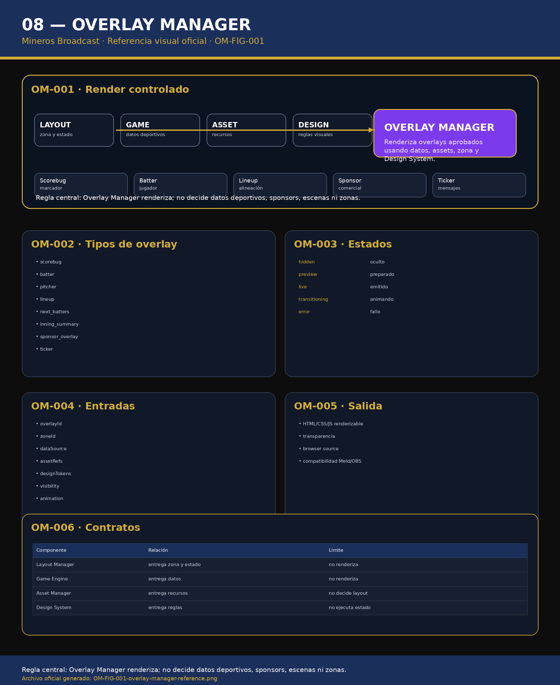

# 08 — Overlay Manager

**Sistema:** Mineros Broadcast  
**Documento:** `08-overlay-manager.md`  
**Versión:** `1.0.0`  
**Estado:** CERRADO PARA REVISIÓN  
**Propietario:** Club Mineros de Santiago  
**Desarrollado por:** Merchise  

---

## 0. Alcance

El **Overlay Manager** renderiza overlays aprobados para transmisión.

Consume:

- zonas desde Layout Manager;
- datos desde Game Engine;
- assets desde Asset Manager;
- reglas visuales desde Design System;
- decisiones comerciales desde Sponsor Engine;
- escenas desde Scene Engine.

No decide:

- marcador;
- inning;
- sponsors elegibles;
- escenas;
- zonas;
- prioridad global.

---

# OM-001 — Referencia Visual Oficial

**Figura:** `OM-FIG-001`  
**Archivo:** `08-overlay-manager-assets/OM-FIG-001-overlay-manager-reference.png`



---

# OM-002 — Principio central

```text
Overlay Manager renderiza.
Los motores deciden datos, reglas y ubicación.
```

---

# OM-003 — Tipos de overlay V1

| Overlay | Documento |
|---|---|
| `scorebug` | `10-scorebug.md` |
| `batter` | `11-batter-overlay.md` |
| `pitcher` | futuro / dentro de batter si aplica |
| `lineup` | `12-lineup.md` |
| `next_batters` | `13-next-batters.md` |
| `inning_summary` | `14-inning-summary.md` |
| `sponsor_overlay` | `15-sponsor-overlay.md` |
| `ticker` | `16-ticker.md` |

---

# OM-004 — Estado de overlay

| Estado | Descripción |
|---|---|
| `hidden` | No visible |
| `preview` | Preparado en Preview |
| `live` | Visible en Program |
| `transitioning` | Entrando o saliendo |
| `error` | Fallo de render |

---

# OM-005 — Contrato de render

```json
{
  "overlayId": "scorebug",
  "zoneId": "A",
  "state": "live",
  "data": {},
  "assets": [],
  "designTokens": {},
  "animation": {
    "in": "fade",
    "out": "fade"
  }
}
```

---

# OM-006 — Reglas

- Todo overlay debe tener `overlayId`.
- Todo overlay visible debe tener `zoneId`.
- Todo overlay debe respetar Design System.
- Todo overlay debe consumir assets por `assetId`.
- Todo overlay debe soportar transparencia.
- Todo overlay debe ser compatible con Meld Studio y OBS Browser Source.

---

# OM-007 — Buenas prácticas

- Mantener overlays como componentes independientes.
- Separar render de lógica deportiva.
- Consumir datos normalizados.
- Implementar estado `preview` y `live`.
- Validar ausencia de assets.
- Usar fallbacks controlados.

---

# OM-008 — Malas prácticas

- Calcular marcador dentro del overlay.
- Cargar logos por ruta local.
- Ignorar zona asignada.
- Renderizar fuera del Safe Area.
- Decidir sponsor dentro del overlay.
- Duplicar reglas del Layout Manager.

---

# OM-009 — Criterios de aceptación

El documento `08-overlay-manager.md` queda cerrado cuando:

- existe referencia visual `OM-FIG-001`;
- existen tipos V1;
- existe contrato de render;
- existen estados;
- quedan claras las entradas;
- queda clara la salida Meld/OBS;
- queda claro que no decide datos, sponsors, escenas ni zonas.

---

# Historial

| Versión | Estado | Descripción |
|---|---|---|
| 1.0.0 | Cerrado para revisión | Primera versión completa de Overlay Manager |
