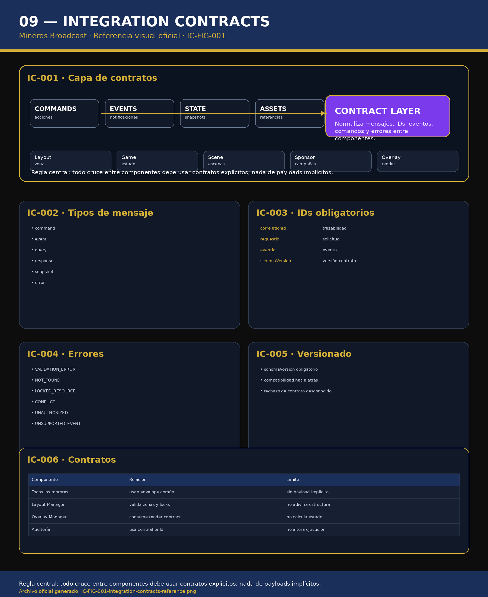

# 09 — Integration Contracts

**Sistema:** Mineros Broadcast  
**Documento:** `09-integration-contracts.md`  
**Versión:** `1.0.0`  
**Estado:** CERRADO PARA REVISIÓN  
**Propietario:** Club Mineros de Santiago  
**Desarrollado por:** Merchise  

---

## 0. Alcance

Este documento define los contratos de integración entre componentes.

Aplica a:

- Layout Manager;
- Design System;
- Asset Manager;
- Game Engine;
- Sponsor Engine;
- Event Engine;
- Scene Engine;
- Overlay Manager;
- overlays específicos.

---

# IC-001 — Referencia Visual Oficial

**Figura:** `IC-FIG-001`  
**Archivo:** `09-integration-contracts-assets/IC-FIG-001-integration-contracts-reference.png`



---

# IC-002 — Principio central

```text
Todo cruce entre componentes debe usar contratos explícitos.
No se permiten payloads implícitos.
```

---

# IC-003 — Envelope estándar

```json
{
  "schemaVersion": "1.0.0",
  "messageType": "command",
  "correlationId": "corr-000001",
  "requestId": "req-000001",
  "source": "LayoutManager",
  "target": "OverlayManager",
  "timestamp": "2026-06-23T00:00:00Z",
  "payload": {}
}
```

---

# IC-004 — Tipos de mensaje

| Tipo | Uso |
|---|---|
| `command` | Solicita una acción |
| `event` | Notifica algo ocurrido |
| `query` | Solicita información |
| `response` | Responde una solicitud |
| `snapshot` | Entrega estado completo |
| `error` | Informa error |

---

# IC-005 — Campos obligatorios

Todo mensaje debe contener:

- `schemaVersion`;
- `messageType`;
- `correlationId`;
- `source`;
- `target`;
- `timestamp`;
- `payload`.

---

# IC-006 — Errores estándar

| Código | Descripción |
|---|---|
| `VALIDATION_ERROR` | Payload inválido |
| `NOT_FOUND` | Recurso no existe |
| `LOCKED_RESOURCE` | Recurso bloqueado |
| `CONFLICT` | Conflicto de prioridad o zona |
| `UNAUTHORIZED` | Permiso insuficiente |
| `UNSUPPORTED_EVENT` | Evento no soportado |
| `ASSET_NOT_APPROVED` | Asset no aprobado |
| `SCENE_NOT_AVAILABLE` | Escena no disponible |

---

# IC-007 — Contrato de comando

```json
{
  "schemaVersion": "1.0.0",
  "messageType": "command",
  "correlationId": "corr-000010",
  "source": "LayoutManager",
  "target": "OverlayManager",
  "timestamp": "2026-06-23T00:00:00Z",
  "payload": {
    "command": "showOverlay",
    "overlayId": "scorebug",
    "zoneId": "A",
    "mode": "preview"
  }
}
```

---

# IC-008 — Contrato de evento

```json
{
  "schemaVersion": "1.0.0",
  "messageType": "event",
  "correlationId": "corr-000020",
  "eventId": "evt-000020",
  "source": "GameEngine",
  "target": "EventEngine",
  "timestamp": "2026-06-23T00:00:00Z",
  "payload": {
    "eventType": "batter_changed",
    "gameId": "game-001"
  }
}
```

---

# IC-009 — Contrato de snapshot

```json
{
  "schemaVersion": "1.0.0",
  "messageType": "snapshot",
  "correlationId": "corr-000030",
  "source": "LayoutManager",
  "target": "Storage",
  "timestamp": "2026-06-23T00:00:00Z",
  "payload": {
    "activeProfileId": "profile-001",
    "programState": {},
    "previewState": {}
  }
}
```

---

# IC-010 — Contrato de error

```json
{
  "schemaVersion": "1.0.0",
  "messageType": "error",
  "correlationId": "corr-000040",
  "source": "LayoutManager",
  "target": "OperatorUI",
  "timestamp": "2026-06-23T00:00:00Z",
  "payload": {
    "code": "LOCKED_RESOURCE",
    "message": "El recurso está siendo editado por otro operador."
  }
}
```

---

# IC-011 — Reglas

- Todo mensaje debe tener `schemaVersion`.
- Todo mensaje debe tener `correlationId`.
- Todo error debe usar código estándar.
- Todo contrato desconocido debe rechazarse.
- Toda integración debe ser auditable.
- Ningún componente debe inferir estructura de payload.

---

# IC-012 — Criterios de aceptación

El documento `09-integration-contracts.md` queda cerrado cuando:

- existe referencia visual `IC-FIG-001`;
- existe envelope estándar;
- existen tipos de mensaje;
- existen campos obligatorios;
- existen errores estándar;
- existen ejemplos de command, event, snapshot y error;
- queda prohibido el payload implícito.

---

# Historial

| Versión | Estado | Descripción |
|---|---|---|
| 1.0.0 | Cerrado para revisión | Primera versión completa de contratos de integración |
