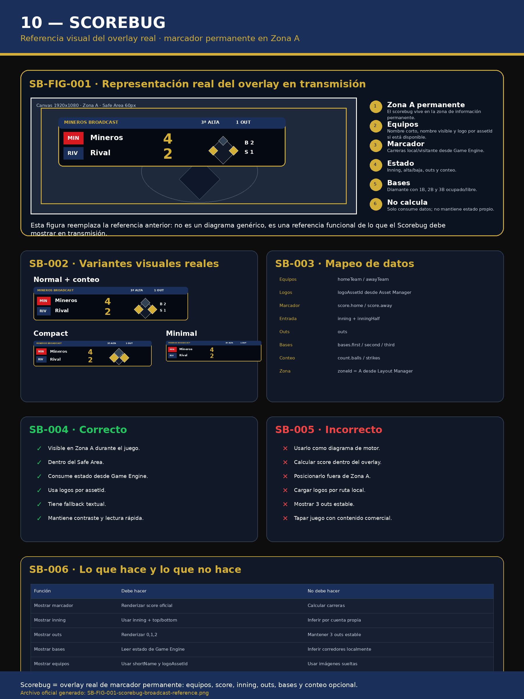

# 10 — Scorebug

**Sistema:** Mineros Broadcast  
**Documento:** `10-scorebug.md`  
**Versión:** `1.2.0`  
**Estado:** CERRADO PARA REVISIÓN  
**Propietario:** Club Mineros de Santiago  
**Desarrollado por:** Merchise  

---

## 0. Alcance

Este documento define el overlay **Scorebug**.

El Scorebug es el overlay permanente de marcador y estado básico del partido.

Consume:

- estado deportivo desde Game Engine;
- logos desde Asset Manager;
- zona desde Layout Manager;
- reglas visuales desde Design System.

El Scorebug no calcula marcador, inning, outs, bases ni conteo.

---

# SB-001 — Referencia Visual Oficial

**Figura:** `SB-FIG-001`  
**Archivo:** `10-scorebug-assets/SB-FIG-001-scorebug-broadcast-reference.png`



La figura `SB-FIG-001` es la referencia visual normativa del Scorebug y representa el overlay real que debe verse en transmisión.

La figura muestra:

- ubicación del Scorebug en Zona A;
- ejemplo funcional del overlay;
- equipos;
- marcador;
- inning;
- outs;
- bases ocupadas;
- conteo opcional;
- datos obligatorios;
- variantes visuales;
- usos correctos e incorrectos;
- contratos con componentes.

---

# SB-002 — Principio central

```text
Scorebug muestra estado deportivo.
Game Engine mantiene el estado deportivo.
```

El Scorebug debe ser una vista renderizable, no una fuente de datos.

---

# SB-003 — Ubicación

| Propiedad | Valor |
|---|---|
| Zona | A |
| Tipo | Permanente |
| Safe Area | Obligatorio |
| Visibilidad | Durante partido |
| Prioridad base | 100 |
| Fondo interno | Sí |
| Pantalla global transparente | Sí |

---

# SB-004 — Datos obligatorios

```json
{
  "homeTeam": {
    "name": "Mineros",
    "shortName": "MIN",
    "logoAssetId": "AM-LOGO-001"
  },
  "awayTeam": {
    "name": "Rival",
    "shortName": "RIV",
    "logoAssetId": "AM-TEAM-002"
  },
  "score": {
    "home": 4,
    "away": 2
  },
  "inning": 3,
  "inningHalf": "top",
  "outs": 1,
  "bases": {
    "first": true,
    "second": false,
    "third": true
  },
  "count": {
    "balls": 2,
    "strikes": 1
  }
}
```

---

# SB-005 — Elementos visuales obligatorios

El Scorebug debe poder mostrar:

- equipo local;
- equipo visitante;
- marcador local;
- marcador visitante;
- inning;
- parte alta o baja;
- outs;
- bases ocupadas;
- conteo si la variante lo permite;
- logos si están disponibles;
- fallback textual si falta logo.

---

# SB-006 — Representación de inning

| Valor | Representación sugerida |
|---|---|
| `top` | Alta |
| `bottom` | Baja |

Ejemplo:

```text
3ª ALTA
3ª BAJA
```

---

# SB-007 — Representación de outs

Los outs se muestran como:

```text
0 OUT
1 OUT
2 OUTS
```

El Scorebug nunca debe mostrar `3 OUTS` como estado estable.  
El tercer out debe gatillar cambio de media entrada desde Game Engine.

---

# SB-008 — Representación de bases

Las bases deben mostrarse como un diamante o indicadores equivalentes.

Cada base tiene dos estados:

| Estado | Visual |
|---|---|
| Ocupada | Activa / destacada |
| Libre | Inactiva / neutra |

El Scorebug no debe inferir corredores.  
Debe consumir el estado desde Game Engine.

---

# SB-009 — Representación del conteo

El conteo puede mostrarse en variantes que lo permitan.

Estructura:

```text
B 2
S 1
```

Reglas:

- balls proviene de Game Engine;
- strikes proviene de Game Engine;
- se reinicia con cambio de bateador;
- se reinicia con cambio de media entrada.

---

# SB-010 — Variantes

| Variante | Uso |
|---|---|
| `normal` | Equipos + marcador + inning + outs + bases |
| `compact` | Versión reducida |
| `with_count` | Incluye balls / strikes |
| `minimal` | Solo equipos + marcador + inning |

---

# SB-011 — Estados

| Estado | Descripción |
|---|---|
| `hidden` | No visible |
| `preview` | Preparado |
| `live` | Visible |
| `error` | Dato requerido faltante |

---

# SB-012 — Reglas visuales

- Debe respetar Design System.
- Debe estar dentro del Safe Area.
- Debe usar colores oficiales.
- Debe ser legible en 1920x1080 y 1280x720.
- Debe tener fondo interno.
- La pantalla global sigue siendo transparente.
- No debe usar fotografías.
- No debe mostrar Merchise por defecto.
- Mineros puede aparecer si corresponde al equipo o branding aprobado.

---

# SB-013 — Reglas de datos

- No calcular marcador localmente.
- No mantener copia propia de inning.
- No inferir bases.
- No inferir outs.
- No inferir balls ni strikes.
- Si falta un dato crítico, entrar en estado `error`.
- Si falta logo, usar fallback textual.
- Si falta nombre corto, usar nombre de equipo truncado.

---

# SB-014 — Relación con Game Engine

El Scorebug consume:

- score;
- inning;
- inningHalf;
- outs;
- bases;
- count;
- teams.

El Scorebug no modifica Game Engine.

---

# SB-015 — Relación con Asset Manager

El Scorebug consume logos mediante `assetId`.

No debe usar rutas locales sueltas.

---

# SB-016 — Relación con Layout Manager

El Layout Manager asigna Scorebug a Zona A.

El Scorebug no decide su posición global.

---

# SB-017 — Relación con Overlay Manager

El Overlay Manager renderiza el Scorebug usando el contrato aprobado.

El Scorebug debe soportar estados `preview` y `live`.

---

# SB-018 — Buenas prácticas

- Mantenerlo siempre visible durante juego.
- Usar nombres cortos de equipo.
- Usar fallback si falta logo.
- Validar contraste.
- Evitar animaciones excesivas.
- Mantener lectura rápida.
- No saturar con sponsors.
- Mantener jerarquía: equipos → marcador → inning → estado.

---

# SB-019 — Malas prácticas

- Calcular marcador dentro del overlay.
- Posicionarse fuera de Zona A.
- Usar logos por ruta local.
- Invadir Safe Area.
- Mostrar sponsor principal dentro del Scorebug sin regla.
- Ocultar información crítica durante juego.
- Mostrar `3 OUTS` como estado estable.
- Mostrar bases inferidas localmente.

---

# SB-020 — Criterios de aceptación

El documento `10-scorebug.md` queda cerrado cuando:

- existe referencia visual funcional `SB-FIG-001`;
- se define ubicación en Zona A;
- se definen datos obligatorios;
- se definen elementos visuales obligatorios;
- se define representación de inning;
- se define representación de outs;
- se define representación de bases;
- se define representación de conteo;
- se definen variantes;
- se definen estados;
- se definen reglas visuales;
- se definen reglas de datos;
- queda clara la relación con Game Engine;
- queda clara la relación con Asset Manager;
- queda clara la relación con Layout Manager;
- queda claro que Scorebug no calcula estado deportivo.

---

# Historial

| Versión | Estado | Descripción |
|---|---|---|
| 1.0.0 | Rechazado visualmente | La imagen no representaba suficientemente qué hace ni qué muestra el Scorebug |
| 1.1.0 | Rechazado visualmente | La gráfica seguía siendo poco representativa del overlay real |
| 1.2.0 | Cerrado para revisión | Reemplaza la referencia por una visualización real del Scorebug en transmisión |
