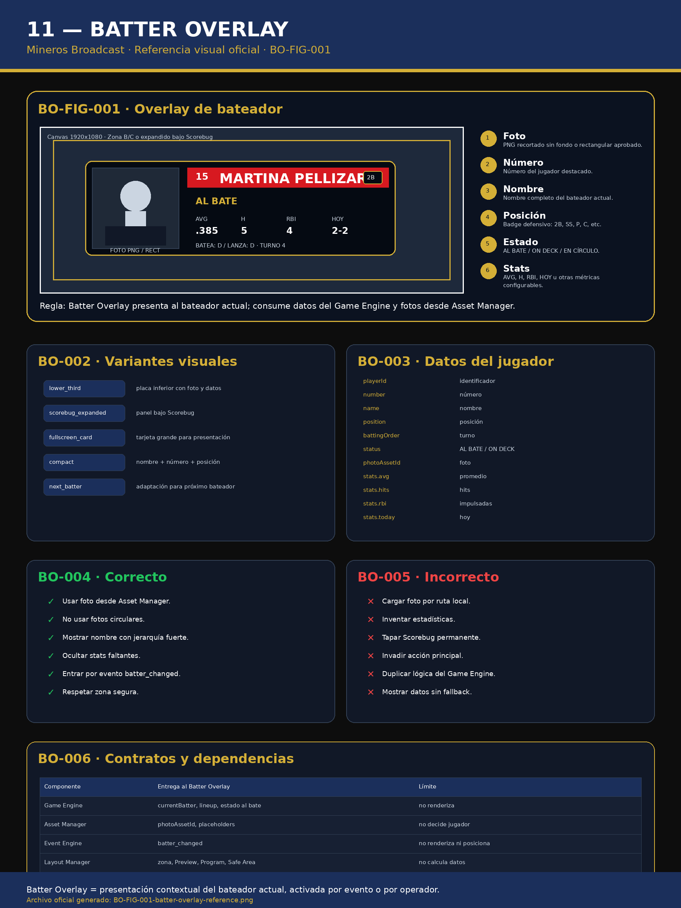

# 11 — Batter Overlay

**Sistema:** Mineros Broadcast  
**Documento:** `11-batter-overlay.md`  
**Versión:** `1.0.0`  
**Estado:** CERRADO PARA IMPLEMENTACIÓN  
**Propietario:** Club Mineros de Santiago  
**Desarrollado por:** Merchise  

---

## 0. Alcance

Este documento define la especificación visual, funcional y técnica del **Batter Overlay**.

El Batter Overlay presenta información contextual del bateador actual.

Debe conservar las definiciones de los documentos previos:

| Documento previo | Definición conservada |
|---|---|
| `01-layout-manager.md` | La zona, Preview, Program, locks, Safe Area y conflictos los resuelve Layout Manager |
| `02-design-system.md` | Colores, tipografías, bordes, sombras, transparencia e iconografía vienen del Design System |
| `03-asset-manager.md` | Fotos, logos y placeholders se consumen por `assetId` |
| `04-game-engine.md` | Bateador actual, lineup, turno, posición y estado vienen del Game Engine |
| `06-event-engine.md` | El evento `batter_changed` puede solicitar la aparición del overlay |
| `07-scene-engine.md` | Una escena puede solicitar presentación de bateador |
| `08-overlay-manager.md` | Overlay Manager renderiza el componente |
| `09-integration-contracts.md` | Todo contrato debe usar `schemaVersion` y `correlationId` |
| `10-scorebug.md` | El panel expandido puede integrarse bajo el Scorebug sin reemplazarlo |

El Batter Overlay **no decide el bateador actual**.  
El Batter Overlay **no calcula estadísticas**.  
El Batter Overlay **no carga fotos por rutas sueltas**.  
El Batter Overlay **no decide zona final**.  
El Batter Overlay **renderiza datos recibidos**.

---

# BO-001 — Referencia Visual Oficial

**Figura:** `BO-FIG-001`  
**Archivo:** `11-batter-overlay-assets/BO-FIG-001-batter-overlay-reference.png`



La figura `BO-FIG-001` es la referencia visual normativa del Batter Overlay.

La figura define:

- composición visual;
- zona de foto;
- jerarquía de número, nombre y posición;
- estado del jugador;
- estadísticas visibles;
- variantes;
- datos requeridos;
- contratos;
- reglas correctas e incorrectas.

---

# BO-002 — Principio central

```text
Batter Overlay presenta al bateador actual.
Game Engine define quién es el bateador actual.
Asset Manager entrega la foto.
Layout Manager valida zona y emisión.
Overlay Manager renderiza.
```

---

# BO-003 — Variantes oficiales

| Variante | Código | Uso |
|---|---|---|
| Placa inferior | `lower_third` | Presentación clásica |
| Expandido bajo Scorebug | `scorebug_expanded` | Integración con Scorebug |
| Tarjeta fullscreen | `fullscreen_card` | Presentación de jugador |
| Compacta | `compact` | Nombre, número y posición |
| Próximo bateador | `next_batter` | Adaptación para On Deck |

---

# BO-004 — Variante lower third

## Propósito

Presentar al bateador actual como una placa inferior o lateral.

## Debe mostrar

- foto del jugador;
- número;
- nombre;
- posición;
- estado;
- estadísticas principales;
- información contextual.

## Estructura

```text
┌────────────────────────────────────┐
│ [FOTO] 15  MARTINA PELLIZARIS  2B  │
│        AL BATE                     │
│        AVG .385  H 5  RBI 4 HOY 2-2│
└────────────────────────────────────┘
```

---

# BO-005 — Variante scorebug expanded

## Propósito

Extender el Scorebug con un panel de bateador.

Debe coincidir con lo definido en `10-scorebug.md`.

## Reglas

- El Scorebug compacto permanece visible.
- El panel de bateador aparece debajo.
- La animación de entrada es `slide_up`.
- La animación de salida es `slide_down`.
- No debe reemplazar el Scorebug.
- Debe mantener jerarquía del marcador.

---

# BO-006 — Variante fullscreen card

## Propósito

Mostrar una tarjeta grande de presentación de jugador.

Uso recomendado:

- inicio de turno especial;
- presentación de jugador destacado;
- cambio importante;
- escenas predefinidas.

Debe requerir validación del Layout Manager y Scene Engine.

---

# BO-007 — Variante compact

## Propósito

Mostrar información mínima:

```text
15 · MARTINA PELLIZARIS · 2B · AL BATE
```

Uso recomendado:

- poco espacio disponible;
- transmisión vertical;
- composición con múltiples overlays.

---

# BO-008 — Datos obligatorios

```json
{
  "currentBatter": {
    "playerId": "player-015",
    "number": "15",
    "name": "Martina Pellizaris",
    "position": "2B",
    "status": "AL BATE",
    "battingOrder": 4,
    "teamId": "team-mineros"
  }
}
```

---

# BO-009 — Datos opcionales

```json
{
  "currentBatter": {
    "photoAssetId": "AM-PLAYER-015",
    "throws": "D",
    "bats": "D",
    "stats": {
      "avg": ".385",
      "hits": 5,
      "rbi": 4,
      "today": "2-2",
      "obp": ".421",
      "slg": ".615"
    }
  }
}
```

---

# BO-010 — Contrato de datos completo

```json
{
  "schemaVersion": "1.0.0",
  "correlationId": "corr-batter-000001",
  "source": "GameEngine",
  "target": "BatterOverlay",
  "timestamp": "2026-06-23T00:00:00Z",
  "payload": {
    "gameId": "game-001",
    "overlayId": "batter",
    "variant": "lower_third",
    "currentBatter": {
      "playerId": "player-015",
      "number": "15",
      "name": "Martina Pellizaris",
      "position": "2B",
      "status": "AL BATE",
      "battingOrder": 4,
      "teamId": "team-mineros",
      "photoAssetId": "AM-PLAYER-015",
      "bats": "D",
      "throws": "D",
      "stats": {
        "avg": ".385",
        "hits": 5,
        "rbi": 4,
        "today": "2-2"
      }
    }
  }
}
```

---

# BO-011 — Configuración JSON completa

```json
{
  "overlayId": "batter",
  "schemaVersion": "1.0.0",
  "enabled": true,
  "preferredZone": "B",
  "variant": "lower_third",
  "position": {
    "anchor": "bottom-left",
    "safeAreaAware": true,
    "offsetX": 60,
    "offsetY": 80
  },
  "layout": {
    "width": 720,
    "height": 220,
    "borderRadius": 8,
    "padding": 12,
    "gap": 8
  },
  "visibility": {
    "showPhoto": true,
    "showNumber": true,
    "showName": true,
    "showPosition": true,
    "showStatus": true,
    "showBattingOrder": false,
    "showStats": true,
    "showBatsThrows": false
  },
  "animations": {
    "in": "slide_up",
    "out": "slide_down",
    "durationMs": 300,
    "holdSeconds": 8
  },
  "fallbacks": {
    "missingPhoto": "placeholder",
    "missingPosition": "hide_position",
    "missingStats": "hide_stats",
    "missingNumber": "hide_number"
  }
}
```

---

# BO-012 — Campos requeridos y opcionales

## Requeridos

| Campo | Requerido | Fallback |
|---|---:|---|
| `playerId` | Sí | Error |
| `name` | Sí | Error |
| `status` | Sí | `AL BATE` |
| `teamId` | Sí | Error |

## Opcionales

| Campo | Uso | Fallback |
|---|---|---|
| `number` | Número visual | Ocultar número |
| `position` | Badge de posición | Ocultar badge |
| `photoAssetId` | Foto jugador | Placeholder |
| `battingOrder` | Turno | Ocultar turno |
| `stats.avg` | Promedio | Ocultar |
| `stats.hits` | Hits | Ocultar |
| `stats.rbi` | Impulsadas | Ocultar |
| `stats.today` | Rendimiento del día | Ocultar |

---

# BO-013 — Reglas de render

| Condición | Resultado |
|---|---|
| Falta `playerId` | Estado `error` |
| Falta `name` | Estado `error` |
| Falta foto | Mostrar placeholder aprobado |
| Falta posición | Ocultar badge |
| Falta estadísticas | Ocultar bloque estadístico |
| Variante desconocida | Usar `lower_third` |
| Zona ocupada | Layout Manager decide alternativa o bloqueo |
| Scorebug activo | No debe taparlo |
| Transmisión vertical | Usar variante `compact` |

---

# BO-014 — Medidas base por variante

Las medidas se expresan para canvas 1920x1080.

| Variante | Ancho recomendado | Alto recomendado |
|---|---:|---:|
| `lower_third` | 620–760 px | 180–240 px |
| `scorebug_expanded` | 520–720 px | 260–340 px |
| `fullscreen_card` | 900–1200 px | 520–700 px |
| `compact` | 360–520 px | 60–90 px |
| `next_batter` | 420–620 px | 120–180 px |

---

# BO-015 — Tokens visuales aplicados

Debe consumir tokens de `02-design-system.md`.

| Token | Valor base |
|---|---|
| `color.minerosRed` | `#D71920` |
| `color.minerosNavy` | `#1B2F5B` |
| `color.minerosGold` | `#D4AF37` |
| `color.broadcastBlack` | `#0D0D0D` |
| `font.primary` | Bebas Neue |
| `font.secondary` | Inter |
| `radius.component` | 6px |
| `radius.fullscreen` | 8px |
| `shadow.default` | `0px 2px 8px rgba(0,0,0,.25)` |

---

# BO-016 — Descomposición por componentes

| Componente | Responsabilidad |
|---|---|
| `BatterOverlayRoot` | Contenedor general |
| `PlayerPhoto` | Foto o placeholder |
| `PlayerNumber` | Número |
| `PlayerName` | Nombre |
| `PositionBadge` | Posición |
| `PlayerStatus` | AL BATE / ON DECK |
| `StatsGrid` | Estadísticas |
| `StatItem` | Métrica individual |
| `BatsThrowsInfo` | Batea / lanza |
| `OverlayAnimationWrapper` | Entrada / salida |

---

# BO-017 — Animaciones

| Animación | Duración | Easing | Uso |
|---|---:|---|---|
| `slide_up` | 300 ms | ease-out | Entrada lower third |
| `slide_down` | 250 ms | ease-in | Salida lower third |
| `fade_in` | 200 ms | ease-out | Entrada compacta |
| `fade_out` | 180 ms | ease-in | Salida compacta |
| `scale_in` | 250 ms | ease-out | Fullscreen card |

---

# BO-018 — Eventos

| Evento | Acción |
|---|---|
| `batter_changed` | Mostrar overlay si configuración lo permite |
| `inning_ended` | Ocultar overlay |
| `scene_changed` | Revalidar visibilidad |
| `overlay_timeout` | Ocultar overlay |
| `manual_show_batter` | Mostrar desde operador |
| `manual_hide_batter` | Ocultar desde operador |

---

# BO-019 — Responsive

## 1920x1080

- Usar `lower_third` o `scorebug_expanded`.
- Mantener dentro del Safe Area.
- No tapar Scorebug.

## 1280x720

- Escalar a 0.66–0.75.
- Reducir cantidad de estadísticas.
- Preferir `compact` si hay poco espacio.

## 1080x1920 vertical

- Usar `compact`.
- Foto opcional.
- Reducir estadísticas.
- No usar fullscreen card salvo escena dedicada.

---

# BO-020 — Estados del overlay

| Estado | Descripción |
|---|---|
| `hidden` | No visible |
| `preview` | Preparado en Preview |
| `live` | Visible en Program |
| `transitioning` | Animación en curso |
| `error` | Falta dato crítico |

---

# BO-021 — Relación con Game Engine

Game Engine entrega:

- currentBatter;
- lineup;
- battingOrder;
- position;
- status;
- stats si están disponibles.

Batter Overlay no modifica Game Engine.

---

# BO-022 — Relación con Asset Manager

Asset Manager entrega:

- foto del jugador;
- placeholder;
- logos si aplican.

Todo recurso debe consumirse por `assetId`.

---

# BO-023 — Relación con Event Engine

Event Engine puede solicitar mostrar Batter Overlay cuando recibe:

```text
batter_changed
```

La acción debe ir a Preview salvo configuración explícita.

---

# BO-024 — Relación con Layout Manager

Layout Manager decide:

- zona;
- posición final;
- conflictos;
- Safe Area;
- Preview;
- Program.

Batter Overlay declara preferencia:

```json
{
  "preferredZone": "B",
  "priority": 80,
  "persistent": false
}
```

---

# BO-025 — Relación con Overlay Manager

Overlay Manager renderiza el Batter Overlay usando:

- configuración;
- contrato de datos;
- assets;
- tokens visuales;
- animaciones.

---

# BO-026 — Buenas prácticas

- Mostrarlo por tiempo limitado.
- Usar foto rectangular o PNG sin fondo.
- Usar jerarquía clara: número, nombre, posición.
- Ocultar estadísticas faltantes.
- Respetar Scorebug permanente.
- Mantener contraste.
- Mantener legibilidad móvil.

---

# BO-027 — Malas prácticas

- Inventar estadísticas.
- Cargar fotos por ruta local.
- Usar fotos circulares.
- Tapar Scorebug.
- Tapar acción principal.
- Mantenerlo visible todo el inning sin regla.
- Renderizar sin validar zona.
- Duplicar lógica del Game Engine.

---

# BO-028 — Criterios de aceptación

El documento `11-batter-overlay.md` queda cerrado para implementación cuando:

- existe referencia visual `BO-FIG-001`;
- conserva reglas de documentos 01 a 10;
- define variantes visuales;
- define datos obligatorios;
- define datos opcionales;
- define contrato de datos completo;
- define configuración JSON completa;
- define campos requeridos;
- define campos opcionales;
- define fallbacks;
- define reglas de render;
- define medidas base;
- define tokens visuales;
- define componentes;
- define animaciones;
- define eventos;
- define responsive;
- define estados;
- define relación con Game Engine;
- define relación con Asset Manager;
- define relación con Event Engine;
- define relación con Layout Manager;
- define relación con Overlay Manager;
- deja claro que no calcula datos ni decide zona.

---

# Historial

| Versión | Estado | Descripción |
|---|---|---|
| 1.0.0 | Cerrado para implementación | Primera versión completa del Batter Overlay |
