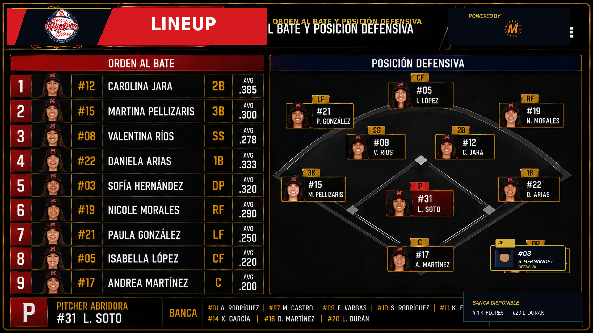

# 12 — Lineup Overlay

**Sistema:** Mineros Broadcast  
**Documento:** `12-lineup.md`  
**Versión:** `2.3.0`  
**Estado:** CANDIDATO VISUAL VALIDADO  
**Propietario:** Club Mineros de Santiago  
**Desarrollado por:** Merchise  

---

## 0. Referencia gráfica candidata

**Figura:** `LU-FIG-001`  
**Archivo:** `12-lineup-assets/LU-FIG-001-lineup-scorebug-validated.png`

---

## 1. Validación previa aplicada

| Criterio | Estado |
|---|---|
| Logo Mineros oficial reemplazado | Cumple |
| Logo Merchise oficial reemplazado | Cumple |
| Paleta acordada usada en correcciones | Cumple |
| Orden al bate visible | Cumple |
| Foto de jugadora en orden al bate | Cumple |
| Posición defensiva visible | Cumple |
| Diamante de fondo | Cumple |
| Jugadoras ubicadas por posición | Cumple |
| `DP` separado como ofensiva, no defensa | Cumple |
| Sponsor duplicado removido | Cumple |
| Estilo oscuro broadcast cercano a Scorebug | Cumple parcialmente / candidato |
| Bebas Neue + Inter declaradas | Cumple en especificación; raster usa fallback para Bebas si no existe instalada |

---

## 2. Regla funcional cerrada

El Lineup Overlay debe mostrar simultáneamente:

1. orden al bate;
2. foto;
3. número;
4. nombre;
5. posición;
6. promedio ofensivo opcional;
7. posición defensiva en diamante;
8. pitcher abridora;
9. banca.

---

## 3. Tokens obligatorios

| Token | Valor |
|---|---|
| Mineros Red | `#D71920` |
| Mineros Navy | `#1B2F5B` |
| Mineros Gold | `#D4AF37` |
| Broadcast Black | `#0D0D0D` |
| White | `#FFFFFF` |

---

## 4. Observación

Esta gráfica queda como **candidata validada**, no como cierre final absoluto, porque la comparación visual definitiva debe hacerse contra el Scorebug aprobado dentro del flujo real de transmisión.
