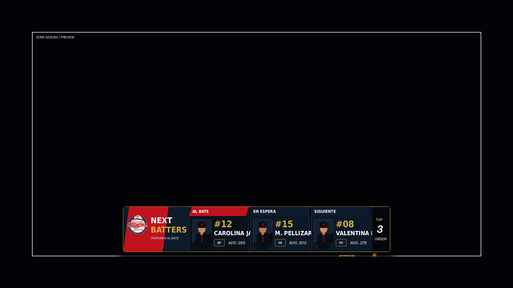

# 13 — Next Batters Overlay

**Sistema:** Mineros Broadcast  
**Documento:** `13-next-batters.md`  
**Versión:** `1.3.0`  
**Estado:** CANDIDATO VISUAL EN REVISIÓN  
**Propietario:** Club Mineros de Santiago  
**Desarrollado por:** Merchise  

---

## 0. Propósito

El **Next Batters Overlay** muestra la secuencia ofensiva inmediata del equipo que está al bate.

Su objetivo es anticipar al espectador quién batea ahora y quiénes vienen a continuación.

Debe responder visualmente a esta pregunta:

```text
¿Quién está bateando y quiénes son los próximos bateadores?
```

Este overlay debe funcionar como una extensión natural del Scorebug, el Batter Overlay y el Lineup Overlay.

---


## 0.1 Referencia gráfica

**Figura:** `NB-FIG-001`  
**Archivo:** `13-next-batters-assets/NB-FIG-001-next-batters-scorebug-style-v3.png`



La gráfica representa la variante principal `horizontal_compact`: bateador actual, próximo bateador y siguiente bateador, con fotos rectangulares y estilo modular compatible con el Scorebug.


## 0.2 Corrección visual v1.2.0

La referencia gráfica `NB-FIG-001` fue corregida para acercarse al Scorebug aprobado:

| Criterio | Corrección |
|---|---|
| Escala | Se redujo a lower-third compacto |
| Lenguaje visual | Se eliminaron bloques tipo dashboard |
| Scorebug | Se usaron módulos compactos, rojo/navy, borde dorado y estructura horizontal |
| Sponsor | Se dejó como mención mínima, no como bloque dominante |
| Fotos | Se mantienen rectangulares |
| Información | Solo bateador actual, en espera y siguiente |
| Fondos | No usa campo ni lámina decorativa |


## 0.3 Corrección visual v1.3.0

Se eliminó el indicador vertical de tres puntos porque no cumplía una función clara dentro del overlay.

| Elemento eliminado | Motivo |
|---|---|
| Tres puntos rojo/dorado/gris | Era decorativo, ambiguo y no aportaba información operativa |
| Módulo lateral sin etiqueta | Podía confundirse con estado, semáforo o progreso |

El cierre derecho queda como módulo simple `TOP 3 ORDEN`, indicando que la pieza muestra los tres bateadores inmediatos.


## 1. Alcance

El Next Batters Overlay debe mostrar:

1. bateador actual;
2. próximo bateador;
3. segundo próximo bateador;
4. tercer próximo bateador, opcional;
5. foto rectangular;
6. número;
7. nombre;
8. posición defensiva;
9. promedio ofensivo opcional;
10. mano de bateo opcional.

---

## 2. Relación con documentos anteriores

| Documento | Relación |
|---|---|
| `01-layout-manager.md` | Define zonas, Preview, Program y conflictos |
| `02-design-system.md` | Define colores, tipografías, bordes, sombras y branding |
| `03-asset-manager.md` | Entrega fotos, logos y placeholders por `assetId` |
| `04-game-engine.md` | Entrega lineup, bateador actual y orden ofensivo |
| `08-overlay-manager.md` | Renderiza el overlay |
| `09-integration-contracts.md` | Define envelope y contratos |
| `10-scorebug.md` | Define el lenguaje visual base |
| `11-batter-overlay.md` | Define la presentación individual del bateador |
| `12-lineup.md` | Define el orden al bate completo |

---

## 3. Principio central

```text
El Next Batters Overlay no calcula el orden al bate.
El Game Engine entrega el bateador actual y los próximos bateadores.
El Overlay Manager solo renderiza la secuencia recibida.
```

---

## 4. Vista base

La vista base debe mostrar una secuencia horizontal o vertical compacta.

### Variante principal

```text
┌───────────────────────────────────────────────┐
│ PRÓXIMOS BATEADORES                           │
├───────────────┬───────────────┬───────────────┤
│ AL BATE       │ EN ESPERA     │ SIGUIENTE     │
│ FOTO #12      │ FOTO #15      │ FOTO #08      │
│ C. JARA       │ M. PELLIZARIS │ V. RÍOS       │
│ 2B · AVG .385 │ 3B · AVG .300 │ SS · AVG .278 │
└───────────────┴───────────────┴───────────────┘
```

---

## 5. Variantes oficiales

| Variante | Código | Uso |
|---|---|---|
| Horizontal compacta | `horizontal_compact` | Principal para transmisión |
| Vertical lateral | `vertical_side` | Uso en zona lateral |
| Lower third | `lower_third` | Sobre cámara, parte inferior |
| Scorebug attached | `scorebug_attached` | Pegado o asociado al Scorebug |
| Full card | `full_card` | Antes de entrada o pausa |

---

## 6. Reglas visuales

| Elemento | Regla |
|---|---|
| Fondo | Oscuro, sin fondos decorativos |
| Contenedor | Negro/navy con borde dorado fino |
| Acentos | Rojo Mineros para estado actual |
| Foto | Rectangular, no circular |
| Bateador actual | Debe ser el más destacado |
| Próximos bateadores | Deben verse como módulos secundarios |
| Posición | Badge compacto |
| AVG | Texto pequeño, opcional |
| Sponsor | No se muestra por defecto |
| Animación | Entrada corta, sin exceso |

---

## 7. Estados de los bateadores

| Estado | Significado | Tratamiento visual |
|---|---|---|
| `current` | Bateador actual | Bloque rojo o mayor énfasis |
| `on_deck` | Próximo bateador | Bloque secundario |
| `in_the_hole` | Segundo próximo | Bloque secundario |
| `third_next` | Tercer próximo opcional | Menor énfasis |

---

## 8. Campos requeridos

| Campo | Requerido | Fallback |
|---|---:|---|
| `team.teamId` | Sí | Error |
| `team.name` | Sí | Error |
| `batters` | Sí | Error |
| `batters[].playerId` | Sí | Error |
| `batters[].name` | Sí | Error |
| `batters[].order` | Sí | Error |
| `batters[].state` | Sí | Error |

---

## 9. Campos opcionales

| Campo | Uso | Fallback |
|---|---|---|
| `batters[].number` | Número de uniforme | Ocultar |
| `batters[].photoAssetId` | Foto | Placeholder |
| `batters[].position` | Posición | Ocultar badge |
| `batters[].avg` | Promedio ofensivo | Ocultar |
| `batters[].bats` | Mano de bateo | Ocultar |
| `team.logoAssetId` | Logo equipo | Short name |

---

## 10. Contrato de datos

```json
{
  "schemaVersion": "1.0.0",
  "correlationId": "corr-next-batters-000001",
  "source": "GameEngine",
  "target": "NextBattersOverlay",
  "timestamp": "2026-06-23T00:00:00Z",
  "payload": {
    "gameId": "game-001",
    "overlayId": "next_batters",
    "team": {
      "teamId": "team-mineros",
      "name": "Mineros",
      "shortName": "MIN",
      "logoAssetId": "AM-LOGO-001"
    },
    "inning": {
      "number": 3,
      "half": "top"
    },
    "batters": [
      {
        "state": "current",
        "order": 1,
        "playerId": "player-012",
        "number": "12",
        "name": "Carolina Jara",
        "position": "2B",
        "photoAssetId": "PLAYER-012",
        "bats": "R",
        "avg": ".385"
      },
      {
        "state": "on_deck",
        "order": 2,
        "playerId": "player-015",
        "number": "15",
        "name": "Martina Pellizaris",
        "position": "3B",
        "photoAssetId": "PLAYER-015",
        "bats": "R",
        "avg": ".300"
      },
      {
        "state": "in_the_hole",
        "order": 3,
        "playerId": "player-008",
        "number": "08",
        "name": "Valentina Ríos",
        "position": "SS",
        "photoAssetId": "PLAYER-008",
        "bats": "L",
        "avg": ".278"
      }
    ]
  }
}
```

---

## 11. Configuración visual base

```json
{
  "overlayId": "next_batters",
  "schemaVersion": "1.0.0",
  "enabled": true,
  "preferredZone": "D",
  "variant": "horizontal_compact",
  "layout": {
    "maxVisibleBatters": 3,
    "showCurrentBatter": true,
    "showOnDeck": true,
    "showInTheHole": true,
    "showThirdNext": false,
    "showPhoto": true,
    "showNumber": true,
    "showPosition": true,
    "showAverage": true,
    "showBats": false
  },
  "animations": {
    "in": "slide_up",
    "out": "fade_out",
    "durationMs": 240,
    "holdSeconds": 8
  },
  "fallbacks": {
    "missingPhoto": "placeholder",
    "missingNumber": "hide_number",
    "missingPosition": "hide_position",
    "missingAverage": "hide_average"
  }
}
```

---

## 12. Reglas de cálculo

El overlay no calcula por sí mismo la rotación ofensiva.

Game Engine debe entregar la secuencia correcta considerando:

- lineup inicial;
- sustituciones;
- bateador actual;
- último out;
- cierre de entrada;
- reinicio del orden después del noveno bateador;
- jugadores removidos;
- cambios ofensivos válidos.

---

## 13. Reglas de render

| Condición | Resultado |
|---|---|
| No hay bateador actual | No mostrar overlay |
| Solo hay un bateador disponible | Mostrar solo bloque actual |
| Faltan próximos bateadores | Mostrar disponibles y ocultar vacíos |
| Falta foto | Placeholder rectangular |
| Falta AVG | Ocultar AVG |
| Falta posición | Ocultar badge |
| Cambio de bateador | Actualizar secuencia con transición corta |
| Fin de entrada | Ocultar overlay |

---

## 14. Eventos que pueden activar el overlay

| Evento | Acción |
|---|---|
| `batter_changed` | Actualiza y muestra Next Batters |
| `inning_started` | Puede mostrar secuencia inicial |
| `lineup_changed` | Recalcula secuencia desde Game Engine |
| `manual_show_next_batters` | Muestra overlay manualmente |
| `manual_hide_next_batters` | Oculta overlay manualmente |

---

## 15. Relación con Scorebug

El Next Batters Overlay debe poder aparecer junto al Scorebug sin competir visualmente.

Debe heredar:

- fondo oscuro;
- módulos compactos;
- acento rojo;
- borde dorado;
- texto blanco;
- datos secundarios en dorado o gris;
- fotos rectangulares.

No debe usar:

- fondos de campo;
- composiciones tipo póster;
- diamantes defensivos;
- múltiples variantes en una misma gráfica;
- sponsors duplicados.

---

## 16. Criterios de aceptación

El documento se acepta cuando:

- define qué muestra el overlay;
- define qué datos consume;
- define variantes;
- define contrato JSON;
- define configuración base;
- define estados de bateadores;
- define fallbacks;
- mantiene relación visual con Scorebug;
- no invade responsabilidades del Game Engine.

---

# Historial

| Versión | Estado | Descripción |
|---|---|---|
| 1.0.0 | Candidato funcional en revisión | Primera especificación del Next Batters Overlay |
| 1.1.0 | Candidato visual en revisión | Agrega referencia gráfica NB-FIG-001 |
| 1.2.0 | Candidato visual en revisión | Corrige escala y estilo para acercarse al Scorebug aprobado |
| 1.3.0 | Candidato visual en revisión | Elimina indicador de tres puntos y aclara módulo de cierre |
