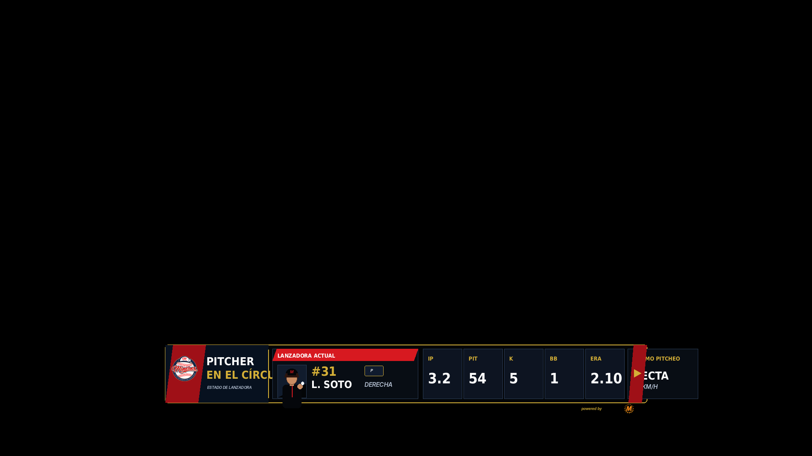

# 14 — Pitcher Overlay

**Sistema:** Mineros Broadcast  
**Documento:** `14-pitcher-overlay.md`  
**Versión:** `1.0.0`  
**Estado:** CANDIDATO VISUAL EN REVISIÓN  
**Propietario:** Club Mineros de Santiago  
**Desarrollado por:** Merchise  

---

## 0. Propósito

El **Pitcher Overlay** muestra la información operativa de la lanzadora o lanzador actual durante la transmisión.

Debe responder visualmente a esta pregunta:

```text
¿Quién está lanzando y cuál es su estado principal en el juego?
```

Este overlay no reemplaza al Scorebug.  
Es una pieza temporal complementaria para presentar a la lanzadora, sus datos básicos y métricas resumidas.

---

## 0.1 Referencia gráfica

**Figura:** `PO-FIG-001`  
**Archivo:** `14-pitcher-overlay-assets/PO-FIG-001-pitcher-overlay-scorebug-style.png`



La gráfica usa un formato **lower-third compacto**, con lenguaje visual derivado del Scorebug aprobado: marco oscuro, borde dorado, módulos internos compactos, rojo Mineros, navy y textos de alto contraste.

---

## 0.2 Descripción funcional completa de la gráfica `PO-FIG-001`

```text
┌────────────────────────────────────────────────────────────────────────────┐
│ BLOQUE EQUIPO / TÍTULO                                                     │
│ Logo Mineros + PITCHER EN EL CÍRCULO + ESTADO DE LANZADORA                 │
├───────────────────────────┬────────┬────────┬─────┬─────┬──────┬──────────┤
│ LANZADORA ACTUAL          │ IP     │ PIT    │ K   │ BB  │ ERA  │ ÚLTIMO   │
│ Foto + # + nombre + mano  │ 3.2    │ 54     │ 5   │ 1   │ 2.10 │ RECTA    │
│ Posición P                │        │        │     │     │      │ 88 KM/H  │
└───────────────────────────┴────────┴────────┴─────┴─────┴──────┴──────────┘
```

---

## 0.3 Mapa de zonas visibles

| Zona | Elemento visible | Función |
|---|---|---|
| `A` | Logo Mineros | Identifica el equipo defensivo |
| `B` | Título `PITCHER EN EL CÍRCULO` | Define que la pieza corresponde a la lanzadora actual |
| `C` | Texto `ESTADO DE LANZADORA` | Aclara el propósito operativo |
| `D` | Tarjeta `LANZADORA ACTUAL` | Muestra identidad de la jugadora que está lanzando |
| `E` | Foto rectangular | Identificación visual |
| `F` | Número de uniforme | Identificación deportiva rápida |
| `G` | Nombre | Identificación principal |
| `H` | Badge `P` | Posición pitcher |
| `I` | Mano de lanzamiento | Derecha / izquierda |
| `J` | `IP` | Entradas lanzadas |
| `K` | `PIT` | Conteo de lanzamientos |
| `L` | `K` | Ponches |
| `M` | `BB` | Bases por bolas |
| `N` | `ERA` | Efectividad |
| `O` | Último pitcheo | Tipo y velocidad del último lanzamiento |
| `P` | Flecha lateral | Indica continuidad visual del sistema, no es botón |

---

## 1. Alcance

El Pitcher Overlay debe mostrar:

1. lanzadora actual;
2. foto rectangular;
3. número;
4. nombre;
5. posición `P`;
6. mano de lanzamiento;
7. entradas lanzadas;
8. conteo de lanzamientos;
9. ponches;
10. bases por bolas;
11. efectividad;
12. último pitcheo opcional;
13. velocidad opcional;
14. estado de reemplazo si aplica.

---

## 2. Relación con documentos anteriores

| Documento | Relación |
|---|---|
| `01-layout-manager.md` | Define zona de aparición, conflictos y preview/program |
| `02-design-system.md` | Define colores, tipografías, bordes y branding |
| `03-asset-manager.md` | Entrega foto y logos |
| `04-game-engine.md` | Entrega lanzadora actual y métricas |
| `08-overlay-manager.md` | Renderiza la pieza |
| `09-integration-contracts.md` | Define contratos y envelope |
| `10-scorebug.md` | Define lenguaje visual base |
| `11-batter-overlay.md` | Debe convivir con el overlay del bateador |
| `13-next-batters.md` | No debe competir si aparece en la misma zona |

---

## 3. Principio central

```text
El Pitcher Overlay no calcula estadísticas.
El Game Engine entrega datos oficiales o calculados.
El Overlay Manager solo renderiza.
```

---

## 4. Variantes oficiales

| Variante | Código | Uso |
|---|---|---|
| Lower third compacto | `lower_third_compact` | Principal |
| Pitcher card | `pitcher_card` | Pausas o presentación |
| Scorebug attached | `scorebug_attached` | Junto al Scorebug |
| Minimal stat strip | `minimal_stat_strip` | Solo métricas |
| Replacement alert | `replacement_alert` | Cambio de lanzadora |

---

## 5. Reglas visuales

| Elemento | Regla |
|---|---|
| Fondo | Oscuro, sin textura decorativa dominante |
| Contenedor | Marco negro con borde dorado |
| Acento principal | Rojo Mineros |
| Módulos secundarios | Navy / negro profundo |
| Foto | Rectangular |
| Sponsor | Mención mínima, no bloque dominante |
| Datos | Compactos y legibles |
| Flecha lateral | Solo cierre visual del sistema |
| Animación | Entrada breve, salida breve |

---

## 6. Campos requeridos

| Campo | Requerido | Fallback |
|---|---:|---|
| `pitcher.playerId` | Sí | Error |
| `pitcher.name` | Sí | Error |
| `pitcher.number` | Sí | Ocultar número |
| `pitcher.teamId` | Sí | Error |
| `pitcher.position` | Sí | `P` |
| `gameId` | Sí | Error |

---

## 7. Campos opcionales

| Campo | Uso | Fallback |
|---|---|---|
| `pitcher.photoAssetId` | Foto | Placeholder |
| `pitcher.throwingHand` | Mano de lanzamiento | Ocultar |
| `stats.inningsPitched` | Entradas lanzadas | Ocultar |
| `stats.pitchCount` | Lanzamientos | Ocultar |
| `stats.strikeouts` | Ponches | Ocultar |
| `stats.walks` | Bases por bolas | Ocultar |
| `stats.era` | Efectividad | Ocultar |
| `lastPitch.type` | Tipo de último lanzamiento | Ocultar módulo |
| `lastPitch.speed` | Velocidad | Ocultar velocidad |

---

## 8. Contrato de datos

```json
{
  "schemaVersion": "1.0.0",
  "correlationId": "corr-pitcher-overlay-000001",
  "source": "GameEngine",
  "target": "PitcherOverlay",
  "timestamp": "2026-06-23T00:00:00Z",
  "payload": {
    "gameId": "game-001",
    "overlayId": "pitcher_overlay",
    "team": {
      "teamId": "team-mineros",
      "name": "Mineros",
      "shortName": "MIN",
      "logoAssetId": "PO-LOGO-001"
    },
    "pitcher": {
      "playerId": "player-031",
      "number": "31",
      "name": "L. Soto",
      "position": "P",
      "photoAssetId": "PLAYER-031",
      "throwingHand": "R"
    },
    "stats": {
      "inningsPitched": "3.2",
      "pitchCount": 54,
      "strikeouts": 5,
      "walks": 1,
      "era": "2.10"
    },
    "lastPitch": {
      "type": "Recta",
      "speed": 88,
      "speedUnit": "km/h"
    }
  }
}
```

---

## 9. Configuración visual base

```json
{
  "overlayId": "pitcher_overlay",
  "schemaVersion": "1.0.0",
  "enabled": true,
  "preferredZone": "D",
  "variant": "lower_third_compact",
  "layout": {
    "showPhoto": true,
    "showNumber": true,
    "showName": true,
    "showThrowingHand": true,
    "showInningsPitched": true,
    "showPitchCount": true,
    "showStrikeouts": true,
    "showWalks": true,
    "showEra": true,
    "showLastPitch": true,
    "showSponsor": "minimal"
  },
  "animations": {
    "in": "slide_up",
    "out": "fade_out",
    "durationMs": 240,
    "holdSeconds": 8
  },
  "fallbacks": {
    "missingPhoto": "placeholder",
    "missingStats": "hide_stat",
    "missingLastPitch": "hide_last_pitch_module"
  }
}
```

---

## 10. Reglas de render

| Condición | Resultado |
|---|---|
| No hay lanzadora actual | No mostrar overlay |
| Falta foto | Placeholder rectangular |
| Falta estadística individual | Ocultar solo esa estadística |
| Falta último pitcheo | Ocultar módulo `ÚLTIMO PITCHEO` |
| Cambio de lanzadora | Mostrar variante `replacement_alert` |
| Fin de entrada | Ocultar salvo activación manual |

---

## 11. Eventos que pueden activar el overlay

| Evento | Acción |
|---|---|
| `pitcher_changed` | Muestra cambio de lanzadora |
| `manual_show_pitcher` | Muestra overlay manualmente |
| `inning_started` | Puede mostrar lanzadora al inicio de entrada |
| `pitch_count_milestone` | Puede mostrar overlay si se alcanza umbral |
| `manual_hide_pitcher` | Oculta overlay |

---

## 12. Qué no representa esta gráfica

| Elemento | Razón |
|---|---|
| No muestra score | Eso pertenece al Scorebug |
| No muestra lineup completo | Eso pertenece a Lineup Overlay |
| No muestra próximos bateadores | Eso pertenece a Next Batters |
| No muestra scouting avanzado | Eso pertenece a módulos estadísticos futuros |
| No calcula estadísticas | Eso pertenece a Game Engine |
| No reemplaza el Batter Overlay | Son piezas complementarias |

---

## 13. Relación con Scorebug

El Pitcher Overlay debe verse como una extensión directa del Scorebug.

Debe heredar:

- formato compacto;
- fondo oscuro;
- borde dorado;
- rojo Mineros;
- navy;
- módulos rectangulares;
- información breve;
- sponsor discreto.

No debe usar:

- dashboard grande;
- campo decorativo;
- múltiples tarjetas sin jerarquía;
- sponsor dominante;
- métricas excesivas;
- texto duplicado.

---

## 14. Criterios de aceptación

El documento se acepta cuando:

- describe cada zona visible de la gráfica;
- define qué datos muestra;
- define qué datos son obligatorios y opcionales;
- define contrato JSON;
- define configuración visual;
- define fallbacks;
- define cuándo aparece y cuándo se oculta;
- no invade responsabilidades del Game Engine;
- mantiene compatibilidad visual con Scorebug.

---

# Historial

| Versión | Estado | Descripción |
|---|---|---|
| 1.0.0 | Candidato visual en revisión | Primera especificación y referencia gráfica del Pitcher Overlay |
