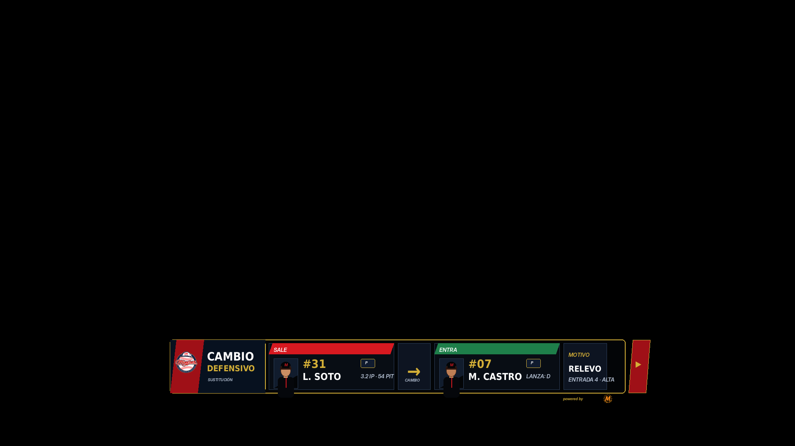
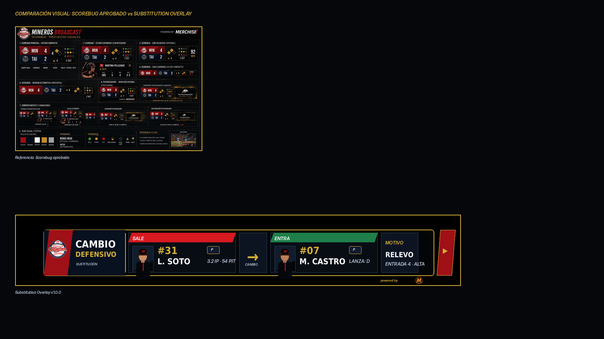

# 15 — Substitution Overlay

**Sistema:** Mineros Broadcast  
**Documento:** `15-substitution-overlay.md`  
**Versión:** `1.0.0`  
**Estado:** CANDIDATO VISUAL EN REVISIÓN  
**Propietario:** Club Mineros de Santiago  
**Desarrollado por:** Merchise  

---

## 0. Propósito

El **Substitution Overlay** comunica un cambio de jugadora durante el juego.

Debe responder visualmente a esta pregunta:

```text
¿Quién sale, quién entra y en qué rol entra?
```

Es una pieza temporal, no persistente. Debe aparecer al momento del cambio y desaparecer después de unos segundos.

---

## 0.1 Referencia gráfica

**Figura:** `SO-FIG-001`  
**Archivo:** `15-substitution-overlay-assets/SO-FIG-001-substitution-overlay-scorebug-style.png`



---

## 0.2 Comparación con Scorebug

**Figura:** `SO-FIG-002`  
**Archivo:** `15-substitution-overlay-assets/SO-FIG-002-scorebug-comparison-check.png`



La gráfica fue generada como **lower-third compacto** para mantener relación visual con el Scorebug aprobado: marco negro, borde dorado, rojo/navy, módulos compactos y cierre lateral sin invadir datos.

---

## 0.3 Descripción funcional de la gráfica `SO-FIG-001`

```text
┌────────────────────────────────────────────────────────────────────────────┐
│ BLOQUE EQUIPO / TIPO DE CAMBIO                                             │
│ Logo Mineros + CAMBIO DEFENSIVO + SUSTITUCIÓN                              │
├────────────────────────┬─────────────┬────────────────────────┬───────────┤
│ SALE                   │ CAMBIO      │ ENTRA                  │ MOTIVO    │
│ Foto + #31 + L. Soto   │ Flecha      │ Foto + #07 + M. Castro │ RELEVO    │
│ P · 3.2 IP · 54 PIT    │             │ P · LANZA: D           │ Entrada   │
└────────────────────────┴─────────────┴────────────────────────┴───────────┘
```

---

## 0.4 Mapa de zonas visibles

| Zona | Elemento visible | Función |
|---|---|---|
| `A` | Logo Mineros | Identifica el equipo que realiza el cambio |
| `B` | Título `CAMBIO DEFENSIVO` | Define el tipo de sustitución |
| `C` | Texto `SUSTITUCIÓN` | Aclara que es una acción de roster |
| `D` | Tarjeta `SALE` | Muestra la jugadora que abandona el juego o posición |
| `E` | Foto de jugadora que sale | Identificación visual |
| `F` | Número y nombre de quien sale | Identificación principal |
| `G` | Posición de quien sale | Rol afectado |
| `H` | Datos breves de salida | Contexto opcional |
| `I` | Flecha central | Indica transición entre jugadoras |
| `J` | Tarjeta `ENTRA` | Muestra la jugadora que ingresa |
| `K` | Foto de jugadora que entra | Identificación visual |
| `L` | Número y nombre de quien entra | Identificación principal |
| `M` | Posición de ingreso | Rol asignado |
| `N` | Módulo `MOTIVO` | Explica el tipo de cambio |
| `O` | Entrada / momento | Contexto temporal |
| `P` | Cierre lateral externo | Continuidad visual del sistema; no tapa datos |

---

## 1. Alcance

El Substitution Overlay debe soportar:

1. cambio defensivo;
2. cambio ofensivo;
3. cambio de lanzadora;
4. corredor emergente;
5. bateador emergente;
6. cambio múltiple;
7. reingreso si la regla de la competencia lo permite;
8. cambio manual informado por operador.

---

## 2. Relación con documentos anteriores

| Documento | Relación |
|---|---|
| `01-layout-manager.md` | Define zona de aparición y conflictos |
| `02-design-system.md` | Define lenguaje visual |
| `03-asset-manager.md` | Entrega fotos y logos |
| `04-game-engine.md` | Entrega sustituciones válidas |
| `08-overlay-manager.md` | Renderiza y anima |
| `09-integration-contracts.md` | Define contratos |
| `10-scorebug.md` | Base visual |
| `12-lineup.md` | Lineup afectado por la sustitución |
| `14-pitcher-overlay.md` | Puede dispararse si el cambio es de pitcher |

---

## 3. Principio central

```text
El Substitution Overlay no decide si el cambio es válido.
El Game Engine valida y entrega el cambio.
El Overlay Manager solo presenta la sustitución.
```

---

## 4. Tipos de sustitución

| Tipo | Código | Uso |
|---|---|---|
| Cambio defensivo | `defensive_change` | Jugadora entra a una posición defensiva |
| Cambio ofensivo | `offensive_change` | Cambio en orden al bate |
| Cambio de pitcher | `pitching_change` | Relevo de lanzadora |
| Bateador emergente | `pinch_hitter` | Entra a batear por otra jugadora |
| Corredor emergente | `pinch_runner` | Entra a correr por otra jugadora |
| Doble cambio | `double_switch` | Cambio múltiple coordinado |
| Cambio múltiple | `multiple_substitution` | Más de una jugadora entra/sale |

---

## 5. Variantes oficiales

| Variante | Código | Uso |
|---|---|---|
| Lower third compacto | `lower_third_compact` | Principal |
| Cambio de pitcher | `pitching_change` | Relevo |
| Cambio múltiple | `multi_change` | Dos o más jugadoras |
| Alerta breve | `compact_alert` | Cambio rápido |
| Full card | `full_card` | Pausas o explicación |

---

## 6. Reglas visuales

| Elemento | Regla |
|---|---|
| Fondo | Oscuro, sin campo decorativo |
| Contenedor | Marco negro con borde dorado |
| Acento `SALE` | Rojo Mineros |
| Acento `ENTRA` | Verde operativo o navy con énfasis |
| Flecha central | Indica transición |
| Fotos | Rectangulares |
| Sponsor | Mención mínima externa |
| Cierre lateral | Fuera del área de datos |
| Texto | Sin duplicación ni solapamiento |

---

## 7. Campos requeridos

| Campo | Requerido | Fallback |
|---|---:|---|
| `substitution.type` | Sí | Error |
| `substitution.reason` | Sí | `Cambio` |
| `outPlayer.playerId` | Sí | Error |
| `outPlayer.name` | Sí | Error |
| `inPlayer.playerId` | Sí | Error |
| `inPlayer.name` | Sí | Error |
| `team.teamId` | Sí | Error |

---

## 8. Campos opcionales

| Campo | Uso | Fallback |
|---|---|---|
| `outPlayer.number` | Número de quien sale | Ocultar |
| `outPlayer.position` | Posición previa | Ocultar |
| `outPlayer.photoAssetId` | Foto | Placeholder |
| `inPlayer.number` | Número de quien entra | Ocultar |
| `inPlayer.position` | Posición de ingreso | Ocultar |
| `inPlayer.photoAssetId` | Foto | Placeholder |
| `context.inning` | Entrada | Ocultar |
| `context.notes` | Nota de operador | Ocultar |
| `stats.outPlayerSummary` | Datos breves de salida | Ocultar |

---

## 9. Contrato de datos

```json
{
  "schemaVersion": "1.0.0",
  "correlationId": "corr-substitution-000001",
  "source": "GameEngine",
  "target": "SubstitutionOverlay",
  "timestamp": "2026-06-23T00:00:00Z",
  "payload": {
    "gameId": "game-001",
    "overlayId": "substitution_overlay",
    "substitution": {
      "type": "pitching_change",
      "reason": "Relevo",
      "sequence": 1
    },
    "team": {
      "teamId": "team-mineros",
      "name": "Mineros",
      "shortName": "MIN",
      "logoAssetId": "SO-LOGO-001"
    },
    "outPlayer": {
      "playerId": "player-031",
      "number": "31",
      "name": "L. Soto",
      "position": "P",
      "photoAssetId": "PLAYER-031"
    },
    "inPlayer": {
      "playerId": "player-007",
      "number": "07",
      "name": "M. Castro",
      "position": "P",
      "photoAssetId": "PLAYER-007",
      "throwingHand": "R"
    },
    "context": {
      "inning": {
        "number": 4,
        "half": "top"
      },
      "notes": "Relevo defensivo"
    },
    "stats": {
      "outPlayerSummary": "3.2 IP · 54 PIT"
    }
  }
}
```

---

## 10. Configuración visual base

```json
{
  "overlayId": "substitution_overlay",
  "schemaVersion": "1.0.0",
  "enabled": true,
  "preferredZone": "D",
  "variant": "lower_third_compact",
  "layout": {
    "showTeamLogo": true,
    "showOutPlayer": true,
    "showInPlayer": true,
    "showPhotos": true,
    "showNumbers": true,
    "showPositions": true,
    "showReason": true,
    "showContext": true,
    "showSponsor": "minimal"
  },
  "animations": {
    "in": "slide_up",
    "out": "fade_out",
    "durationMs": 240,
    "holdSeconds": 7
  },
  "fallbacks": {
    "missingPhoto": "placeholder",
    "missingNumber": "hide_number",
    "missingPosition": "hide_position",
    "missingReason": "Cambio"
  }
}
```

---

## 11. Reglas de render

| Condición | Resultado |
|---|---|
| Falta jugadora que entra | No mostrar overlay |
| Falta jugadora que sale | Mostrar solo entrada si el evento lo permite |
| Cambio múltiple | Usar variante `multi_change` |
| Falta foto | Placeholder rectangular |
| Falta posición | Ocultar badge |
| Falta motivo | Mostrar `Cambio` |
| Fin de evento | Ocultar automáticamente |

---

## 12. Eventos que pueden activar el overlay

| Evento | Acción |
|---|---|
| `substitution_confirmed` | Muestra overlay |
| `pitcher_changed` | Muestra variante de relevo |
| `pinch_hitter_announced` | Muestra bateador emergente |
| `pinch_runner_announced` | Muestra corredor emergente |
| `manual_show_substitution` | Muestra manualmente |
| `manual_hide_substitution` | Oculta manualmente |

---

## 13. Qué no representa esta gráfica

| Elemento | Razón |
|---|---|
| No valida reglas de sustitución | Eso pertenece al Game Engine |
| No actualiza visualmente todo el lineup | Eso pertenece a Lineup Overlay |
| No muestra estadísticas completas | Solo resumen breve |
| No reemplaza el Pitcher Overlay | Puede activar una pieza relacionada, pero no la sustituye |
| No muestra score | Eso pertenece al Scorebug |

---

## 14. Criterios de aceptación

El documento se acepta cuando:

- describe cada zona visible;
- define quién sale y quién entra;
- define tipos de sustitución;
- define contrato JSON;
- define configuración visual;
- define fallbacks;
- define eventos;
- mantiene compatibilidad visual con Scorebug;
- evita solapamientos;
- no invade responsabilidades del Game Engine.

---

# Historial

| Versión | Estado | Descripción |
|---|---|---|
| 1.0.0 | Candidato visual en revisión | Primera especificación y referencia gráfica del Substitution Overlay |
