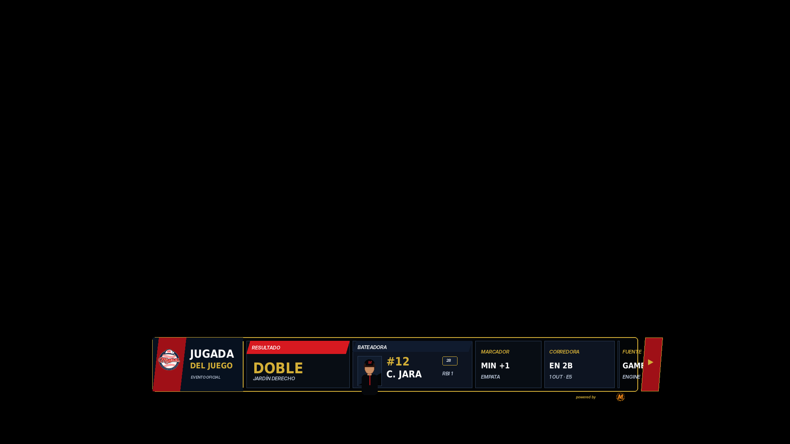
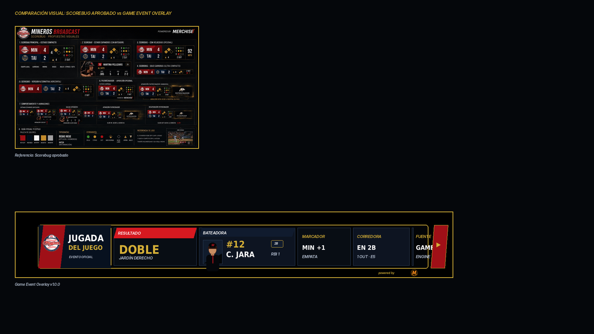

# 16 — Game Event Overlay

**Sistema:** Mineros Broadcast  
**Documento:** `16-game-event-overlay.md`  
**Versión:** `1.0.0`  
**Estado:** CANDIDATO VISUAL EN REVISIÓN  
**Propietario:** Club Mineros de Santiago  
**Desarrollado por:** Merchise  

---

## 0. Propósito

El **Game Event Overlay** comunica una jugada relevante ocurrida durante el juego.

Debe responder visualmente a esta pregunta:

```text
¿Qué acaba de pasar en el juego?
```

Es una pieza temporal, activada por eventos del Game Engine o por el operador.

---

## 0.1 Referencia gráfica

**Figura:** `GEV-FIG-001`  
**Archivo:** `16-game-event-overlay-assets/GEV-FIG-001-game-event-overlay-scorebug-style.png`



---

## 0.2 Comparación con Scorebug

**Figura:** `GEV-FIG-002`  
**Archivo:** `16-game-event-overlay-assets/GEV-FIG-002-scorebug-comparison-check.png`



La gráfica usa un formato **lower-third compacto** para mantener continuidad visual con el Scorebug aprobado: marco negro, borde dorado, rojo/navy, módulos de datos compactos y cierre lateral sin invadir información.

---

## 0.3 Descripción funcional de la gráfica `GEV-FIG-001`

```text
┌────────────────────────────────────────────────────────────────────────────┐
│ BLOQUE EQUIPO / TIPO DE EVENTO                                             │
│ Logo Mineros + JUGADA DEL JUEGO + EVENTO OFICIAL                           │
├───────────────────────┬──────────────────────┬─────────────┬─────────────┤
│ RESULTADO             │ BATEADORA            │ MARCADOR    │ CORREDORA   │
│ DOBLE                 │ Foto + #12 + C. Jara │ MIN +1      │ EN 2B       │
│ Jardín derecho        │ 2B · RBI 1           │ Empata      │ 1 OUT · E5  │
└───────────────────────┴──────────────────────┴─────────────┴─────────────┘
```

---

## 0.4 Mapa de zonas visibles

| Zona | Elemento visible | Función |
|---|---|---|
| `A` | Logo Mineros | Identifica el equipo asociado al evento |
| `B` | Título `JUGADA DEL JUEGO` | Define que se comunica un evento relevante |
| `C` | Texto `EVENTO OFICIAL` | Aclara que proviene del estado oficial del juego |
| `D` | Módulo `RESULTADO` | Muestra el resultado principal de la jugada |
| `E` | Descripción de dirección | Indica dónde ocurrió la jugada |
| `F` | Módulo `BATEADORA` | Identifica a la jugadora protagonista |
| `G` | Foto rectangular | Identificación visual |
| `H` | Número y nombre | Identificación deportiva |
| `I` | Posición y RBI | Contexto ofensivo |
| `J` | Módulo `MARCADOR` | Explica impacto en el score |
| `K` | Módulo `CORREDORA` | Muestra estado posterior en bases |
| `L` | Módulo `FUENTE` | Identifica origen del evento |
| `M` | Cierre lateral externo | Continuidad visual del sistema, no tapa datos |

---

## 1. Alcance

El Game Event Overlay debe soportar:

1. hit sencillo;
2. doble;
3. triple;
4. home run;
5. carrera anotada;
6. carrera impulsada;
7. base por bolas;
8. ponche;
9. out defensivo;
10. robo de base;
11. error;
12. doble play;
13. jugada destacada manual;
14. revisión o corrección de jugada.

---

## 2. Relación con documentos anteriores

| Documento | Relación |
|---|---|
| `01-layout-manager.md` | Define zona de aparición y conflictos |
| `02-design-system.md` | Define lenguaje visual |
| `03-asset-manager.md` | Entrega fotos y logos |
| `04-game-engine.md` | Entrega eventos oficiales del juego |
| `06-event-engine.md` | Orquesta eventos y disparadores |
| `08-overlay-manager.md` | Renderiza la pieza |
| `09-integration-contracts.md` | Define contratos |
| `10-scorebug.md` | Base visual |
| `11-batter-overlay.md` | Puede aportar datos de la bateadora |
| `13-next-batters.md` | Se oculta si compite por la misma zona |
| `14-pitcher-overlay.md` | Se oculta si el evento está asociado al pitcher |

---

## 3. Principio central

```text
El Game Event Overlay no interpreta la jugada.
El Game Engine entrega el evento validado.
El Overlay Manager presenta el evento con una variante visual.
```

---

## 4. Tipos de evento

| Tipo | Código | Uso |
|---|---|---|
| Hit sencillo | `single` | Bateadora llega a primera |
| Doble | `double` | Bateadora llega a segunda |
| Triple | `triple` | Bateadora llega a tercera |
| Home run | `home_run` | Cuadrangular |
| Carrera | `run_scored` | Carrera anotada |
| RBI | `rbi` | Carrera impulsada |
| Base por bolas | `walk` | Boleto |
| Ponche | `strikeout` | Out por strikes |
| Out | `out` | Out registrado |
| Robo | `stolen_base` | Base robada |
| Error | `error` | Error defensivo |
| Doble play | `double_play` | Dos outs en una jugada |
| Destacada manual | `manual_highlight` | Evento creado por operador |

---

## 5. Variantes oficiales

| Variante | Código | Uso |
|---|---|---|
| Lower third compacto | `lower_third_compact` | Principal |
| Home run alert | `home_run_alert` | Cuadrangular |
| Run alert | `run_alert` | Carrera anotada |
| Defensive play | `defensive_play` | Jugada defensiva |
| Minimal alert | `minimal_alert` | Evento breve |
| Full card | `full_card` | Pausa o repetición |

---

## 6. Reglas visuales

| Elemento | Regla |
|---|---|
| Fondo | Oscuro, sin campo decorativo |
| Contenedor | Marco negro con borde dorado |
| Resultado principal | Mayor jerarquía visual |
| Jugadora protagonista | Foto rectangular + número + nombre |
| Impacto en marcador | Módulo separado |
| Estado posterior | Módulo separado |
| Fuente | Módulo pequeño |
| Sponsor | Mención mínima externa |
| Cierre lateral | Fuera del área de datos |
| Texto | Sin duplicación ni solapamiento |

---

## 7. Campos requeridos

| Campo | Requerido | Fallback |
|---|---:|---|
| `event.type` | Sí | Error |
| `event.label` | Sí | Error |
| `team.teamId` | Sí | Error |
| `gameId` | Sí | Error |
| `timestamp` | Sí | Error |

---

## 8. Campos opcionales

| Campo | Uso | Fallback |
|---|---|---|
| `event.description` | Dirección o detalle | Ocultar |
| `player.playerId` | Jugadora protagonista | Ocultar módulo jugador |
| `player.number` | Número | Ocultar |
| `player.name` | Nombre | Ocultar |
| `player.position` | Posición | Ocultar |
| `player.photoAssetId` | Foto | Placeholder |
| `impact.scoreDelta` | Cambio de score | Ocultar |
| `impact.rbi` | Carreras impulsadas | Ocultar |
| `stateAfter.bases` | Estado de bases | Ocultar |
| `context.inning` | Entrada | Ocultar |
| `context.outs` | Outs | Ocultar |

---

## 9. Contrato de datos

```json
{
  "schemaVersion": "1.0.0",
  "correlationId": "corr-game-event-000001",
  "source": "GameEngine",
  "target": "GameEventOverlay",
  "timestamp": "2026-06-23T00:00:00Z",
  "payload": {
    "gameId": "game-001",
    "overlayId": "game_event_overlay",
    "event": {
      "type": "double",
      "label": "Doble",
      "description": "Jardín derecho"
    },
    "team": {
      "teamId": "team-mineros",
      "name": "Mineros",
      "shortName": "MIN",
      "logoAssetId": "GEV-LOGO-001"
    },
    "player": {
      "playerId": "player-012",
      "number": "12",
      "name": "Carolina Jara",
      "shortName": "C. Jara",
      "position": "2B",
      "photoAssetId": "PLAYER-012"
    },
    "impact": {
      "scoreDelta": 1,
      "scoreLabel": "MIN +1",
      "rbi": 1,
      "summary": "Empata"
    },
    "stateAfter": {
      "runnerLabel": "En 2B",
      "bases": {
        "first": false,
        "second": true,
        "third": false
      }
    },
    "context": {
      "inning": {
        "number": 5,
        "half": "top"
      },
      "outs": 1
    }
  }
}
```

---

## 10. Configuración visual base

```json
{
  "overlayId": "game_event_overlay",
  "schemaVersion": "1.0.0",
  "enabled": true,
  "preferredZone": "D",
  "variant": "lower_third_compact",
  "layout": {
    "showTeamLogo": true,
    "showEventLabel": true,
    "showDescription": true,
    "showPlayer": true,
    "showPhoto": true,
    "showImpact": true,
    "showStateAfter": true,
    "showSponsor": "minimal"
  },
  "animations": {
    "in": "slide_up",
    "out": "fade_out",
    "durationMs": 240,
    "holdSeconds": 6
  },
  "fallbacks": {
    "missingPhoto": "placeholder",
    "missingPlayer": "hide_player_module",
    "missingImpact": "hide_impact_module",
    "missingStateAfter": "hide_state_module"
  }
}
```

---

## 11. Reglas de render

| Condición | Resultado |
|---|---|
| Falta `event.label` | No mostrar overlay |
| Falta jugadora | Mostrar solo resultado e impacto |
| Falta foto | Placeholder rectangular |
| Falta descripción | Ocultar línea secundaria |
| Falta impacto en score | Ocultar módulo marcador |
| Falta estado posterior | Ocultar módulo de bases/corredora |
| Evento manual | Mostrar `manual_highlight` |
| Evento de alto impacto | Puede usar variante especial |

---

## 12. Eventos que pueden activar el overlay

| Evento | Acción |
|---|---|
| `play_result_confirmed` | Muestra resultado de jugada |
| `run_scored` | Muestra alerta de carrera |
| `home_run` | Muestra variante home run |
| `strikeout` | Muestra evento de ponche |
| `walk` | Muestra base por bolas |
| `defensive_highlight` | Muestra jugada defensiva |
| `manual_show_game_event` | Muestra manualmente |
| `manual_hide_game_event` | Oculta manualmente |

---

## 13. Qué no representa esta gráfica

| Elemento | Razón |
|---|---|
| No muestra marcador completo | Eso pertenece al Scorebug |
| No calcula el resultado de la jugada | Eso pertenece al Game Engine |
| No actualiza lineup | Eso pertenece al Lineup Overlay |
| No reemplaza Batter Overlay | Solo comunica la jugada |
| No muestra todas las estadísticas | Solo el contexto inmediato |
| No es un replay gráfico | Solo título/datos del evento |

---

## 14. Criterios de aceptación

El documento se acepta cuando:

- describe cada zona visible;
- define tipos de evento;
- define contrato JSON;
- define configuración visual;
- define fallbacks;
- define eventos;
- mantiene compatibilidad visual con Scorebug;
- evita solapamientos;
- no invade responsabilidades del Game Engine;
- permite variantes especiales para eventos de alto impacto.

---

# Historial

| Versión | Estado | Descripción |
|---|---|---|
| 1.0.0 | Candidato visual en revisión | Primera especificación y referencia gráfica del Game Event Overlay |
