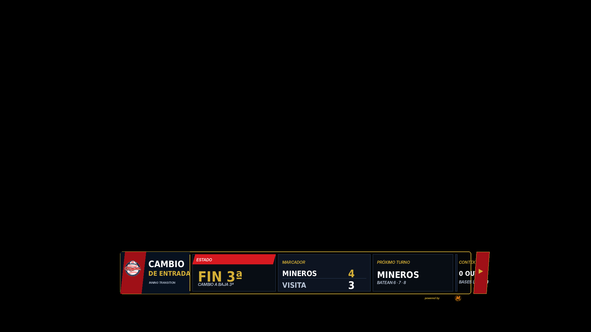
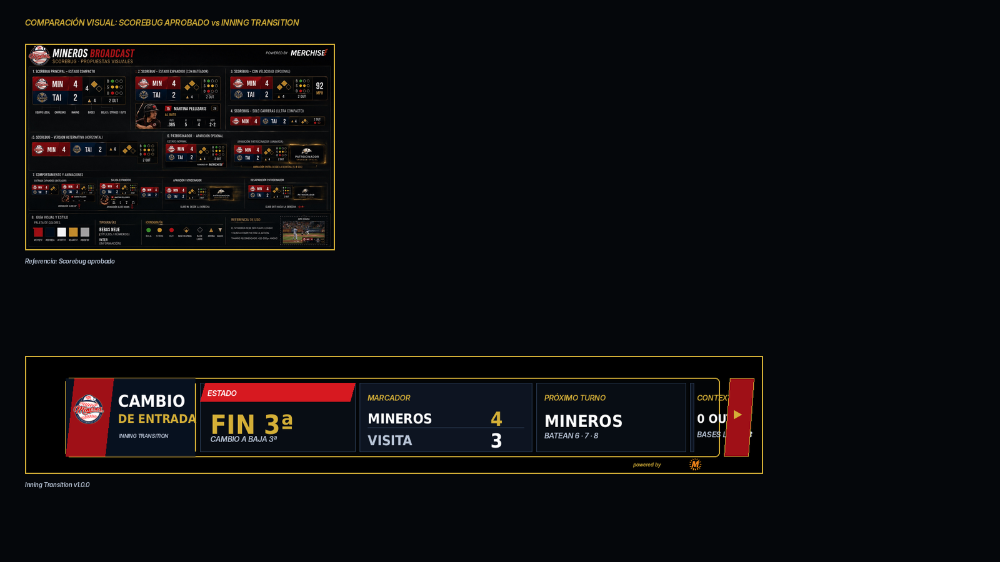

# 17 — Inning Transition Overlay

**Sistema:** Mineros Broadcast  
**Documento:** `17-inning-transition.md`  
**Versión:** `1.0.0`  
**Estado:** CANDIDATO VISUAL EN REVISIÓN  
**Propietario:** Club Mineros de Santiago  
**Desarrollado por:** Merchise  

---

## 0. Propósito

El **Inning Transition Overlay** comunica el cierre de una media entrada y la transición hacia la siguiente mitad del inning.

Debe responder visualmente a esta pregunta:

```text
¿Terminó la media entrada y qué viene ahora?
```

Es una pieza temporal. Debe aparecer cuando finaliza la parte alta o baja de una entrada, y ocultarse antes del siguiente lanzamiento.

---

## 0.1 Referencia gráfica

**Figura:** `IT-FIG-001`  
**Archivo:** `17-inning-transition-assets/IT-FIG-001-inning-transition-scorebug-style.png`



---

## 0.2 Comparación con Scorebug

**Figura:** `IT-FIG-002`  
**Archivo:** `17-inning-transition-assets/IT-FIG-002-scorebug-comparison-check.png`



La gráfica usa un formato **lower-third compacto** alineado al Scorebug aprobado: marco negro, borde dorado, rojo/navy, módulos de datos compactos, cierre lateral externo y sponsor mínimo.

---

## 0.3 Descripción funcional de la gráfica `IT-FIG-001`

```text
┌────────────────────────────────────────────────────────────────────────────┐
│ BLOQUE EQUIPO / TIPO DE TRANSICIÓN                                         │
│ Logo Mineros + CAMBIO DE ENTRADA + INNING TRANSITION                       │
├────────────────────────┬────────────────────────┬────────────────────────┤
│ ESTADO                 │ MARCADOR               │ PRÓXIMO TURNO          │
│ FIN 3ª                 │ Mineros 4 / Visita 3   │ Mineros                │
│ Cambio a baja 3ª       │                        │ Batean 6 · 7 · 8       │
└────────────────────────┴────────────────────────┴────────────────────────┘
```

---

## 0.4 Mapa de zonas visibles

| Zona | Elemento visible | Función |
|---|---|---|
| `A` | Logo Mineros | Identifica el equipo destacado en la transición |
| `B` | Título `CAMBIO DE ENTRADA` | Define que hay transición de media entrada |
| `C` | Texto `INNING TRANSITION` | Identifica el tipo de overlay |
| `D` | Módulo `ESTADO` | Indica media entrada finalizada |
| `E` | Línea `CAMBIO A BAJA 3ª` | Indica cuál será la siguiente mitad |
| `F` | Módulo `MARCADOR` | Resume el score al cierre de la media entrada |
| `G` | Módulo `PRÓXIMO TURNO` | Indica quién batea después |
| `H` | Módulo `CONTEXTO` | Muestra condiciones iniciales de la nueva media entrada |
| `I` | Cierre lateral externo | Continuidad visual; no tapa datos |
| `J` | Sponsor mínimo | Marca técnica discreta |

---

## 1. Alcance

El Inning Transition Overlay debe mostrar:

1. media entrada terminada;
2. próxima media entrada;
3. marcador actual;
4. equipo que batea a continuación;
5. próximos bateadores resumidos;
6. contexto inicial de la nueva media entrada;
7. sponsor mínimo opcional.

---

## 2. Relación con documentos anteriores

| Documento | Relación |
|---|---|
| `01-layout-manager.md` | Define zona de aparición y conflictos |
| `02-design-system.md` | Define lenguaje visual |
| `03-asset-manager.md` | Entrega logos |
| `04-game-engine.md` | Entrega inning, marcador y próximo turno |
| `06-event-engine.md` | Dispara transición de entrada |
| `08-overlay-manager.md` | Renderiza y anima |
| `09-integration-contracts.md` | Define contratos |
| `10-scorebug.md` | Base visual |
| `13-next-batters.md` | Puede alimentar resumen de próximos bateadores |
| `16-game-event-overlay.md` | Puede anteceder si el último out fue una jugada relevante |

---

## 3. Principio central

```text
El Inning Transition Overlay no calcula score ni lineup.
El Game Engine entrega estado de inning, marcador y próximo turno.
El Overlay Manager solo presenta.
```

---

## 4. Tipos de transición

| Tipo | Código | Uso |
|---|---|---|
| Alta a baja | `top_to_bottom` | Termina alta, comienza baja |
| Baja a alta | `bottom_to_top` | Termina baja, comienza nueva entrada |
| Fin de inning | `inning_completed` | Entrada completa finalizada |
| Fin de juego | `game_completed` | Partido finalizado |
| Pausa entre entradas | `between_innings` | Espera operativa |

---

## 5. Variantes oficiales

| Variante | Código | Uso |
|---|---|---|
| Lower third compacto | `lower_third_compact` | Principal |
| Full width | `full_width` | Transmisión con pausa |
| Minimal | `minimal` | Transición breve |
| Scorebug attached | `scorebug_attached` | Integrado al Scorebug |
| End game | `end_game` | Cierre de juego |

---

## 6. Reglas visuales

| Elemento | Regla |
|---|---|
| Fondo | Oscuro, sin campo decorativo |
| Contenedor | Marco negro con borde dorado |
| Estado de entrada | Mayor jerarquía visual |
| Marcador | Módulo separado |
| Próximo turno | Módulo separado |
| Contexto | Módulo compacto |
| Sponsor | Mención mínima externa |
| Cierre lateral | Fuera del área de datos |
| Texto | Sin duplicación ni solapamiento |

---

## 7. Campos requeridos

| Campo | Requerido | Fallback |
|---|---:|---|
| `gameId` | Sí | Error |
| `transition.type` | Sí | Error |
| `inning.number` | Sí | Error |
| `inning.nextHalf` | Sí | Error |
| `score` | Sí | Error |
| `nextBattingTeam.teamId` | Sí | Error |

---

## 8. Campos opcionales

| Campo | Uso | Fallback |
|---|---|---|
| `nextBattingTeam.logoAssetId` | Logo | Ocultar |
| `nextBattersSummary` | Próximos bateadores | Ocultar |
| `context.outs` | Outs iniciales | `0 OUTS` |
| `context.bases` | Bases iniciales | `Bases limpias` |
| `message` | Texto editorial | Ocultar |

---

## 9. Contrato de datos

```json
{
  "schemaVersion": "1.0.0",
  "correlationId": "corr-inning-transition-000001",
  "source": "GameEngine",
  "target": "InningTransitionOverlay",
  "timestamp": "2026-06-23T00:00:00Z",
  "payload": {
    "gameId": "game-001",
    "overlayId": "inning_transition",
    "transition": {
      "type": "top_to_bottom",
      "label": "Cambio de entrada",
      "statusLabel": "Fin 3ª",
      "nextLabel": "Cambio a baja 3ª"
    },
    "inning": {
      "number": 3,
      "completedHalf": "top",
      "nextHalf": "bottom"
    },
    "score": {
      "home": {
        "teamId": "team-mineros",
        "shortName": "MINEROS",
        "runs": 4
      },
      "away": {
        "teamId": "team-visit",
        "shortName": "VISITA",
        "runs": 3
      }
    },
    "nextBattingTeam": {
      "teamId": "team-mineros",
      "shortName": "MINEROS",
      "logoAssetId": "IT-LOGO-001"
    },
    "nextBattersSummary": "Batean 6 · 7 · 8",
    "context": {
      "outs": 0,
      "basesLabel": "Bases limpias"
    }
  }
}
```

---

## 10. Configuración visual base

```json
{
  "overlayId": "inning_transition",
  "schemaVersion": "1.0.0",
  "enabled": true,
  "preferredZone": "D",
  "variant": "lower_third_compact",
  "layout": {
    "showTeamLogo": true,
    "showTransitionStatus": true,
    "showScore": true,
    "showNextBattingTeam": true,
    "showNextBattersSummary": true,
    "showContext": true,
    "showSponsor": "minimal"
  },
  "animations": {
    "in": "slide_up",
    "out": "fade_out",
    "durationMs": 240,
    "holdSeconds": 6
  },
  "fallbacks": {
    "missingNextBatters": "hide_next_batters_summary",
    "missingContext": "show_default_context",
    "missingTeamLogo": "hide_logo"
  }
}
```

---

## 11. Reglas de render

| Condición | Resultado |
|---|---|
| Falta score | No mostrar overlay |
| Falta próxima media entrada | No mostrar overlay |
| Falta próximos bateadores | Ocultar resumen |
| Fin de juego | Usar variante `end_game` |
| Pausa prolongada | Puede mantenerse más tiempo |
| Activación manual | Mostrar según payload manual |

---

## 12. Eventos que pueden activar el overlay

| Evento | Acción |
|---|---|
| `half_inning_completed` | Muestra transición |
| `inning_completed` | Muestra fin de inning |
| `side_retired` | Muestra cambio de entrada |
| `game_completed` | Muestra variante cierre |
| `manual_show_inning_transition` | Muestra manualmente |
| `manual_hide_inning_transition` | Oculta manualmente |

---

## 13. Qué no representa esta gráfica

| Elemento | Razón |
|---|---|
| No muestra jugada final | Eso pertenece a Game Event Overlay |
| No muestra lineup completo | Eso pertenece a Lineup Overlay |
| No muestra detalle de bateadores | Eso pertenece a Next Batters |
| No calcula marcador | Eso pertenece al Game Engine |
| No reemplaza Scorebug | Solo complementa transición |

---

## 14. Criterios de aceptación

El documento se acepta cuando:

- describe cada zona visible;
- define tipos de transición;
- define contrato JSON;
- define configuración visual;
- define fallbacks;
- define eventos;
- mantiene compatibilidad visual con Scorebug;
- evita solapamientos;
- no invade responsabilidades del Game Engine.

---

# Historial

| Versión | Estado | Descripción |
|---|---|---|
| 1.0.0 | Candidato visual en revisión | Primera especificación y referencia gráfica del Inning Transition Overlay |
