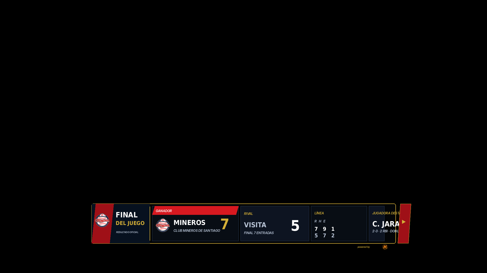
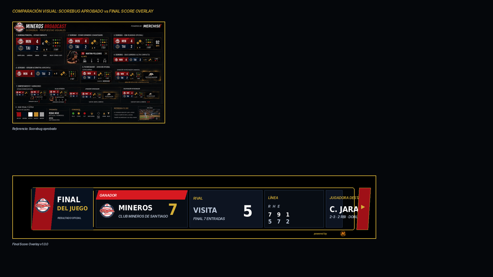

# 18 — Final Score Overlay

**Sistema:** Mineros Broadcast  
**Documento:** `18-final-score-overlay.md`  
**Versión:** `1.0.0`  
**Estado:** CANDIDATO VISUAL EN REVISIÓN  
**Propietario:** Club Mineros de Santiago  
**Desarrollado por:** Merchise  

---

## 0. Propósito

El **Final Score Overlay** comunica el resultado oficial al terminar el partido.

Debe responder visualmente a esta pregunta:

```text
¿Cuál fue el resultado final del juego?
```

Es una pieza de cierre. Puede mostrarse al finalizar la transmisión, durante entrevistas o como pantalla de resumen antes del cierre.

---

## 0.1 Referencia gráfica

**Figura:** `FS-FIG-001`  
**Archivo:** `18-final-score-overlay-assets/FS-FIG-001-final-score-overlay-scorebug-style.png`



---

## 0.2 Comparación con Scorebug

**Figura:** `FS-FIG-002`  
**Archivo:** `18-final-score-overlay-assets/FS-FIG-002-scorebug-comparison-check.png`



La gráfica mantiene el lenguaje visual del Scorebug aprobado: lower-third compacto, marco negro, borde dorado, rojo/navy, módulos de datos y sponsor mínimo.

---

## 0.3 Descripción funcional de la gráfica `FS-FIG-001`

```text
┌────────────────────────────────────────────────────────────────────────────┐
│ BLOQUE FINAL                                                               │
│ Logo Mineros + FINAL DEL JUEGO + RESULTADO OFICIAL                         │
├────────────────────────┬────────────────────┬─────────────┬───────────────┤
│ GANADOR                │ RIVAL              │ LÍNEA       │ DESTACADA     │
│ Mineros 7              │ Visita 5           │ R H E       │ C. Jara       │
│ Club Mineros Santiago  │ Final 7 entradas   │ 7 9 1       │ 2-3 · 2 RBI   │
└────────────────────────┴────────────────────┴─────────────┴───────────────┘
```

---

## 0.4 Mapa de zonas visibles

| Zona | Elemento visible | Función |
|---|---|---|
| `A` | Logo Mineros | Identifica equipo destacado |
| `B` | Título `FINAL DEL JUEGO` | Indica cierre oficial |
| `C` | Texto `RESULTADO OFICIAL` | Aclara que es marcador final |
| `D` | Módulo `GANADOR` | Muestra equipo ganador y carreras |
| `E` | Módulo `RIVAL` | Muestra equipo contrario y carreras |
| `F` | Módulo `LÍNEA` | Muestra resumen R/H/E |
| `G` | Módulo `JUGADORA DESTACADA` | Destaca rendimiento clave |
| `H` | Cierre lateral externo | Continuidad visual; no tapa datos |
| `I` | Sponsor mínimo | Marca técnica discreta |

---

## 1. Alcance

El Final Score Overlay debe mostrar:

1. estado final del partido;
2. equipo ganador;
3. equipo rival;
4. marcador final;
5. resumen de línea opcional;
6. jugadora destacada opcional;
7. duración o número de entradas;
8. sponsor mínimo opcional.

---

## 2. Relación con documentos anteriores

| Documento | Relación |
|---|---|
| `01-layout-manager.md` | Define zona de aparición y conflictos |
| `02-design-system.md` | Define lenguaje visual |
| `03-asset-manager.md` | Entrega logos y fotos opcionales |
| `04-game-engine.md` | Entrega marcador final |
| `06-event-engine.md` | Dispara evento de fin de juego |
| `08-overlay-manager.md` | Renderiza y anima |
| `09-integration-contracts.md` | Define contratos |
| `10-scorebug.md` | Base visual |
| `16-game-event-overlay.md` | Puede anteceder al resultado final |
| `17-inning-transition.md` | Se sustituye por esta pieza al finalizar el juego |

---

## 3. Principio central

```text
El Final Score Overlay no calcula el resultado.
El Game Engine entrega el resultado oficial.
El Overlay Manager presenta la pieza de cierre.
```

---

## 4. Variantes oficiales

| Variante | Código | Uso |
|---|---|---|
| Lower third compacto | `lower_third_compact` | Principal |
| Full width | `full_width` | Cierre de transmisión |
| Full card | `full_card` | Pantalla final |
| Minimal | `minimal` | Resultado rápido |
| Sponsor closing | `sponsor_closing` | Cierre patrocinado |

---

## 5. Reglas visuales

| Elemento | Regla |
|---|---|
| Fondo | Oscuro, sin campo decorativo |
| Contenedor | Marco negro con borde dorado |
| Ganador | Mayor jerarquía |
| Rival | Módulo secundario |
| Línea R/H/E | Módulo opcional |
| Jugadora destacada | Módulo opcional |
| Sponsor | Mención mínima o variante patrocinada |
| Cierre lateral | Fuera del área de datos |
| Texto | Sin duplicación ni solapamiento |

---

## 6. Campos requeridos

| Campo | Requerido | Fallback |
|---|---:|---|
| `gameId` | Sí | Error |
| `status` | Sí | Error |
| `finalScore.home.runs` | Sí | Error |
| `finalScore.away.runs` | Sí | Error |
| `winner.teamId` | Sí | Error |

---

## 7. Campos opcionales

| Campo | Uso | Fallback |
|---|---|---|
| `winner.logoAssetId` | Logo ganador | Ocultar |
| `winner.name` | Nombre equipo ganador | Short name |
| `loser.name` | Nombre equipo rival | Short name |
| `lineScore` | R/H/E | Ocultar |
| `featuredPlayer` | Jugadora destacada | Ocultar módulo |
| `duration` | Duración juego | Ocultar |
| `inningsPlayed` | Entradas jugadas | Ocultar |

---

## 8. Contrato de datos

```json
{
  "schemaVersion": "1.0.0",
  "correlationId": "corr-final-score-000001",
  "source": "GameEngine",
  "target": "FinalScoreOverlay",
  "timestamp": "2026-06-23T00:00:00Z",
  "payload": {
    "gameId": "game-001",
    "overlayId": "final_score_overlay",
    "status": "final",
    "winner": {
      "teamId": "team-mineros",
      "name": "Mineros",
      "shortName": "MINEROS",
      "logoAssetId": "FS-LOGO-001"
    },
    "loser": {
      "teamId": "team-visit",
      "name": "Visita",
      "shortName": "VISITA"
    },
    "finalScore": {
      "winnerRuns": 7,
      "loserRuns": 5
    },
    "lineScore": {
      "winner": {
        "runs": 7,
        "hits": 9,
        "errors": 1
      },
      "loser": {
        "runs": 5,
        "hits": 7,
        "errors": 2
      }
    },
    "featuredPlayer": {
      "playerId": "player-012",
      "name": "C. Jara",
      "summary": "2-3 · 2 RBI · Doble"
    },
    "context": {
      "inningsPlayed": 7,
      "label": "Final 7 entradas"
    }
  }
}
```

---

## 9. Configuración visual base

```json
{
  "overlayId": "final_score_overlay",
  "schemaVersion": "1.0.0",
  "enabled": true,
  "preferredZone": "D",
  "variant": "lower_third_compact",
  "layout": {
    "showWinnerLogo": true,
    "showWinner": true,
    "showLoser": true,
    "showLineScore": true,
    "showFeaturedPlayer": true,
    "showSponsor": "minimal"
  },
  "animations": {
    "in": "slide_up",
    "out": "fade_out",
    "durationMs": 260,
    "holdSeconds": 12
  },
  "fallbacks": {
    "missingLineScore": "hide_line_score",
    "missingFeaturedPlayer": "hide_featured_player",
    "missingLogo": "hide_logo"
  }
}
```

---

## 10. Reglas de render

| Condición | Resultado |
|---|---|
| Partido no finalizado | No mostrar overlay |
| Falta ganador | No mostrar overlay |
| Falta line score | Ocultar módulo R/H/E |
| Falta jugadora destacada | Ocultar módulo destacado |
| Empate permitido por regla | Mostrar `EMPATE` como estado |
| Cierre patrocinado | Usar variante `sponsor_closing` |

---

## 11. Eventos que pueden activar el overlay

| Evento | Acción |
|---|---|
| `game_completed` | Muestra resultado final |
| `official_score_confirmed` | Muestra resultado oficial |
| `manual_show_final_score` | Muestra manualmente |
| `manual_hide_final_score` | Oculta manualmente |
| `broadcast_closing` | Puede mantener la pieza en pantalla |

---

## 12. Qué no representa esta gráfica

| Elemento | Razón |
|---|---|
| No muestra jugadas del partido | Eso pertenece a Game Event Overlay |
| No muestra box score completo | Puede ser módulo futuro |
| No calcula ganador | Eso pertenece al Game Engine |
| No reemplaza pantalla de cierre completa | Solo es overlay compacto |
| No muestra lineup | Eso pertenece a Lineup Overlay |

---

## 13. Criterios de aceptación

El documento se acepta cuando:

- describe cada zona visible;
- define resultado final;
- define contrato JSON;
- define configuración visual;
- define fallbacks;
- define eventos;
- mantiene compatibilidad visual con Scorebug;
- evita solapamientos;
- no invade responsabilidades del Game Engine.

---

# Historial

| Versión | Estado | Descripción |
|---|---|---|
| 1.0.0 | Candidato visual en revisión | Primera especificación y referencia gráfica del Final Score Overlay |
