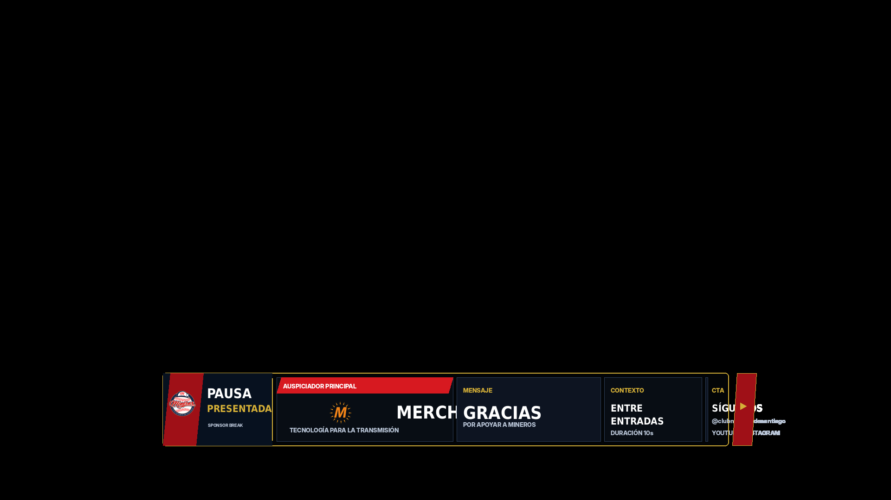
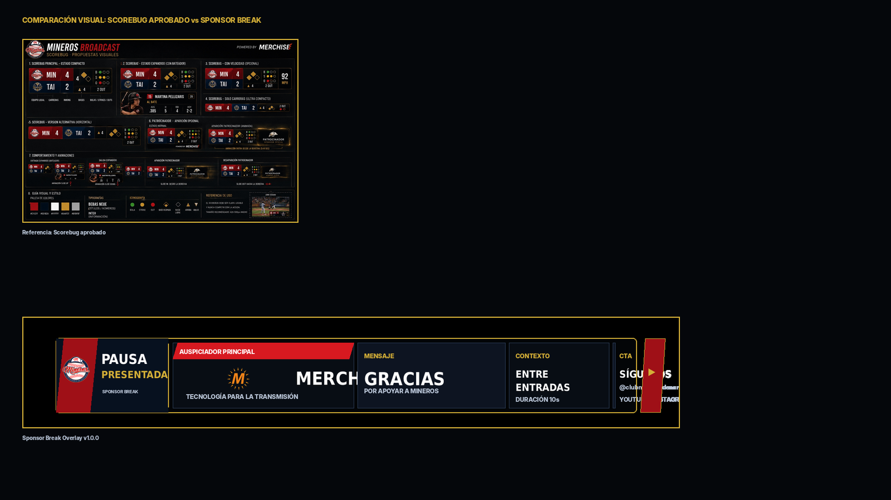

# 19 — Sponsor Break Overlay

**Sistema:** Mineros Broadcast  
**Documento:** `19-sponsor-break-overlay.md`  
**Versión:** `1.0.0`  
**Estado:** CANDIDATO VISUAL EN REVISIÓN  
**Propietario:** Club Mineros de Santiago  
**Desarrollado por:** Merchise  

---

## 0. Propósito

El **Sponsor Break Overlay** muestra una pausa patrocinada durante momentos naturales de la transmisión.

Debe responder visualmente a esta pregunta:

```text
¿Quién presenta esta pausa de transmisión?
```

Es una pieza temporal. Puede usarse entre entradas, en pausa de pitcher, durante preparación de campo o antes de volver a juego.

---

## 0.1 Referencia gráfica

**Figura:** `SPB-FIG-001`  
**Archivo:** `19-sponsor-break-overlay-assets/SPB-FIG-001-sponsor-break-overlay-scorebug-style.png`



---

## 0.2 Comparación con Scorebug

**Figura:** `SPB-FIG-002`  
**Archivo:** `19-sponsor-break-overlay-assets/SPB-FIG-002-scorebug-comparison-check.png`



La gráfica mantiene continuidad visual con el Scorebug aprobado: lower-third compacto, marco negro, borde dorado, rojo/navy, módulos de datos y cierre lateral externo.

---

## 0.3 Descripción funcional de la gráfica `SPB-FIG-001`

```text
┌────────────────────────────────────────────────────────────────────────────┐
│ BLOQUE PAUSA                                                               │
│ Logo Mineros + PAUSA PRESENTADA + SPONSOR BREAK                            │
├────────────────────────┬────────────────────┬─────────────┬───────────────┤
│ AUSPICIADOR PRINCIPAL  │ MENSAJE            │ CONTEXTO    │ CTA           │
│ Merchise               │ Gracias            │ Entre       │ Síguenos      │
│ Tecnología transmisión │ Por apoyar Mineros │ entradas    │ @clubmineros  │
└────────────────────────┴────────────────────┴─────────────┴───────────────┘
```

---

## 0.4 Mapa de zonas visibles

| Zona | Elemento visible | Función |
|---|---|---|
| `A` | Logo Mineros | Mantiene identidad de transmisión |
| `B` | Título `PAUSA PRESENTADA` | Define que es una pausa patrocinada |
| `C` | Texto `SPONSOR BREAK` | Identifica tipo de overlay |
| `D` | Módulo `AUSPICIADOR PRINCIPAL` | Muestra marca patrocinadora |
| `E` | Módulo `MENSAJE` | Mensaje editorial o comercial breve |
| `F` | Módulo `CONTEXTO` | Indica cuándo se muestra la pieza |
| `G` | Módulo `CTA` | Llamado a redes o acción |
| `H` | Cierre lateral externo | Continuidad visual; no tapa datos |

---

## 1. Alcance

El Sponsor Break Overlay debe soportar:

1. patrocinador principal;
2. patrocinador secundario;
3. mensaje comercial corto;
4. llamado a redes;
5. pausa entre entradas;
6. pausa manual;
7. patrocinador rotativo;
8. variante sin CTA;
9. variante solo logo.

---

## 2. Relación con documentos anteriores

| Documento | Relación |
|---|---|
| `01-layout-manager.md` | Define zona y conflictos |
| `02-design-system.md` | Define lenguaje visual |
| `03-asset-manager.md` | Entrega logos |
| `05-sponsor-engine.md` | Define patrocinadores y rotación |
| `06-event-engine.md` | Dispara pausas |
| `08-overlay-manager.md` | Renderiza y anima |
| `09-integration-contracts.md` | Define contratos |
| `10-scorebug.md` | Base visual |
| `17-inning-transition.md` | Puede anteceder o coexistir según zona |

---

## 3. Principio central

```text
El Sponsor Break Overlay no decide qué sponsor se muestra.
Sponsor Engine define la marca activa.
Overlay Manager solo presenta.
```

---

## 4. Tipos de sponsor

| Tipo | Código | Uso |
|---|---|---|
| Principal | `primary` | Sponsor dominante de la pausa |
| Secundario | `secondary` | Sponsor complementario |
| Rotativo | `rotation` | Selección por campaña |
| Institucional | `institutional` | Mensaje del club |
| CTA social | `social_cta` | Redes o inscripción |

---

## 5. Variantes oficiales

| Variante | Código | Uso |
|---|---|---|
| Lower third compacto | `lower_third_compact` | Principal |
| Full width | `full_width` | Pausa larga |
| Logo only | `logo_only` | Mención rápida |
| Sponsor + CTA | `sponsor_cta` | Pausa con redes |
| Multi sponsor | `multi_sponsor` | Varios auspiciadores |

---

## 6. Reglas visuales

| Elemento | Regla |
|---|---|
| Fondo | Oscuro, sin campo decorativo |
| Contenedor | Marco negro con borde dorado |
| Sponsor | Módulo principal |
| CTA | Módulo separado |
| Contexto | Módulo separado |
| Cierre lateral | Fuera del área de datos |
| Texto | Sin duplicación ni solapamiento |
| Duración | Definida por configuración |

---

## 7. Campos requeridos

| Campo | Requerido | Fallback |
|---|---:|---|
| `sponsor.sponsorId` | Sí | Error |
| `sponsor.name` | Sí | Error |
| `sponsor.logoAssetId` | Sí | Mostrar nombre |
| `placement.type` | Sí | `primary` |

---

## 8. Campos opcionales

| Campo | Uso | Fallback |
|---|---|---|
| `message.title` | Mensaje principal | Ocultar |
| `message.subtitle` | Mensaje secundario | Ocultar |
| `cta.text` | Llamado a acción | Ocultar |
| `cta.handle` | Red social o URL corta | Ocultar |
| `context.label` | Contexto de aparición | Ocultar |
| `durationSeconds` | Tiempo de exposición | Valor por defecto |

---

## 9. Contrato de datos

```json
{
  "schemaVersion": "1.0.0",
  "correlationId": "corr-sponsor-break-000001",
  "source": "SponsorEngine",
  "target": "SponsorBreakOverlay",
  "timestamp": "2026-06-23T00:00:00Z",
  "payload": {
    "overlayId": "sponsor_break",
    "placement": {
      "type": "primary",
      "slot": "between_innings"
    },
    "sponsor": {
      "sponsorId": "sponsor-merchise",
      "name": "Merchise",
      "logoAssetId": "SPB-LOGO-002"
    },
    "message": {
      "title": "Gracias",
      "subtitle": "Por apoyar a Mineros"
    },
    "cta": {
      "text": "Síguenos",
      "handle": "@clubminerosdesantiago"
    },
    "context": {
      "label": "Entre entradas",
      "durationSeconds": 10
    }
  }
}
```

---

## 10. Configuración visual base

```json
{
  "overlayId": "sponsor_break",
  "schemaVersion": "1.0.0",
  "enabled": true,
  "preferredZone": "D",
  "variant": "lower_third_compact",
  "layout": {
    "showClubLogo": true,
    "showSponsorLogo": true,
    "showSponsorName": true,
    "showMessage": true,
    "showContext": true,
    "showCta": true
  },
  "animations": {
    "in": "slide_up",
    "out": "fade_out",
    "durationMs": 260,
    "holdSeconds": 10
  },
  "fallbacks": {
    "missingSponsorLogo": "show_sponsor_name",
    "missingMessage": "hide_message",
    "missingCta": "hide_cta"
  }
}
```

---

## 11. Reglas de render

| Condición | Resultado |
|---|---|
| Falta sponsor | No mostrar overlay |
| Falta logo sponsor | Mostrar nombre |
| Falta mensaje | Ocultar módulo mensaje |
| Falta CTA | Ocultar módulo CTA |
| Pausa muy corta | Usar variante `logo_only` |
| Varios sponsors | Usar variante `multi_sponsor` |
| Activación manual | Mostrar según payload manual |

---

## 12. Eventos que pueden activar el overlay

| Evento | Acción |
|---|---|
| `between_innings_started` | Muestra pausa patrocinada |
| `sponsor_rotation_tick` | Actualiza sponsor |
| `manual_show_sponsor_break` | Muestra manualmente |
| `manual_hide_sponsor_break` | Oculta manualmente |
| `broadcast_pause_started` | Muestra sponsor si hay campaña activa |

---

## 13. Qué no representa esta gráfica

| Elemento | Razón |
|---|---|
| No muestra score | Eso pertenece al Scorebug |
| No muestra evento deportivo | Eso pertenece a Game Event Overlay |
| No decide sponsor activo | Eso pertenece a Sponsor Engine |
| No debe tapar juego en vivo | Solo en pausas o zonas permitidas |
| No sustituye publicidad full-screen | Es mención compacta |

---

## 14. Criterios de aceptación

El documento se acepta cuando:

- describe cada zona visible;
- define sponsor y mensaje;
- define contrato JSON;
- define configuración visual;
- define fallbacks;
- define eventos;
- mantiene compatibilidad visual con Scorebug;
- evita solapamientos;
- no invade responsabilidades del Sponsor Engine.

---

# Historial

| Versión | Estado | Descripción |
|---|---|---|
| 1.0.0 | Candidato visual en revisión | Primera especificación y referencia gráfica del Sponsor Break Overlay |
