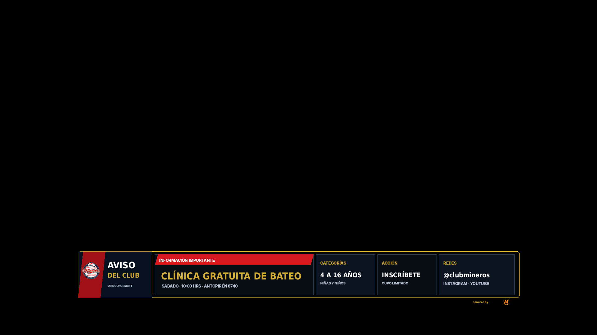
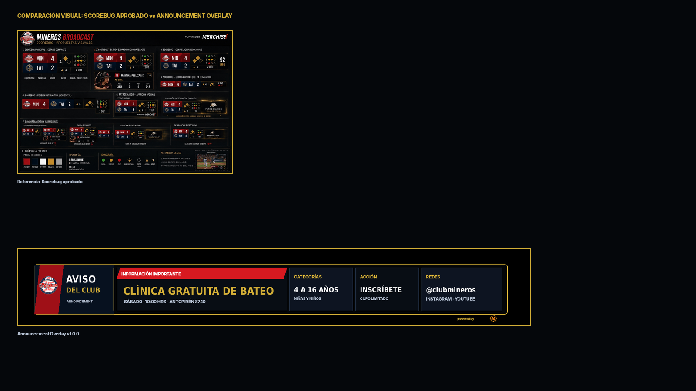

# 20 — Announcement Overlay

**Sistema:** Mineros Broadcast  
**Documento:** `20-announcement-overlay.md`  
**Versión:** `1.0.0`  
**Estado:** CANDIDATO VISUAL EN REVISIÓN  
**Propietario:** Club Mineros de Santiago  
**Desarrollado por:** Merchise  

---

## 0. Propósito

El **Announcement Overlay** comunica avisos generales del club o de la transmisión.

Debe responder visualmente a esta pregunta:

```text
¿Qué información institucional o logística debe conocer la audiencia?
```

Es una pieza temporal. Puede mostrarse entre entradas, antes del juego, durante pausas, clínicas, anuncios de inscripción, cambios de horario o información institucional.

---

## 0.1 Referencia gráfica

**Figura:** `AN-FIG-001`  
**Archivo:** `20-announcement-overlay-assets/AN-FIG-001-announcement-overlay-scorebug-style.png`



---

## 0.2 Comparación con Scorebug

**Figura:** `AN-FIG-002`  
**Archivo:** `20-announcement-overlay-assets/AN-FIG-002-scorebug-comparison-check.png`



La gráfica mantiene continuidad visual con el Scorebug aprobado: lower-third compacto, marco negro, borde dorado, rojo/navy, módulos de datos y sponsor mínimo.

---

## 0.3 Descripción funcional de la gráfica `AN-FIG-001`

```text
┌────────────────────────────────────────────────────────────────────────────┐
│ BLOQUE AVISO                                                               │
│ Logo Mineros + AVISO DEL CLUB + ANNOUNCEMENT                               │
├──────────────────────────────┬──────────────┬──────────────┬──────────────┤
│ INFORMACIÓN IMPORTANTE       │ CATEGORÍAS   │ ACCIÓN       │ REDES        │
│ Clínica gratuita de bateo    │ 4 a 16 años  │ Inscríbete   │ @clubmineros │
│ Sábado · 10:00 · Antupirén   │ Niñas/niños  │ Cupo limitado│ IG/Youtube   │
└──────────────────────────────┴──────────────┴──────────────┴──────────────┘
```

---

## 0.4 Mapa de zonas visibles

| Zona | Elemento visible | Función |
|---|---|---|
| `A` | Logo Mineros | Identifica el origen institucional |
| `B` | Título `AVISO DEL CLUB` | Define que es un anuncio institucional |
| `C` | Texto `ANNOUNCEMENT` | Identifica tipo de overlay |
| `D` | Módulo `INFORMACIÓN IMPORTANTE` | Mensaje principal |
| `E` | Fecha/lugar/hora | Contexto operativo |
| `F` | Módulo `CATEGORÍAS` | Público objetivo |
| `G` | Módulo `ACCIÓN` | Acción esperada |
| `H` | Módulo `REDES` | Contacto o canal |
| `I` | Sponsor mínimo | Marca técnica discreta |

---

## 1. Alcance

El Announcement Overlay debe soportar:

1. avisos del club;
2. clínicas;
3. invitaciones a inscripción;
4. cambios de horario;
5. información de sede;
6. llamados a redes;
7. mensajes institucionales;
8. alertas logísticas;
9. anuncios manuales del operador.

---

## 2. Relación con documentos anteriores

| Documento | Relación |
|---|---|
| `01-layout-manager.md` | Define zona de aparición y conflictos |
| `02-design-system.md` | Define lenguaje visual |
| `03-asset-manager.md` | Entrega logos |
| `06-event-engine.md` | Dispara anuncios programados |
| `08-overlay-manager.md` | Renderiza y anima |
| `09-integration-contracts.md` | Define contratos |
| `10-scorebug.md` | Base visual |
| `19-sponsor-break-overlay.md` | Puede coexistir solo si hay zona disponible |

---

## 3. Principio central

```text
El Announcement Overlay no decide cuándo publicar un aviso.
Event Engine u operador definen la activación.
Overlay Manager solo presenta.
```

---

## 4. Tipos de anuncio

| Tipo | Código | Uso |
|---|---|---|
| Aviso institucional | `club_notice` | Mensaje del club |
| Clínica | `clinic` | Actividad formativa |
| Inscripción | `registration` | Llamado a matrícula |
| Cambio horario | `schedule_change` | Información logística |
| Sede | `venue_info` | Dirección o cancha |
| Redes | `social_cta` | Llamado a seguir redes |
| Alerta | `alert` | Información urgente |
| Manual | `manual` | Texto ingresado por operador |

---

## 5. Variantes oficiales

| Variante | Código | Uso |
|---|---|---|
| Lower third compacto | `lower_third_compact` | Principal |
| Minimal | `minimal` | Aviso corto |
| Full width | `full_width` | Aviso más largo |
| Alert | `alert` | Urgente |
| Social CTA | `social_cta` | Redes |
| Clinic card | `clinic_card` | Actividad del club |

---

## 6. Reglas visuales

| Elemento | Regla |
|---|---|
| Fondo | Oscuro, sin campo decorativo |
| Contenedor | Marco negro con borde dorado |
| Mensaje principal | Mayor jerarquía |
| Módulos secundarios | Compactos |
| CTA | Módulo separado |
| Redes | Texto corto, sin URLs largas |
| Sponsor | Mención mínima externa |
| Cierre lateral | No se usa si puede tapar texto |
| Texto | Sin duplicación ni solapamiento |

---

## 7. Campos requeridos

| Campo | Requerido | Fallback |
|---|---:|---|
| `announcement.type` | Sí | `club_notice` |
| `announcement.title` | Sí | Error |
| `announcement.message` | Sí | Error |

---

## 8. Campos opcionales

| Campo | Uso | Fallback |
|---|---|---|
| `announcement.subtitle` | Línea secundaria | Ocultar |
| `announcement.dateLabel` | Fecha | Ocultar |
| `announcement.locationLabel` | Lugar | Ocultar |
| `audience.label` | Público objetivo | Ocultar |
| `cta.label` | Acción | Ocultar CTA |
| `cta.handle` | Redes/contacto | Ocultar |
| `durationSeconds` | Tiempo | Valor por defecto |

---

## 9. Contrato de datos

```json
{
  "schemaVersion": "1.0.0",
  "correlationId": "corr-announcement-000001",
  "source": "EventEngine",
  "target": "AnnouncementOverlay",
  "timestamp": "2026-06-23T00:00:00Z",
  "payload": {
    "overlayId": "announcement",
    "announcement": {
      "type": "clinic",
      "title": "Clínica gratuita de bateo",
      "message": "Sábado · 10:00 hrs · Antupirén 8740"
    },
    "audience": {
      "label": "4 a 16 años",
      "subtitle": "Niñas y niños"
    },
    "cta": {
      "label": "Inscríbete",
      "subtitle": "Cupo limitado",
      "handle": "@clubmineros"
    },
    "channels": {
      "label": "Instagram · YouTube"
    },
    "context": {
      "durationSeconds": 8
    }
  }
}
```

---

## 10. Configuración visual base

```json
{
  "overlayId": "announcement",
  "schemaVersion": "1.0.0",
  "enabled": true,
  "preferredZone": "D",
  "variant": "lower_third_compact",
  "layout": {
    "showClubLogo": true,
    "showTitle": true,
    "showMessage": true,
    "showAudience": true,
    "showCta": true,
    "showChannels": true,
    "showSponsor": "minimal"
  },
  "animations": {
    "in": "slide_up",
    "out": "fade_out",
    "durationMs": 240,
    "holdSeconds": 8
  },
  "fallbacks": {
    "missingAudience": "hide_audience",
    "missingCta": "hide_cta",
    "missingChannels": "hide_channels"
  }
}
```

---

## 11. Reglas de render

| Condición | Resultado |
|---|---|
| Falta título | No mostrar overlay |
| Falta mensaje | No mostrar overlay |
| Falta CTA | Ocultar módulo CTA |
| Falta público objetivo | Ocultar módulo categorías |
| Texto muy largo | Usar variante `full_width` |
| Alerta urgente | Usar variante `alert` |
| Activación manual | Mostrar según payload manual |

---

## 12. Eventos que pueden activar el overlay

| Evento | Acción |
|---|---|
| `announcement_scheduled` | Muestra anuncio programado |
| `manual_show_announcement` | Muestra manualmente |
| `manual_hide_announcement` | Oculta manualmente |
| `clinic_promo` | Muestra clínica |
| `registration_cta` | Muestra inscripción |
| `schedule_change_notice` | Muestra cambio de horario |

---

## 13. Qué no representa esta gráfica

| Elemento | Razón |
|---|---|
| No muestra score | Eso pertenece al Scorebug |
| No muestra sponsor como pieza principal | Eso pertenece a Sponsor Break |
| No muestra evento deportivo | Eso pertenece a Game Event Overlay |
| No debe tapar información crítica | Solo debe aparecer en zonas permitidas |
| No decide calendario | Eso pertenece al Event Engine u operador |

---

## 14. Criterios de aceptación

El documento se acepta cuando:

- describe cada zona visible;
- define tipos de anuncio;
- define contrato JSON;
- define configuración visual;
- define fallbacks;
- define eventos;
- mantiene compatibilidad visual con Scorebug;
- evita textos cortados;
- no invade responsabilidades del Event Engine.

---

# Historial

| Versión | Estado | Descripción |
|---|---|---|
| 1.0.0 | Candidato visual en revisión | Primera especificación y referencia gráfica del Announcement Overlay |
