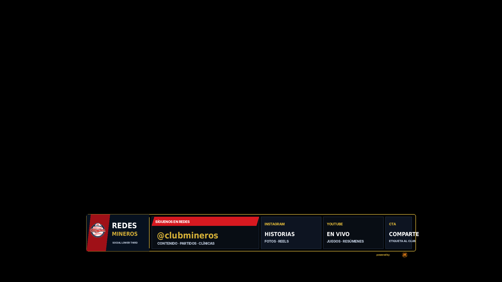
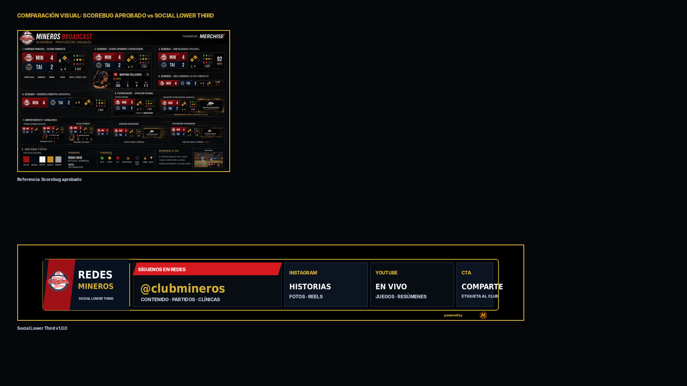

# 21 — Social Lower Third

**Sistema:** Mineros Broadcast  
**Documento:** `21-social-lower-third.md`  
**Versión:** `1.0.0`  
**Estado:** CANDIDATO VISUAL EN REVISIÓN  
**Propietario:** Club Mineros de Santiago  
**Desarrollado por:** Merchise  

---

## 0. Propósito

El **Social Lower Third** muestra los canales sociales del club durante la transmisión.

Debe responder visualmente a esta pregunta:

```text
¿Dónde puede seguir la audiencia al Club Mineros?
```

Es una pieza temporal. Puede mostrarse entre innings, antes del juego, después de una jugada, durante pausas o antes del cierre de transmisión.

---

## 0.1 Referencia gráfica

**Figura:** `SLT-FIG-001`  
**Archivo:** `21-social-lower-third-assets/SLT-FIG-001-social-lower-third-scorebug-style.png`



---

## 0.2 Comparación con Scorebug

**Figura:** `SLT-FIG-002`  
**Archivo:** `21-social-lower-third-assets/SLT-FIG-002-scorebug-comparison-check.png`



La gráfica mantiene continuidad visual con el Scorebug aprobado: lower-third compacto, marco negro, borde dorado, rojo/navy, módulos de datos y sponsor mínimo.

---

## 0.3 Descripción funcional de la gráfica `SLT-FIG-001`

```text
┌────────────────────────────────────────────────────────────────────────────┐
│ BLOQUE REDES                                                               │
│ Logo Mineros + REDES MINEROS + SOCIAL LOWER THIRD                          │
├────────────────────────────┬──────────────┬──────────────┬───────────────┤
│ SÍGUENOS EN REDES          │ INSTAGRAM    │ YOUTUBE      │ CTA           │
│ @clubmineros               │ Historias    │ En vivo      │ Comparte      │
│ Contenido · partidos       │ Fotos · Reels│ Juegos       │ Etiqueta club │
└────────────────────────────┴──────────────┴──────────────┴───────────────┘
```

---

## 0.4 Mapa de zonas visibles

| Zona | Elemento visible | Función |
|---|---|---|
| `A` | Logo Mineros | Identifica el origen del mensaje |
| `B` | Título `REDES MINEROS` | Define que es una pieza social |
| `C` | Texto `SOCIAL LOWER THIRD` | Identifica tipo de overlay |
| `D` | Módulo principal `SÍGUENOS EN REDES` | Muestra handle principal |
| `E` | Módulo `INSTAGRAM` | Indica contenido disponible en Instagram |
| `F` | Módulo `YOUTUBE` | Indica contenido disponible en YouTube |
| `G` | Módulo `CTA` | Llamado a compartir o etiquetar |
| `H` | Sponsor mínimo | Marca técnica discreta |

---

## 1. Alcance

El Social Lower Third debe soportar:

1. Instagram del club;
2. YouTube del club;
3. handle corto;
4. CTA social;
5. variante con QR;
6. variante sin sponsor;
7. variante de inscripción;
8. variante de transmisión en vivo.

---

## 2. Relación con documentos anteriores

| Documento | Relación |
|---|---|
| `01-layout-manager.md` | Define zona de aparición y conflictos |
| `02-design-system.md` | Define lenguaje visual |
| `03-asset-manager.md` | Entrega logos |
| `06-event-engine.md` | Puede programar rotación social |
| `08-overlay-manager.md` | Renderiza y anima |
| `09-integration-contracts.md` | Define contratos |
| `10-scorebug.md` | Base visual |
| `20-announcement-overlay.md` | Puede usar el mismo contenido como anuncio extendido |

---

## 3. Principio central

```text
El Social Lower Third no administra redes.
Solo presenta handles y llamados definidos por el operador o Event Engine.
```

---

## 4. Tipos de mensaje social

| Tipo | Código | Uso |
|---|---|---|
| Follow | `follow` | Seguir redes |
| Live | `live` | Ver transmisión |
| Share | `share` | Compartir contenido |
| Tag | `tag` | Etiquetar al club |
| Subscribe | `subscribe` | Suscribirse en YouTube |
| Register | `register` | CTA de inscripción |

---

## 5. Variantes oficiales

| Variante | Código | Uso |
|---|---|---|
| Lower third compacto | `lower_third_compact` | Principal |
| Minimal handle | `minimal_handle` | Solo handle |
| QR social | `qr_social` | Handle + QR |
| Dual channel | `dual_channel` | Instagram + YouTube |
| Registration CTA | `registration_cta` | Inscripción al club |

---

## 6. Reglas visuales

| Elemento | Regla |
|---|---|
| Fondo | Oscuro, sin campo decorativo |
| Contenedor | Marco negro con borde dorado |
| Handle | Debe ser corto y legible |
| URLs largas | No se muestran |
| Redes | Módulos separados |
| Sponsor | Mención mínima externa |
| Cierre lateral | No se usa si puede tapar texto |
| Texto | Sin duplicación ni solapamiento |

---

## 7. Campos requeridos

| Campo | Requerido | Fallback |
|---|---:|---|
| `social.primaryHandle` | Sí | Error |
| `message.title` | Sí | `Síguenos` |

---

## 8. Campos opcionales

| Campo | Uso | Fallback |
|---|---|---|
| `social.instagram` | Instagram | Ocultar módulo |
| `social.youtube` | YouTube | Ocultar módulo |
| `message.subtitle` | Línea secundaria | Ocultar |
| `cta.label` | CTA | Ocultar |
| `qr.assetId` | QR | Ocultar QR |
| `durationSeconds` | Tiempo | Valor por defecto |

---

## 9. Contrato de datos

```json
{
  "schemaVersion": "1.0.0",
  "correlationId": "corr-social-lower-third-000001",
  "source": "EventEngine",
  "target": "SocialLowerThird",
  "timestamp": "2026-06-23T00:00:00Z",
  "payload": {
    "overlayId": "social_lower_third",
    "message": {
      "title": "Síguenos en redes",
      "subtitle": "Contenido · partidos · clínicas"
    },
    "social": {
      "primaryHandle": "@clubmineros",
      "instagram": "@clubminerosdesantiago",
      "youtube": "@clubminerosdesantiago"
    },
    "cta": {
      "label": "Comparte",
      "subtitle": "Etiqueta al club"
    },
    "context": {
      "durationSeconds": 8
    }
  }
}
```

---

## 10. Configuración visual base

```json
{
  "overlayId": "social_lower_third",
  "schemaVersion": "1.0.0",
  "enabled": true,
  "preferredZone": "D",
  "variant": "lower_third_compact",
  "layout": {
    "showClubLogo": true,
    "showPrimaryHandle": true,
    "showInstagram": true,
    "showYoutube": true,
    "showCta": true,
    "showSponsor": "minimal"
  },
  "animations": {
    "in": "slide_up",
    "out": "fade_out",
    "durationMs": 240,
    "holdSeconds": 8
  },
  "fallbacks": {
    "missingInstagram": "hide_instagram",
    "missingYoutube": "hide_youtube",
    "missingCta": "hide_cta"
  }
}
```

---

## 11. Reglas de render

| Condición | Resultado |
|---|---|
| Falta handle principal | No mostrar overlay |
| Falta Instagram | Ocultar módulo Instagram |
| Falta YouTube | Ocultar módulo YouTube |
| Texto largo | Usar variante `minimal_handle` |
| Hay QR | Usar variante `qr_social` |
| Se muestra durante juego activo | Debe ocupar zona que no tape datos críticos |

---

## 12. Eventos que pueden activar el overlay

| Evento | Acción |
|---|---|
| `manual_show_social_lower_third` | Muestra manualmente |
| `manual_hide_social_lower_third` | Oculta manualmente |
| `between_innings_started` | Puede mostrar redes |
| `broadcast_opening` | Puede mostrar redes al inicio |
| `broadcast_closing` | Puede mostrar redes al cierre |
| `social_rotation_tick` | Cambia mensaje social |

---

## 13. Qué no representa esta gráfica

| Elemento | Razón |
|---|---|
| No muestra score | Eso pertenece al Scorebug |
| No muestra anuncio extendido | Eso pertenece a Announcement Overlay |
| No muestra sponsor principal | Eso pertenece a Sponsor Break |
| No decide calendario | Eso pertenece al Event Engine u operador |
| No debe usar URLs largas | Por legibilidad en transmisión |

---

## 14. Criterios de aceptación

El documento se acepta cuando:

- describe cada zona visible;
- define canales sociales;
- define contrato JSON;
- define configuración visual;
- define fallbacks;
- define eventos;
- mantiene compatibilidad visual con Scorebug;
- evita textos cortados;
- no invade responsabilidades del Event Engine.

---

# Historial

| Versión | Estado | Descripción |
|---|---|---|
| 1.0.0 | Candidato visual en revisión | Primera especificación y referencia gráfica del Social Lower Third |
