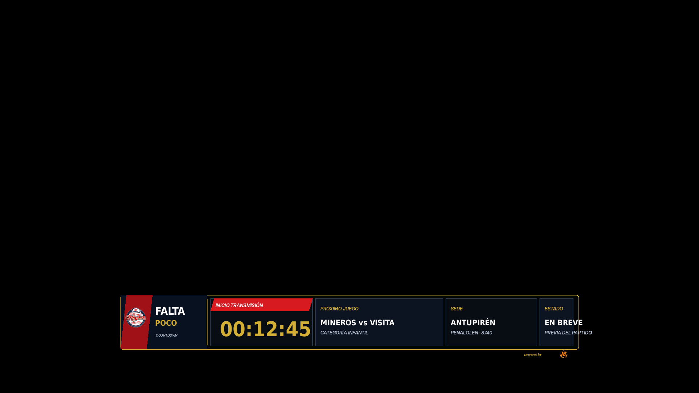
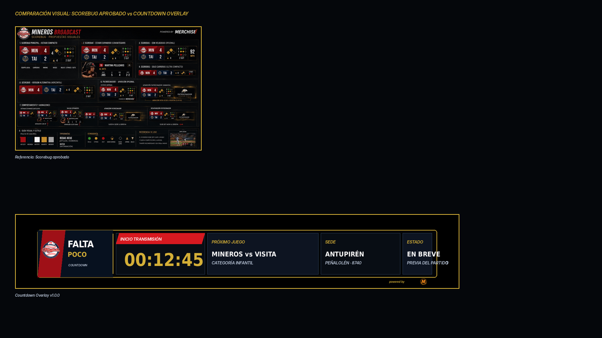

# 22 — Countdown Overlay

**Sistema:** Mineros Broadcast  
**Documento:** `22-countdown-overlay.md`  
**Versión:** `1.0.0`  
**Estado:** CANDIDATO VISUAL EN REVISIÓN  
**Propietario:** Club Mineros de Santiago  
**Desarrollado por:** Merchise  

---

## 0. Propósito

El **Countdown Overlay** muestra una cuenta regresiva antes de iniciar o reanudar una transmisión.

Debe responder visualmente a esta pregunta:

```text
¿Cuánto falta para que comience la transmisión o el siguiente bloque?
```

Es una pieza temporal. Puede mostrarse antes del juego, entre bloques, antes de una ceremonia, antes de una entrevista o antes de reanudar la señal principal.

---

## 0.1 Referencia gráfica

**Figura:** `CD-FIG-001`  
**Archivo:** `22-countdown-overlay-assets/CD-FIG-001-countdown-overlay-scorebug-style.png`



---

## 0.2 Comparación con Scorebug

**Figura:** `CD-FIG-002`  
**Archivo:** `22-countdown-overlay-assets/CD-FIG-002-scorebug-comparison-check.png`



La gráfica mantiene continuidad visual con el Scorebug aprobado: lower-third compacto, marco negro, borde dorado, rojo/navy, módulos de datos y sponsor mínimo.

---

## 0.3 Descripción funcional de la gráfica `CD-FIG-001`

```text
┌────────────────────────────────────────────────────────────────────────────┐
│ BLOQUE CUENTA REGRESIVA                                                    │
│ Logo Mineros + FALTA POCO + COUNTDOWN                                      │
├────────────────────────┬────────────────────────┬──────────────┬──────────┤
│ INICIO TRANSMISIÓN     │ PRÓXIMO JUEGO          │ SEDE         │ ESTADO   │
│ 00:12:45               │ Mineros vs Visita      │ Antupirén    │ En breve │
│                        │ Categoría Infantil     │ Peñalolén    │ Previa   │
└────────────────────────┴────────────────────────┴──────────────┴──────────┘
```

---

## 0.4 Mapa de zonas visibles

| Zona | Elemento visible | Función |
|---|---|---|
| `A` | Logo Mineros | Identifica la transmisión del club |
| `B` | Título `FALTA POCO` | Define el carácter de espera |
| `C` | Texto `COUNTDOWN` | Identifica tipo de overlay |
| `D` | Tiempo `00:12:45` | Cuenta regresiva principal |
| `E` | Módulo `PRÓXIMO JUEGO` | Informa partido o bloque siguiente |
| `F` | Módulo `SEDE` | Informa lugar |
| `G` | Módulo `ESTADO` | Indica contexto de la espera |
| `H` | Sponsor mínimo | Marca técnica discreta |

---

## 1. Alcance

El Countdown Overlay debe soportar:

1. inicio de transmisión;
2. reanudación después de pausa;
3. inicio de juego;
4. inicio de ceremonia;
5. inicio de entrevista;
6. salida a vivo;
7. cambio de bloque programado;
8. cancelación o pausa extendida.

---

## 2. Relación con documentos anteriores

| Documento | Relación |
|---|---|
| `01-layout-manager.md` | Define zona de aparición y conflictos |
| `02-design-system.md` | Define lenguaje visual |
| `03-asset-manager.md` | Entrega logos |
| `06-event-engine.md` | Dispara horarios y bloques |
| `08-overlay-manager.md` | Renderiza y anima |
| `09-integration-contracts.md` | Define contratos |
| `10-scorebug.md` | Base visual |
| `20-announcement-overlay.md` | Puede complementar la información de la espera |
| `21-social-lower-third.md` | Puede rotar durante la espera |

---

## 3. Principio central

```text
El Countdown Overlay no calcula el horario oficial.
Event Engine entrega el tiempo objetivo.
Overlay Manager calcula la cuenta regresiva visual desde el timestamp recibido.
```

---

## 4. Tipos de countdown

| Tipo | Código | Uso |
|---|---|---|
| Inicio transmisión | `broadcast_start` | Antes de salir al aire |
| Inicio juego | `game_start` | Antes del primer lanzamiento |
| Reanudación | `resume` | Después de pausa |
| Ceremonia | `ceremony_start` | Antes de acto o presentación |
| Entrevista | `interview_start` | Antes de entrevista |
| Bloque | `segment_start` | Antes de bloque programado |

---

## 5. Variantes oficiales

| Variante | Código | Uso |
|---|---|---|
| Lower third compacto | `lower_third_compact` | Principal |
| Full width | `full_width` | Previa larga |
| Minimal timer | `minimal_timer` | Solo reloj |
| Social rotation | `social_rotation` | Reloj + redes |
| Sponsor countdown | `sponsor_countdown` | Reloj patrocinado |

---

## 6. Reglas visuales

| Elemento | Regla |
|---|---|
| Fondo | Oscuro, sin campo decorativo |
| Contenedor | Marco negro con borde dorado |
| Tiempo | Mayor jerarquía |
| Partido o bloque | Módulo separado |
| Sede | Módulo separado |
| Estado | Módulo separado |
| Sponsor | Mención mínima externa |
| Cierre lateral | No se usa si no aporta función |
| Texto | Sin duplicación ni solapamiento |

---

## 7. Campos requeridos

| Campo | Requerido | Fallback |
|---|---:|---|
| `countdown.targetTime` | Sí | Error |
| `countdown.type` | Sí | `broadcast_start` |
| `countdown.label` | Sí | `Inicio transmisión` |

---

## 8. Campos opcionales

| Campo | Uso | Fallback |
|---|---|---|
| `event.title` | Partido o bloque | Ocultar |
| `event.subtitle` | Categoría o contexto | Ocultar |
| `venue.name` | Sede | Ocultar |
| `venue.location` | Comuna/dirección corta | Ocultar |
| `status.label` | Estado | Ocultar |
| `sponsor.logoAssetId` | Sponsor | Ocultar |

---

## 9. Contrato de datos

```json
{
  "schemaVersion": "1.0.0",
  "correlationId": "corr-countdown-000001",
  "source": "EventEngine",
  "target": "CountdownOverlay",
  "timestamp": "2026-06-23T00:00:00Z",
  "payload": {
    "overlayId": "countdown",
    "countdown": {
      "type": "broadcast_start",
      "label": "Inicio transmisión",
      "targetTime": "2026-06-23T18:00:00Z",
      "display": "00:12:45"
    },
    "event": {
      "title": "Mineros vs Visita",
      "subtitle": "Categoría Infantil"
    },
    "venue": {
      "name": "Antupirén",
      "location": "Peñalolén · 8740"
    },
    "status": {
      "label": "En breve",
      "subtitle": "Previa del partido"
    }
  }
}
```

---

## 10. Configuración visual base

```json
{
  "overlayId": "countdown",
  "schemaVersion": "1.0.0",
  "enabled": true,
  "preferredZone": "D",
  "variant": "lower_third_compact",
  "layout": {
    "showClubLogo": true,
    "showCountdown": true,
    "showEvent": true,
    "showVenue": true,
    "showStatus": true,
    "showSponsor": "minimal"
  },
  "animations": {
    "in": "slide_up",
    "out": "fade_out",
    "durationMs": 240,
    "holdSeconds": "until_target_or_manual_hide"
  },
  "fallbacks": {
    "missingEvent": "hide_event",
    "missingVenue": "hide_venue",
    "missingStatus": "hide_status"
  }
}
```

---

## 11. Reglas de render

| Condición | Resultado |
|---|---|
| Falta `targetTime` | No mostrar overlay |
| Countdown llega a cero | Emitir evento `countdown_completed` |
| Tiempo negativo | Ocultar o cambiar a `EN VIVO` |
| Falta evento | Mostrar solo reloj |
| Falta sede | Ocultar módulo sede |
| Pausa extendida | Puede actualizar estado |
| Activación manual | Mostrar según payload manual |

---

## 12. Eventos que pueden activar el overlay

| Evento | Acción |
|---|---|
| `countdown_started` | Muestra cuenta regresiva |
| `countdown_tick` | Actualiza tiempo |
| `countdown_completed` | Oculta o cambia a vivo |
| `manual_show_countdown` | Muestra manualmente |
| `manual_hide_countdown` | Oculta manualmente |
| `broadcast_starting_soon` | Muestra previa |

---

## 13. Qué no representa esta gráfica

| Elemento | Razón |
|---|---|
| No muestra score | Eso pertenece al Scorebug |
| No muestra jugada | Eso pertenece a Game Event Overlay |
| No decide horario | Eso pertenece a Event Engine |
| No reemplaza pantalla full previa | Es versión lower-third |
| No debe tapar datos críticos | Solo debe aparecer en zonas permitidas |

---

## 14. Criterios de aceptación

El documento se acepta cuando:

- describe cada zona visible;
- define countdown y contexto;
- define contrato JSON;
- define configuración visual;
- define fallbacks;
- define eventos;
- mantiene compatibilidad visual con Scorebug;
- evita textos cortados;
- no invade responsabilidades del Event Engine.

---

# Historial

| Versión | Estado | Descripción |
|---|---|---|
| 1.0.0 | Candidato visual en revisión | Primera especificación y referencia gráfica del Countdown Overlay |
