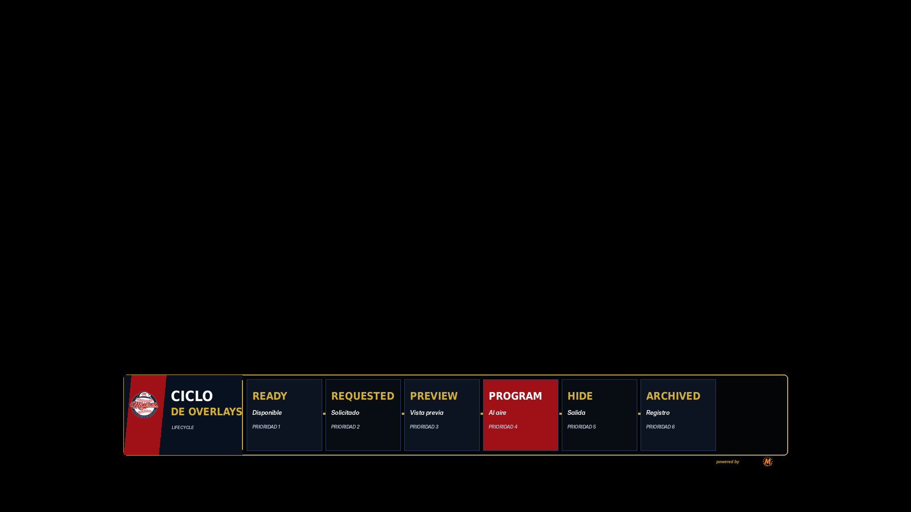
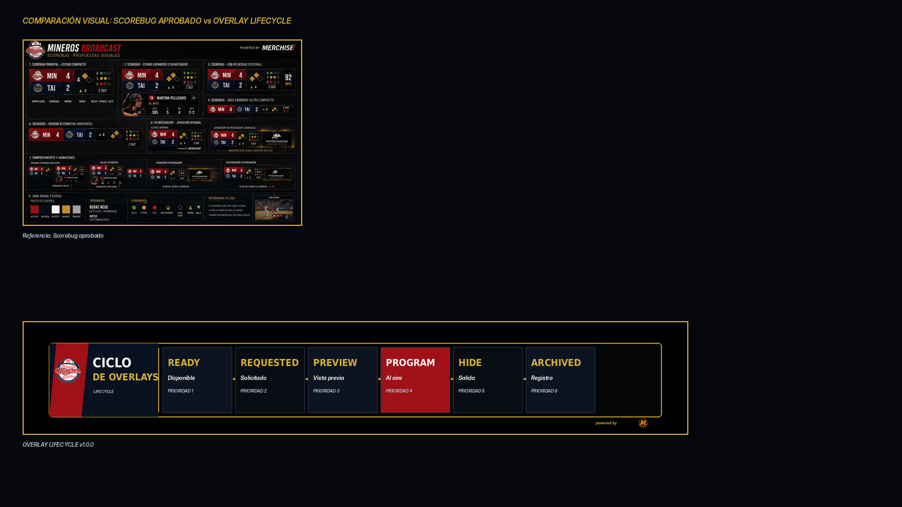

# 23 — Overlay Lifecycle

**Sistema:** Mineros Broadcast  
**Documento:** `23-overlay-lifecycle.md`  
**Versión:** `1.0.0`  
**Estado:** CANDIDATO FUNCIONAL EN REVISIÓN  
**Propietario:** Club Mineros de Santiago  
**Desarrollado por:** Merchise  

---

## 0. Propósito

El **Overlay Lifecycle** define el ciclo de vida común para todos los overlays del sistema.

Debe responder:

```text
¿Cuándo nace, entra a preview, sale al aire, se oculta y se registra un overlay?
```

---

## 0.1 Referencia gráfica

**Figura:** `OL-FIG-001`  
**Archivo:** `23-overlay-lifecycle-assets/OL-FIG-001-overlay-lifecycle-scorebug-style.png`



---

## 0.2 Comparación con Scorebug

**Figura:** `OL-FIG-002`  
**Archivo:** `23-overlay-lifecycle-assets/OL-FIG-002-scorebug-comparison-check.png`



---

## 1. Estados oficiales

| Estado | Código | Descripción |
|---|---|---|
| Disponible | `ready` | Overlay registrado, con plantilla y contrato disponibles |
| Solicitado | `requested` | Evento o usuario solicita mostrarlo |
| Validado | `validated` | Payload y reglas mínimas aprobadas |
| Preview | `preview` | Visible solo para operador |
| Program | `program` | Visible en salida en vivo |
| Holding | `holding` | Mantiene pantalla por tiempo o condición |
| Hiding | `hiding` | Animación de salida |
| Hidden | `hidden` | Fuera de pantalla |
| Archived | `archived` | Evento registrado en auditoría |

---

## 2. Máquina de estados

```text
ready → requested → validated → preview → program → holding → hiding → hidden → archived
```

Transiciones rápidas permitidas:

```text
requested → validated → program
program → hiding → hidden
preview → hidden
```

---

## 3. Reglas de activación

| Regla | Descripción |
|---|---|
| Payload válido | Ningún overlay entra a preview/program sin datos mínimos |
| Zona disponible | Layout Manager debe confirmar zona libre o desplazamiento permitido |
| Prioridad | Un overlay de mayor prioridad puede desplazar uno menor |
| Duración | Cada overlay define `holdSeconds` |
| Operador | El operador puede forzar show/hide si tiene permiso |
| Registro | Todo show/hide debe quedar auditado |

---

## 4. Prioridades base

| Prioridad | Tipo | Ejemplos |
|---:|---|---|
| 100 | Crítico | Error, alerta urgente, safety |
| 90 | Juego | Scorebug, sustitución, revisión |
| 80 | Evento | Game Event, Final Score |
| 70 | Jugador | Batter, Pitcher, Lineup |
| 60 | Transición | Inning Transition, Countdown |
| 50 | Comunicación | Announcement, Social |
| 40 | Sponsor | Sponsor Break |

---

## 5. Contrato de lifecycle

```json
{
  "schemaVersion": "1.0.0",
  "correlationId": "corr-overlay-lifecycle-000001",
  "source": "OverlayManager",
  "target": "LayoutManager",
  "timestamp": "2026-06-23T00:00:00Z",
  "payload": {
    "overlayId": "game_event_overlay",
    "state": "requested",
    "priority": 80,
    "preferredZone": "D",
    "durationSeconds": 6,
    "transition": {
      "in": "slide_up",
      "out": "fade_out",
      "durationMs": 240
    },
    "reason": "play_result_confirmed"
  }
}
```

---

## 6. Eventos del lifecycle

| Evento | Acción |
|---|---|
| `overlay_requested` | Solicita mostrar overlay |
| `overlay_validated` | Payload válido |
| `overlay_previewed` | Entra a preview |
| `overlay_programmed` | Entra a program |
| `overlay_hold_elapsed` | Se cumple duración |
| `overlay_hidden` | Sale de pantalla |
| `overlay_rejected` | Rechazado por reglas |
| `overlay_conflict_detected` | Conflicto de zona/prioridad |

---

## 7. Criterios de aceptación

El documento se acepta cuando:

- define estados;
- define transiciones;
- define prioridades;
- define contrato;
- define eventos;
- explica conflictos;
- sirve como regla común para todos los overlays.
