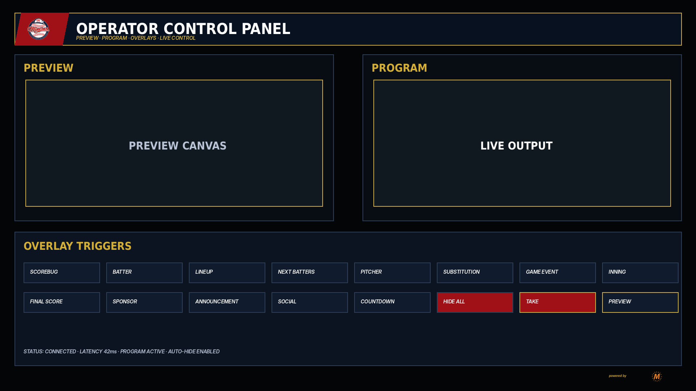
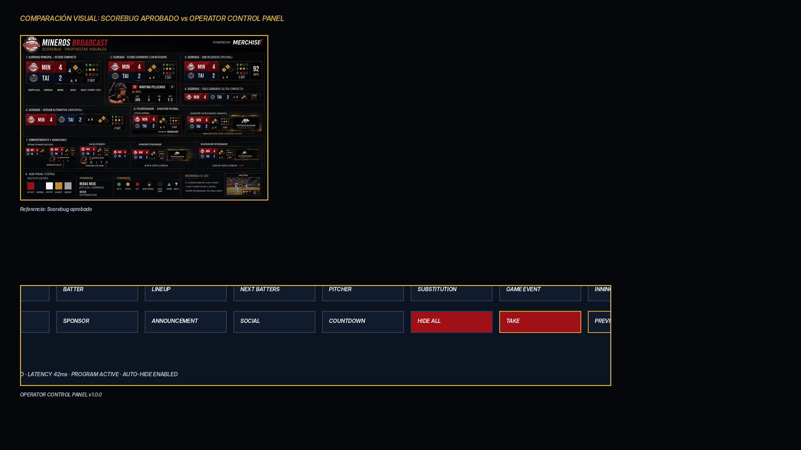

# 24 — Operator Control Panel

**Sistema:** Mineros Broadcast  
**Documento:** `24-operator-control-panel.md`  
**Versión:** `1.0.0`  
**Estado:** CANDIDATO FUNCIONAL EN REVISIÓN  
**Propietario:** Club Mineros de Santiago  
**Desarrollado por:** Merchise  

---

## 0. Propósito

El **Operator Control Panel** es la interfaz que usa el operador para controlar la transmisión en vivo.

Debe responder:

```text
¿Qué overlay puedo preparar, previsualizar, enviar al aire u ocultar?
```

---

## 0.1 Referencia gráfica

**Figura:** `OCP-FIG-001`  
**Archivo:** `24-operator-control-panel-assets/OCP-FIG-001-operator-control-panel.png`



---

## 0.2 Comparación con Scorebug

**Figura:** `OCP-FIG-002`  
**Archivo:** `24-operator-control-panel-assets/OCP-FIG-002-scorebug-comparison-check.png`



---

## 1. Zonas principales

| Zona | Función |
|---|---|
| Preview | Muestra overlay antes de salir al aire |
| Program | Muestra salida en vivo |
| Overlay Triggers | Botones para activar overlays |
| Status Bar | Estado de conexión, latencia, programa y auto-hide |
| Take | Envía preview a program |
| Hide All | Oculta todos los overlays no persistentes |

---

## 2. Funcionalidades obligatorias

1. preview de overlay;
2. program en vivo;
3. botón `Take`;
4. botón `Hide All`;
5. activación manual por overlay;
6. auto-hide por duración;
7. indicación de latencia;
8. estado de conexión;
9. lista de overlays activos;
10. bloqueo por conflicto de zona;
11. historial de acciones;
12. permisos por rol.

---

## 3. Roles

| Rol | Permiso |
|---|---|
| Admin | Configura sistema completo |
| Director | Envía overlays a program |
| Operador | Prepara y activa overlays permitidos |
| Revisor | Solo preview |
| Invitado | Sin control |

---

## 4. Acciones

| Acción | Descripción |
|---|---|
| `preview_overlay` | Renderiza overlay en Preview |
| `take_overlay` | Envía overlay a Program |
| `hide_overlay` | Oculta overlay específico |
| `hide_all` | Oculta overlays no persistentes |
| `lock_scorebug` | Impide ocultar Scorebug por error |
| `force_show` | Fuerza salida con prioridad |
| `clear_preview` | Limpia Preview |
| `reload_assets` | Recarga logos/fotos |

---

## 5. Contrato de acción

```json
{
  "schemaVersion": "1.0.0",
  "correlationId": "corr-operator-action-000001",
  "source": "OperatorControlPanel",
  "target": "OverlayManager",
  "timestamp": "2026-06-23T00:00:00Z",
  "payload": {
    "action": "take_overlay",
    "overlayId": "game_event_overlay",
    "operatorId": "operator-001",
    "target": "program",
    "priority": 80,
    "payloadRef": "payload-game-event-0001"
  }
}
```

---

## 6. Reglas de seguridad

| Regla | Descripción |
|---|---|
| Scorebug protegido | No se oculta con `Hide All` salvo permiso superior |
| Confirmación crítica | Cambios de marcador requieren confirmación |
| Auditoría | Toda acción queda registrada |
| Preview obligatorio | Overlays no críticos deben pasar por Preview |
| Prioridad | Program no acepta overlay si pierde conflicto |

---

## 7. Criterios de aceptación

El documento se acepta cuando:

- define Preview y Program;
- define acciones;
- define roles;
- define contrato;
- define reglas de seguridad;
- define conflictos;
- permite operar transmisión sin modificar código.
