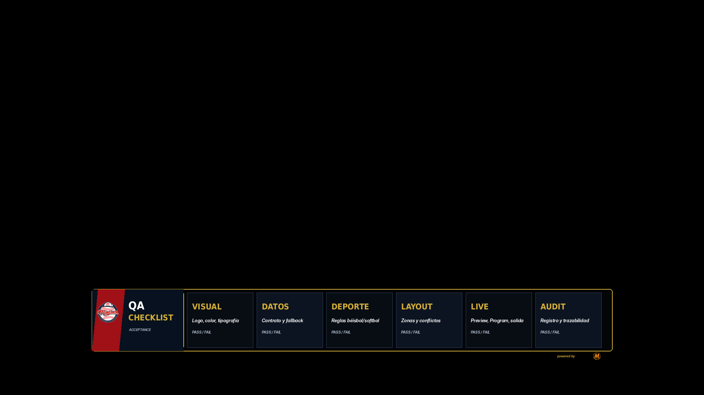

# 25 — QA Acceptance Checklist

**Sistema:** Mineros Broadcast  
**Documento:** `25-qa-acceptance-checklist.md`  
**Versión:** `1.0.0`  
**Estado:** CANDIDATO FINAL EN REVISIÓN  
**Propietario:** Club Mineros de Santiago  
**Desarrollado por:** Merchise  

---

## 0. Propósito

Este documento define el checklist final de aceptación para cada overlay del sistema.

Debe responder:

```text
¿El overlay está listo para implementación y uso en transmisión real?
```

---

## 0.1 Referencia gráfica

**Figura:** `QA-FIG-001`  
**Archivo:** `25-qa-acceptance-checklist-assets/QA-FIG-001-acceptance-checklist.png`



---

## 1. Checklist visual

| Criterio | Resultado |
|---|---|
| Usa logo Mineros correcto | PASS / FAIL |
| Usa logo Merchise correcto si aplica | PASS / FAIL |
| Respeta paleta oficial | PASS / FAIL |
| Respeta tipografía oficial o fallback documentado | PASS / FAIL |
| No corta texto | PASS / FAIL |
| No superpone módulos | PASS / FAIL |
| No usa elementos decorativos sin función | PASS / FAIL |
| Se parece al sistema del Scorebug | PASS / FAIL |

---

## 2. Checklist funcional

| Criterio | Resultado |
|---|---|
| Describe cada zona visible | PASS / FAIL |
| Define contrato JSON | PASS / FAIL |
| Define campos requeridos | PASS / FAIL |
| Define campos opcionales | PASS / FAIL |
| Define fallbacks | PASS / FAIL |
| Define eventos de activación | PASS / FAIL |
| Define cuándo ocultarse | PASS / FAIL |
| No invade responsabilidades de otros módulos | PASS / FAIL |

---

## 3. Checklist deportivo

| Criterio | Resultado |
|---|---|
| Usa terminología correcta | PASS / FAIL |
| No ubica DP/DH como defensa | PASS / FAIL |
| No inventa marcador | PASS / FAIL |
| No calcula lineup en overlay | PASS / FAIL |
| No calcula score fuera del Game Engine | PASS / FAIL |
| Respeta sustituciones según payload | PASS / FAIL |

---

## 4. Checklist de operación en vivo

| Criterio | Resultado |
|---|---|
| Puede ir a Preview | PASS / FAIL |
| Puede ir a Program | PASS / FAIL |
| Tiene prioridad definida | PASS / FAIL |
| Tiene zona preferida | PASS / FAIL |
| Maneja conflicto de zona | PASS / FAIL |
| Tiene duración o salida manual | PASS / FAIL |
| Se audita show/hide | PASS / FAIL |

---

## 5. Checklist de archivos

| Criterio | Resultado |
|---|---|
| `.md` existe | PASS / FAIL |
| Asset principal existe | PASS / FAIL |
| Comparación con Scorebug existe si aplica | PASS / FAIL |
| Logos están copiados en carpeta del módulo | PASS / FAIL |
| Rutas relativas funcionan | PASS / FAIL |
| Versión e historial actualizados | PASS / FAIL |

---

## 6. Criterio de cierre

Un overlay solo puede pasar a **CERRADO PARA IMPLEMENTACIÓN** si todos los criterios críticos están en PASS.

Críticos:

- branding correcto;
- texto sin cortes;
- contrato JSON claro;
- fallbacks definidos;
- compatibilidad con Scorebug;
- no invasión de responsabilidades;
- validación del usuario.
